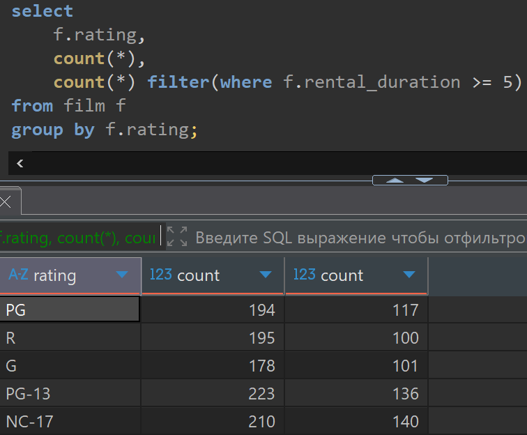

# Домашняя работа по фильтрации в агрегатных функциях FILTER()

[link video](https://www.youtube.com/watch?v=0IUHRSIOP_4&list=PLzvuaEeolxkz4a0t4qhA0pxmttG8ZbBtd&index=41)

## Задание 1

Все фильмы (film) нужно сгруппировать по рейтингу (film.rating). И для каждой группы вывести 3 поля:

- Название рейтинга (film.rating)
- Сколько всего фильмов с данным рейтингом
- Сколько фильмов с данным рейтингом и продолжительностью сдачи в аренду 5 или больше (film.rating_duration >= 5)

Решение:

```SQL
select 
    f.rating,
    count(*),
    count(*) filter(where f.rental_duration >= 5)
from film f
group by f.rating;
```

А решение выглядит так в DBeaver


