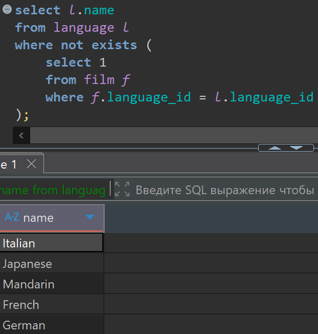
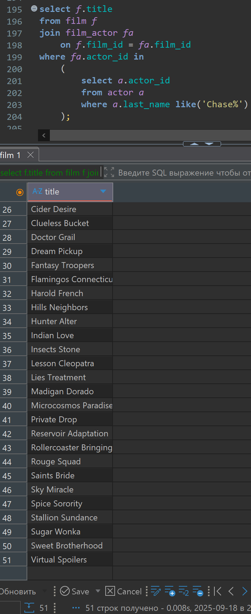
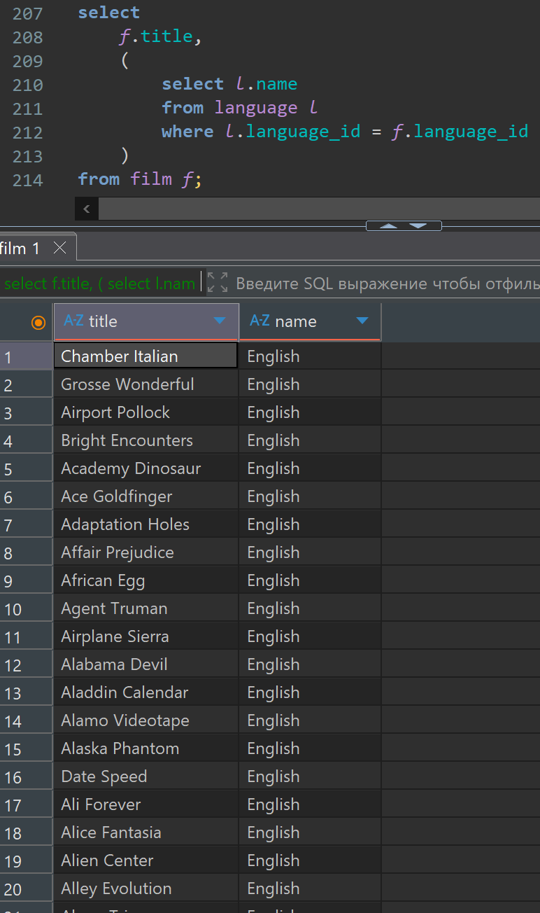
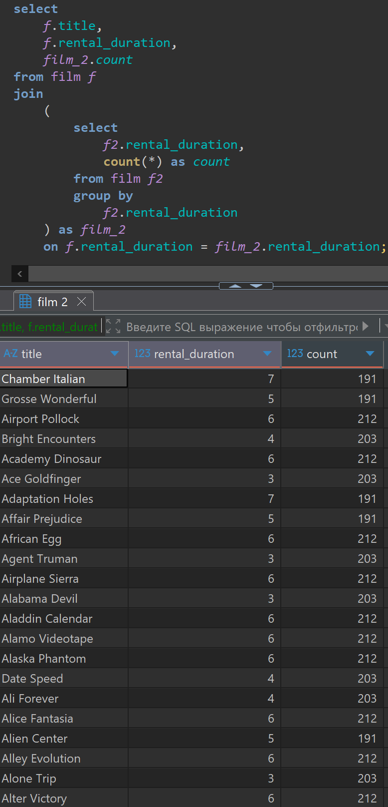

# Домашняя работа по Подзапросам

[link video](https://www.youtube.com/watch?v=ezXKjJpH_m4&list=PLzvuaEeolxkz4a0t4qhA0pxmttG8ZbBtd&index=45)

## Задание 1

Вывести названия всех языков (language.name), на которых нет фильмов в базе данных.
Использовать функцию not exists.

Решение:

```SQL
select l.name
from language l 
where not exists (
    select 1
    from film f 
    where f.language_id = l.language_id
);
```

А решение выглядит так в DBeaver



## Задание 2

Вывести названия всех фильмов (film.title), в которых снимались актеры с фамилией (actor.last_name) начинающейся на 'Chase'. Использовать функцию IN.

Решение:

```SQL
select f.title
from film f 
join film_actor fa
    on f.film_id = fa.film_id
where fa.actor_id in 
    (
        select a.actor_id
        from actor a 
        where a.last_name like('Chase%')
    );
```

А решение выглядит так в DBeaver получился 51 фильм с этими актерами



## Задание 3

Вывести все фильмы из таблицы (film). По каждому фильму отобразить:

- название фильма (film.title).
- название языка, на котором этот фильм снят (language.name).

Название языка получить получить с помощью подзапроса в select

Решение:

```SQL
select 
    f.title,
    (
        select l.name
        from language l
        where l.language_id = f.language_id
    )
from film f;
```

А решение выглядит так в DBeaver, все фильмы в базе у нас на английском языке, соответственно и результат у нас такой.



## Задание 4

Вывести список всех фильмов. По каждому фильму вывести:

- название фильма (film.title).
- на сколько дней фильм отдается в сдачу (film.rental_duration).
- сколько всего фильмов с таким же значением rental_duration.

С помощью подзапроса в блоке from получить таблицу, в которой для каждого значения rental_duration будет посчитано количество фильмов.

Решение:

```SQL
select 
    f.title,
    f.rental_duration,
    film_2.count 
from film f
join 
    (
        select
            f2.rental_duration, 
            count(*) as count
        from film f2
        group by
            f2.rental_duration 
    ) as film_2
    on f.rental_duration = film_2.rental_duration;
```

А решение выглядит так в DBeaver


