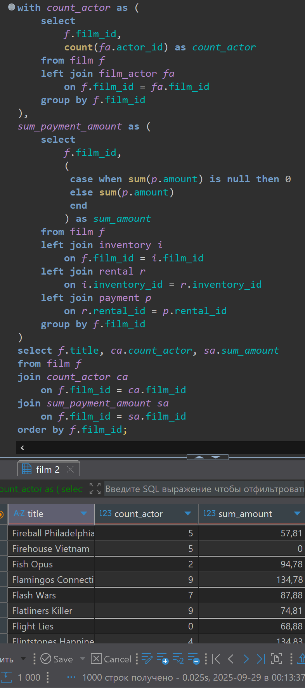

# Домашняя работа по общим табличным выражениям common table expression (CTE)

[link video](https://www.youtube.com/watch?v=fG46jKnec60&list=PLzvuaEeolxkz4a0t4qhA0pxmttG8ZbBtd&index=48)

## Задание 1

По каждому фильму (film) вывести поля:

- название фильма (film.title)
- количество актеров, снявшихся в фильме (количество строк в таблице film_actor)
- сумму продаж по данному фильму (sum(payment.amount))

Сделать расчет количества актеров в каждом фильме в отдельном запросе CTE. Сделать расчет общей суммы продаж по каждому фильму в отдельном CTE

Решение:

```SQL
with count_actor as (
    select 
        f.film_id,
        count(fa.actor_id) as count_actor
    from film f
    left join film_actor fa 
        on f.film_id = fa.film_id
    group by f.film_id
),
sum_payment_amount as (
    select 
        f.film_id,
        (
         case when sum(p.amount) is null then 0
         else sum(p.amount) 
         end
        ) as sum_amount
    from film f 
    left join inventory i 
        on f.film_id = i.film_id 
    left join rental r 
        on i.inventory_id = r.inventory_id
    left join payment p
        on r.rental_id = p.rental_id
    group by f.film_id 
)
select f.title, ca.count_actor, sa.sum_amount
from film f 
join count_actor ca
    on f.film_id = ca.film_id
join sum_payment_amount sa
    on f.film_id = sa.film_id
order by f.film_id;
```

Заметим что у нас есть три фильма без актеров, и фильмы без продаж которые никак у нас не продавались, не сдавались в аренду.

А решение выглядит так в DBeaver



## Задание 2 (со звездочкой *)

Вывести по каждому фильму (film) поля:

- название фильма (film.title)
- общую сумму продаж по фильму (sum(payment.amount))
- общую сумму продаж по всем фильмам (sum(payment.amount))
- долю продаж данного фильма от всех продаж в процентах, рассчитанную по формуле:
( [продажи_по_данному_фильму] / [продажи_по_всем_фильмам] ) * 100. Расчет всех продаж по всем фильмам выполнить с помощью CTE

Решение:

```SQL
with sum_payment_amount as (
    select 
        f.film_id,
        (
         case when sum(p.amount) is null then 0
         else sum(p.amount) 
         end
        ) as sum_amount
    from film f 
    left join inventory i 
        on f.film_id = i.film_id 
    left join rental r 
        on i.inventory_id = r.inventory_id
    left join payment p
        on r.rental_id = p.rental_id
    group by f.film_id 
),
total_amount as (
    select sum(sa.sum_amount)
    from sum_payment_amount sa
)
select 
    f.title, 
    sa.sum_amount as sum_amount,
    (select * from total_amount) as total_sum,
    (sum_amount / (select * from total_amount)) * 100 prosent_amount
from film f 
join sum_payment_amount sa
    on f.film_id = sa.film_id
order by f.film_id;
```

А решение выглядит так в DBeaver


