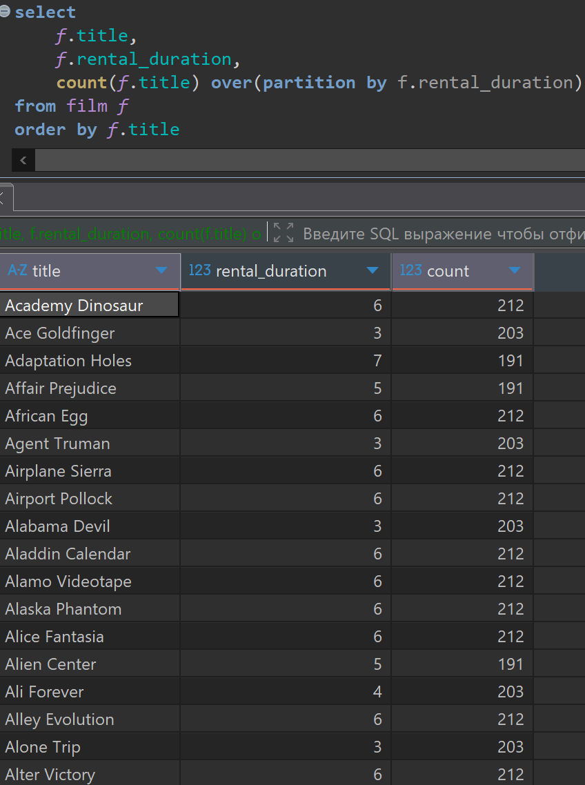
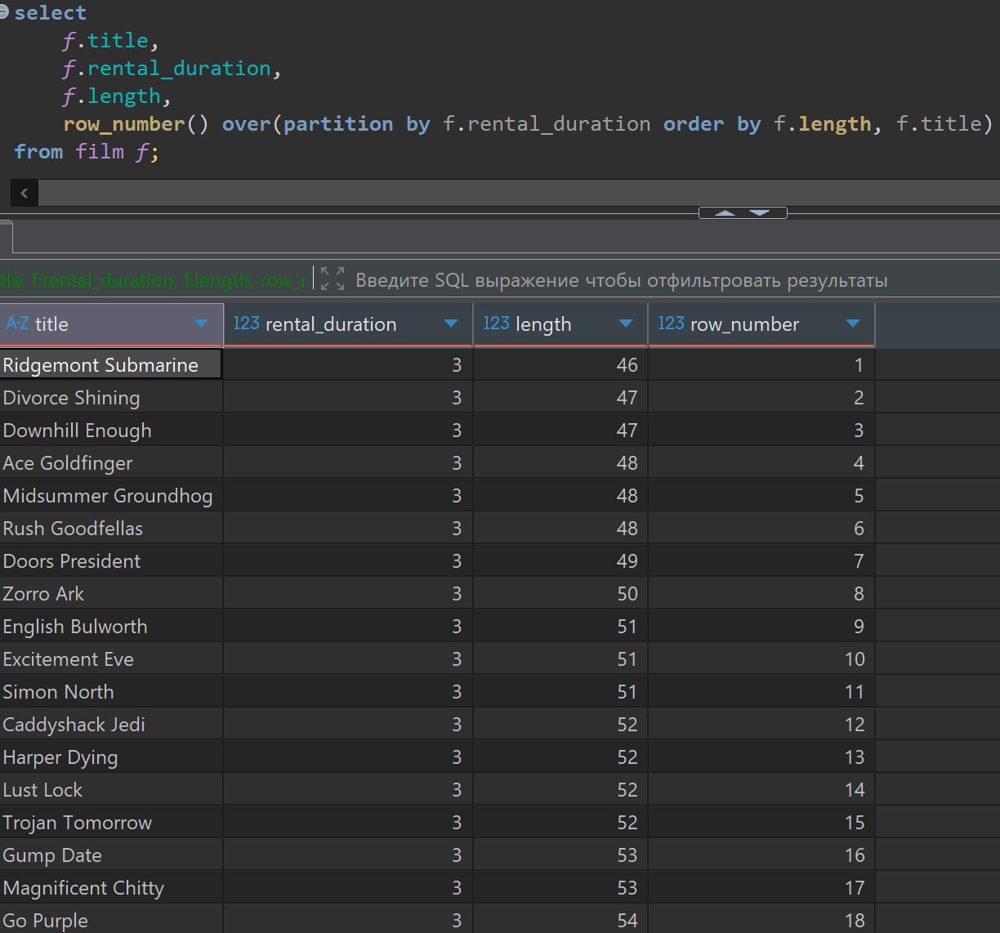
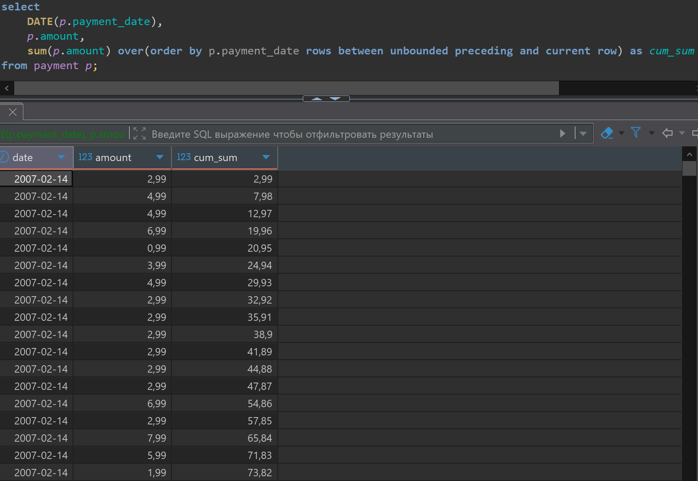

# Домашняя работа по Оконные функции

[link video](https://www.youtube.com/watch?v=uytpmv5JPuk&list=PLzvuaEeolxkz4a0t4qhA0pxmttG8ZbBtd&index=52)

## Задача 1

Вывести список всех фильмов (film). По каждому фильму отобразить поля:

- название (film.title)
- количество дней, на которые фильм дается в аренду (film.rental_duration)
- общее количество фильмов которые даются в аренду на такое же количество дней (с таким же значением film.rental_duration)

Решение:

```SQL
select 
select 
    f.title,
    f.rental_duration,
    count(f.title) over(partition by f.rental_duration)
from film f
order by f.title
```

А решение выглядит так в DBeaver



## Задача 2

Вывести список всех фильмов (film). По каждому фильму отобразить поля:

- название (film.title)
- количество дней, на которые фильм дается в аренду (film.rental_duration)
- продолжительность фильма (film.length)
- порядковый номер фильма в порядке уменьшения продолжительности (film.length). Нумеруем в рамках групп фильмов с одинаковым значением film.rental_duration.
У каждого фильма должен быть свой уникальный номер. Фильмы с одинаковой продолжительностью сортируем по названию (film.title) в алфавитном порядке.

Решение:

```SQL
select 
    f.title,
    f.rental_duration,
    f.length,
    row_number() over(partition by f.rental_duration order by f.length, f.title)
from film f;
```

А решение выглядит так в DBeaver



## Задача 3 (задача со звездочкой ***)

На основе таблицы платежей (payment) посчитать накопительным итогом общую сумму платежей (sum(payment.amount)) на каждую дату, на которую были платежи. Вывести поля:

- дата (payment.payment_date::date). Одну дату выводим в одной строке.
- общая сумма всех платежей (sum(payment.amount)) за все даты до текущей, а также за текущую дату.

Решение:

```SQL
select
    DATE(p.payment_date),
    p.amount,
    sum(p.amount) over(order by p.payment_date rows between unbounded preceding and current row) as cum_sum
from payment p;
```

А решение выглядит так в DBeaver


