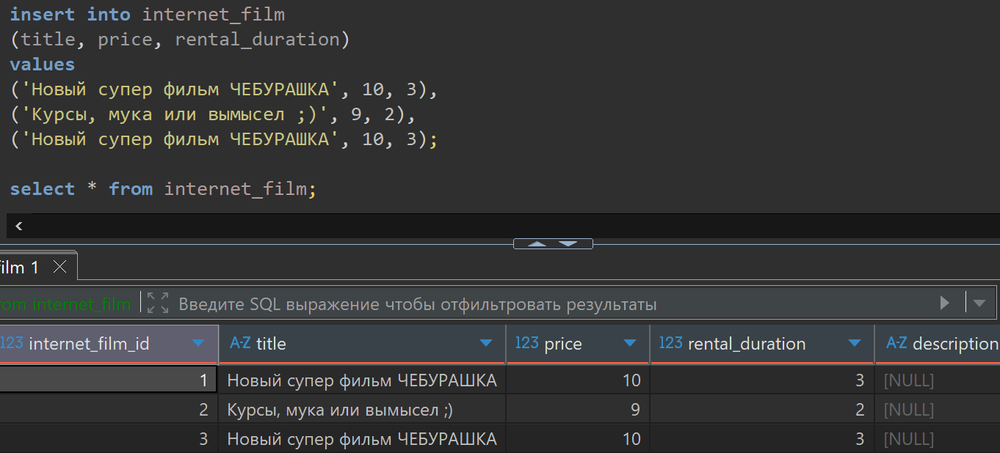
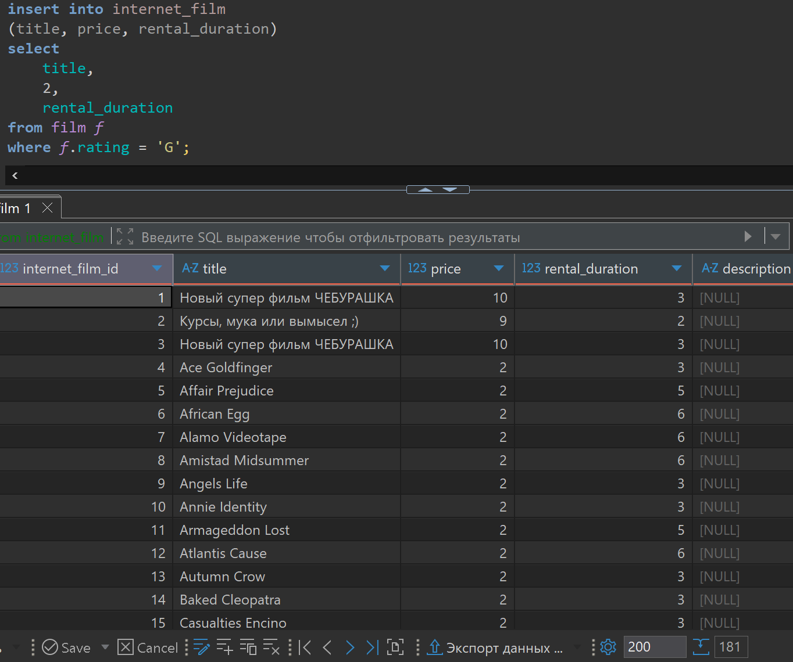

# Домашняя работа по созданию и наполнению таблиц

[link video](https://www.youtube.com/watch?v=K4MQFSW8UEQ&list=PLzvuaEeolxkz4a0t4qhA0pxmttG8ZbBtd&index=56)

## Задача 1

Создать таблицу (internet_film) со списком фильмов, доступных для аренды онлайн.
Список полей:

- internet_film_id - Идентификатор фильма (Целое число. Должно проставляться автоматически. Обязательно для заполнения).
- title - Название фильма (строка длиной до 50 символов. Пробелами дополнятся не должна. Обязательное для заполнения).
- price - Стоимость сдачи в прокат (число с плавающей точкой. Обязательное для заполнения).
- rental_duration - Количество дней, на которое фильм отдается в прокат (Целое число. Обязательное для заполнения).
- description - Описание фильма (строка длиной до 500 символов. Не обязательное для заполнения)

```SQL
drop table internet_film;

create table if not exists internet_film (
    internet_film_id serial not null,
    title varchar(50) not null,
    price real not null,
    rental_duration int not null,
    description varchar(500) null
);

select * from internet_film;
```

А решение выглядит так в DBeaver

## Задача 2

Добавить в таблицу три любых фильма по своему желанию

Решение:

```SQL
insert into internet_film
(title, price, rental_duration)
values
('Новый супер фильм ЧЕБУРАШКА', 10, 3),
('Курсы, мука или вымысел ;)', 9, 2),
('Новый супер фильм ЧЕБУРАШКА', 10, 3);

select * from internet_film;
```

А решение выглядит так в DBeaver



## Задача 3

Добавить в таблицу все фильмы из таблицы film, у которых рейтинг 'G' (film.rating = 'G'). Поставить цену проката - 2. Остальные поля взять из таблицы film.

Решение:

```SQL
insert into internet_film
(title, price, rental_duration)
select 
    title,
    2,
    rental_duration
from film f
where f.rating = 'G';

select * from internet_film;
```

А решение выглядит так в DBeaver получим 178 + 3 позиции учитывая уже введенные фильмы ранее


