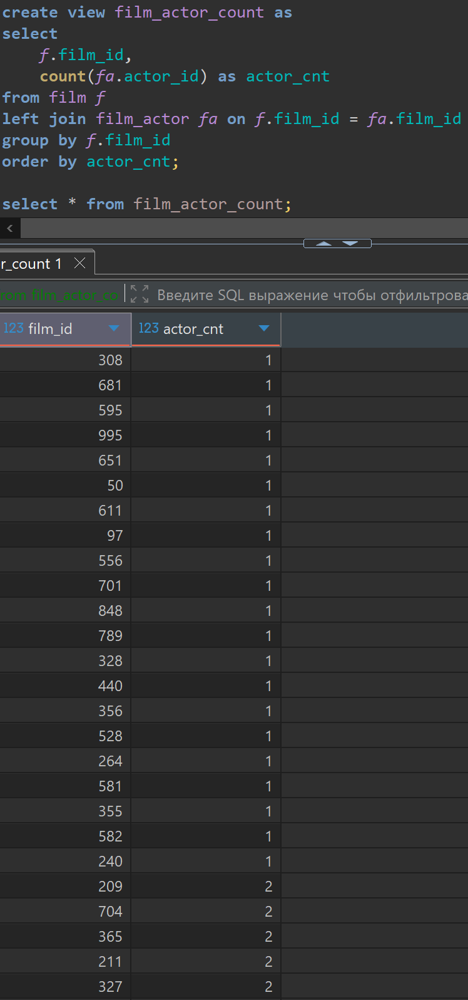
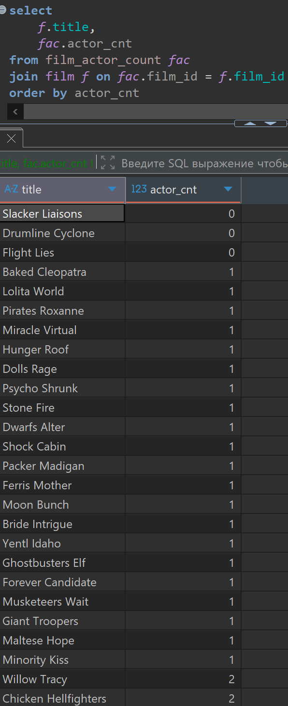
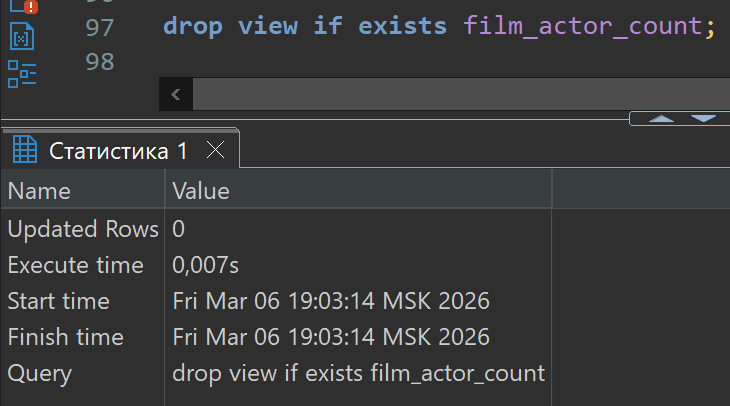

# Домашняя работа по созданию и наполнению таблиц

[link video](https://www.youtube.com/watch?v=X2yUdJv-yFE&list=PLzvuaEeolxkz4a0t4qhA0pxmttG8ZbBtd&index=61)

## Задача 1

Создать представление, в котором будет 2 поля:

- film_id - идентификатор фильма
- actor_cnt - количество актеров, снявшихся в фильме

Если в фильме не снялось ни одного актера, то такой фильм должен выводится в этом представлении с 0 (нуль) актеров.

```SQL
create view film_actor_count as
select 
    f.film_id,
    count(fa.actor_id) as actor_cnt
from film f
left join film_actor fa on f.film_id = fa.film_id
group by f.film_id
order by actor_cnt;

select * from film_actor_count;
```

А решение выглядит так в DBeaver:



## Задача 2

Написать запрос, в котором будет использовано представление из задачи 1.
Вывести список всех фильмов (film) и по каждому фильму отобразить:

- название фильма (film.title)
- кол-во актеров, снявшихся в фильме

```SQL
select 
    f.title,
    fac.actor_cnt
from film_actor_count fac
join film f on fac.film_id = f.film_id
order by actor_cnt;
```

А решение выглядит так в DBeaver:



## Задача 3

Удалить представление, созданное в первой задаче.

```SQL
drop view if exists film_actor_count;
```

А решение выглядит так в DBeaver:


