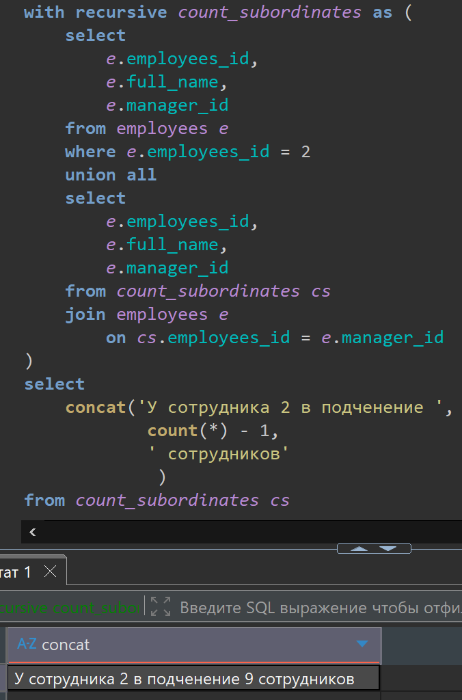
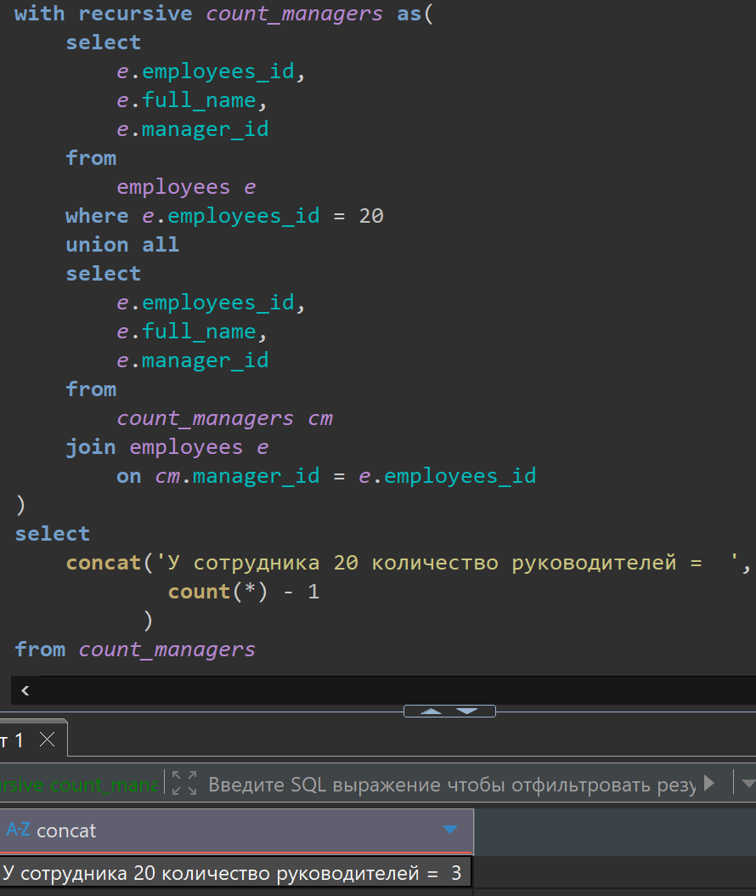
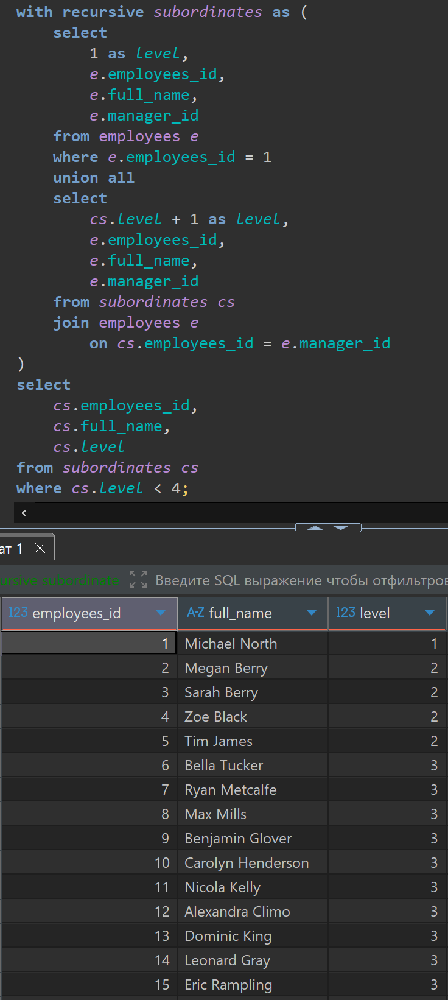

# Домашняя работа по рекурсии

[link video](https://www.youtube.com/watch?v=86zNjGKMx-Y&list=PLzvuaEeolxkz4a0t4qhA0pxmttG8ZbBtd&index=68)

## Задача 1

Схему с сотрудниками закреплю еще тут


Для сотрудника с идентификатором 2 посчитать, сколько всего у него подчиненных.

```SQL
with recursive count_subordinates as (
    select 
        e.employees_id,
        e.full_name,
        e.manager_id
    from employees e 
    where e.employees_id = 2
    union all
    select
        e.employees_id,
        e.full_name,
        e.manager_id
    from count_subordinates cs
    join employees e 
        on cs.employees_id = e.manager_id
)
select 
    concat('У сотрудника 2 в подченение ', 
            count(*) - 1, 
            ' сотрудников'
             ) 
from count_subordinates cs
```

А решение выглядит так в DBeaver:



## Задача 2

Для сотрудника с идентификатором 20 посчитать, сколько всего у него начальников.

```SQL
with recursive count_managers as(
    select
        e.employees_id,
        e.full_name,
        e.manager_id
    from
        employees e 
    where e.employees_id = 20
    union all
    select
        e.employees_id,
        e.full_name,
        e.manager_id
    from 
        count_managers cm
    join employees e
        on cm.manager_id = e.employees_id  
)
select 
    concat('У сотрудника 20 количество руководителей =  ', 
            count(*) - 1
          )  
from count_managers
```

А решение выглядит так в DBeaver:



## Задача 3

С помощью рекурсивного запроса вывести сотрудника с идентификатором 1 и всех его подчиненных
со второго и третьего уровней иерархии. С 4-ого уровня и ниже подчиненных выводить не нужно.

```SQL
with recursive subordinates as (
    select
        1 as level,
        e.employees_id,
        e.full_name,
        e.manager_id
    from employees e 
    where e.employees_id = 1
    union all
    select
        cs.level + 1 as level, 
        e.employees_id,
        e.full_name,
        e.manager_id
    from subordinates cs
    join employees e 
        on cs.employees_id = e.manager_id
)
select 
    cs.employees_id,
    cs.full_name,
    cs.level
from subordinates cs
where cs.level < 4;
```

А решение выглядит так в DBeaver:


