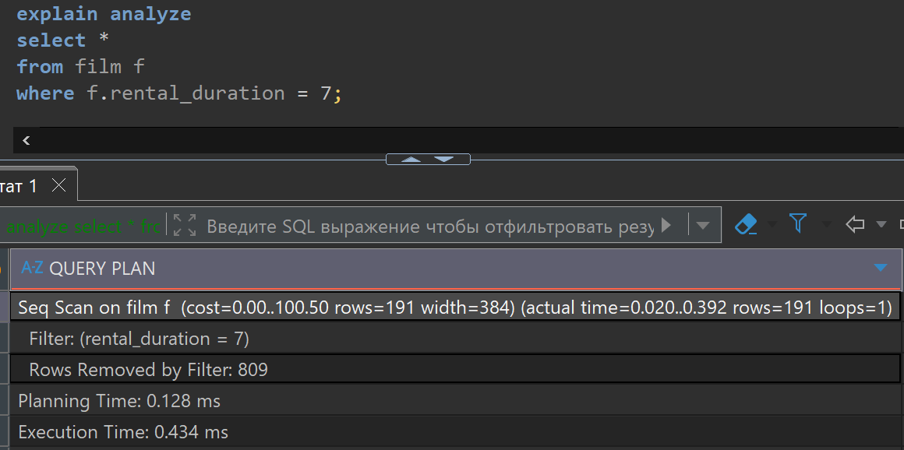
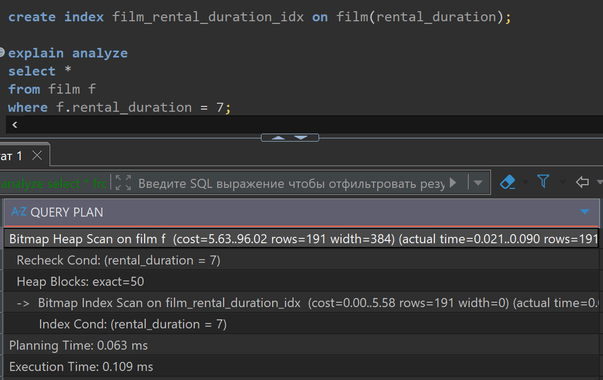

# Домашняя работа по оптимизациям запросов

[link video](https://www.youtube.com/watch?v=-bD485Icyxc&list=PLzvuaEeolxkz4a0t4qhA0pxmttG8ZbBtd&index=70)

## Задача 1

Оптимизируйте запрос с помощью создания индекса:

Построим план выполнения запроса до создания индекса и после и посмотрим на сколько изменится время
выполнения запроса.

вот наш изначальный запрос который ищет фильмы с продолжительностью аренды 7

```SQL
explain analyze
select * 
from film f 
where f.rental_duration = 7;
```

Вот так выглядит план запроса, и время выполнения запроса в DBeaver:



Теперь создадим индекс для таблицы film и поля rental_duration
назовем индекс film_rental_duration_idx

```SQL
create index film_rental_duration_idx on film(rental_duration);

explain analyze
select * 
from film f 
where f.rental_duration = 7;
```

Вот так выглядит план запроса, и время выполнения запроса в DBeaver:



Увидим уменьшение времени выполнения если в первом случае бывало время выполнения до 1ms,
то теперь с индексом время выполнения не было выше 0.6ms.
