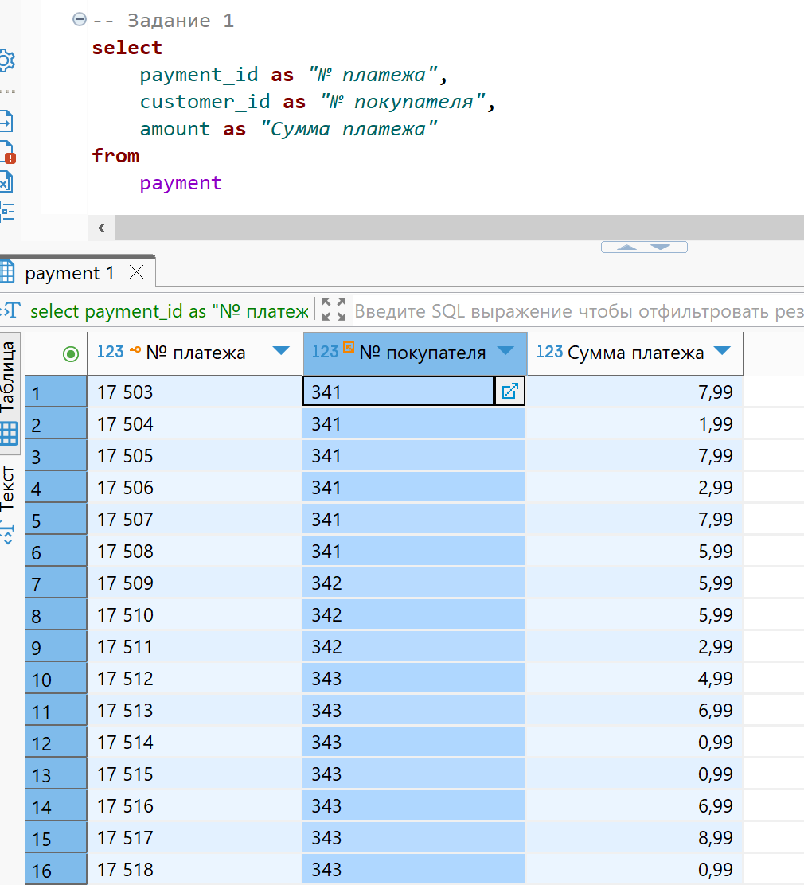
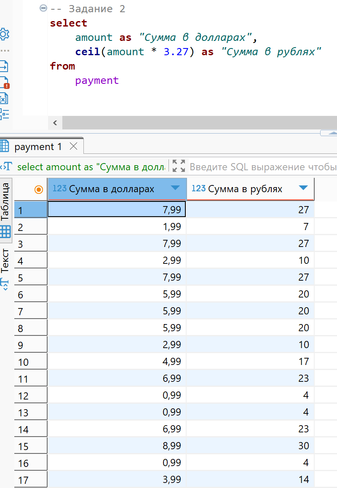
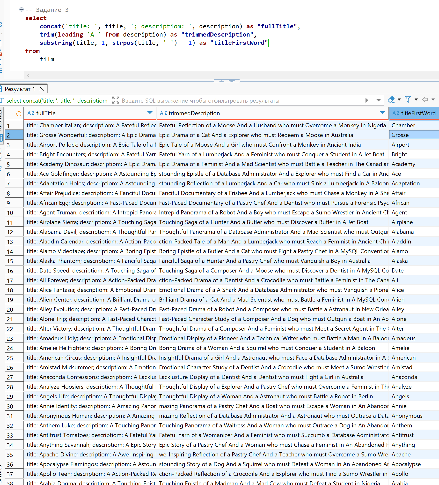

# Домашняя работа

[link video](https://www.youtube.com/watch?v=WEhkiERgJjY&list=PLzvuaEeolxkz4a0t4qhA0pxmttG8ZbBtd&index=7)

## Задание 1

Сделать запрос из таблицы платежей (payment), который получает поля: payment_id, customer_id, amount и дать им названия соответственно: "№ платежа", "№ покупателя", "Сумма платежа"

Решение:

```SQL
select 
    payment_id as "№ платежа", 
    customer_id as "№ покупателя", 
    amount as "Сумма платежа"
from 
    payment
```

А решение выглядит так в DBeaver



## Задание 2

Вывести по каждому платежу из таблицы платежей (payment) сумма платежа в долларах (значение из поля amount) и сумма платежа в рублях (значение из поля amount умноженное на текущий курс доллара к рублю) и дать им названия: "Сумма в долларах", "Сумма в рублях"

Решение:

В дополнение округлил до целого значения цены в рублях (3,27 по курсу нац банка РБ на 03.08.2025), так показалось корректнее.

```SQL
select
    amount as "Сумма в долларах",
    ceil(amount * 3.27) as "Сумма в рублях"
from
    payment
```

А решение выглядит так в DBeaver



## Задание 3

Сделать запрос из таблицы фильмов (film) со следующими столбцами:

1. Для каждого фильма, вывести строку в следующем формате:
    - "title:{1}; description: {2}", где:
        - {1} - Настоящее название фильма
        - {2} - Описание фильма
    - Дать название столбцу fullTitle.

2. Вывести описание фильма (film.description), у которого:
    - удалена подстрока "А" из начала строки, если такая есть.
    - Дать название столбцу: trimmedDescription.

3. Из названия фильма вывести только первое слово, которое идет до пробела, название столбцу дать titleFirstWord.

Решение:

```SQL
select 
    concat('title: ', title, '; description: ', description) as "fullTitle",
    trim(leading 'A ' from description) as "trimmedDescription",
    substring(title, 1, strpos(title, ' ') - 1) as "titleFirstWord"
from
    film
```

А решение выглядит так в DBeaver


