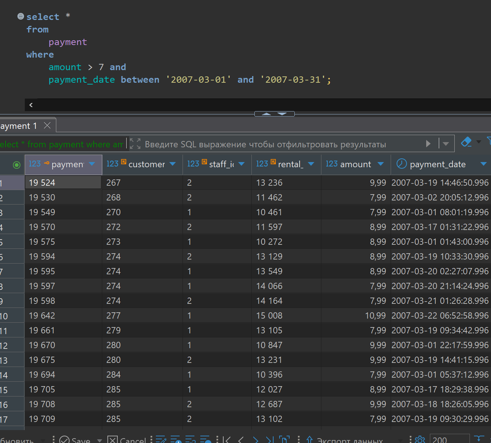
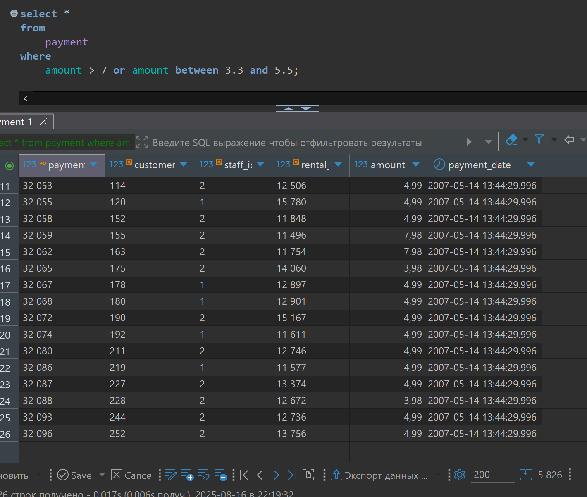
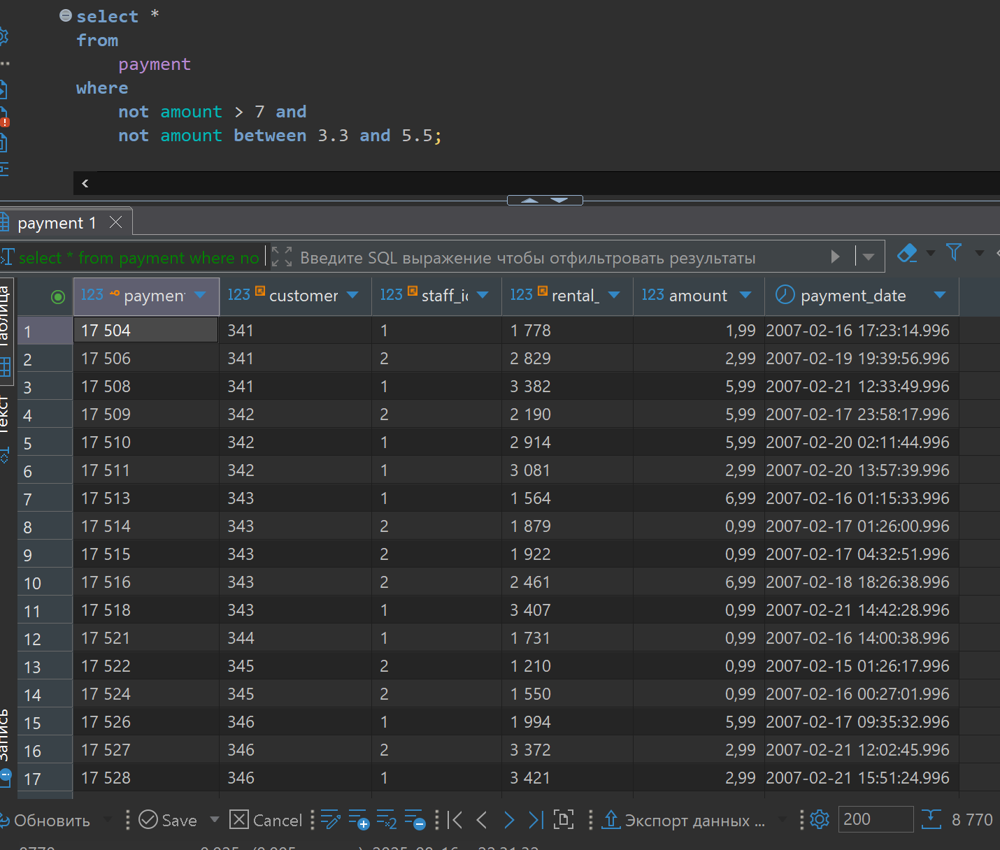
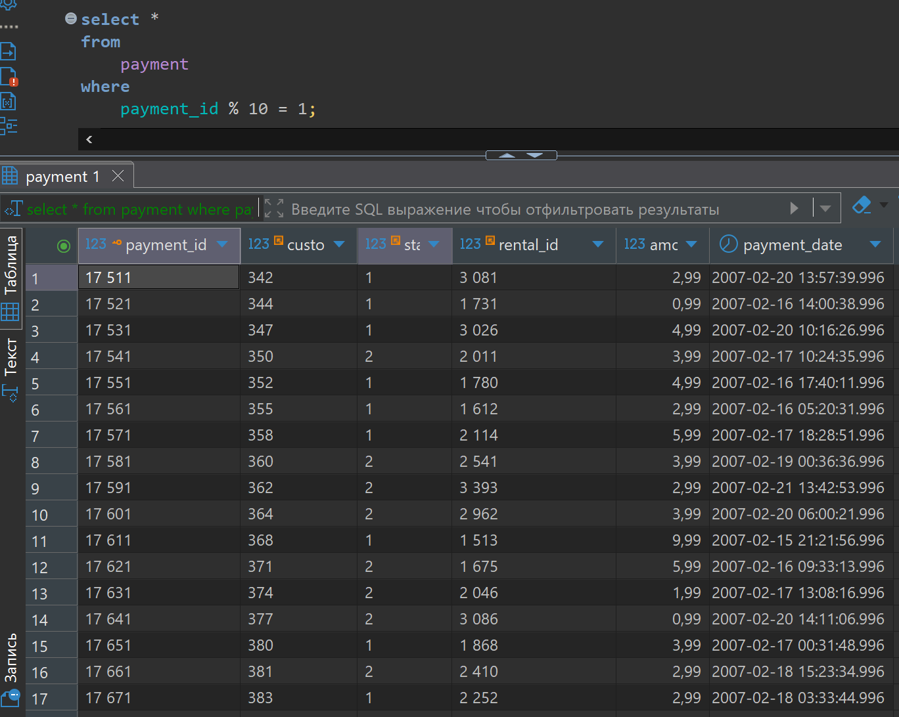
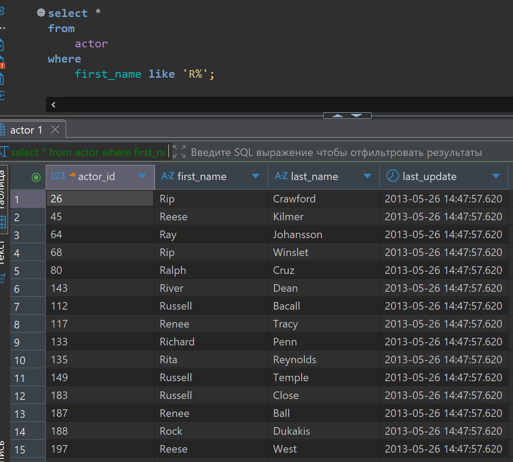
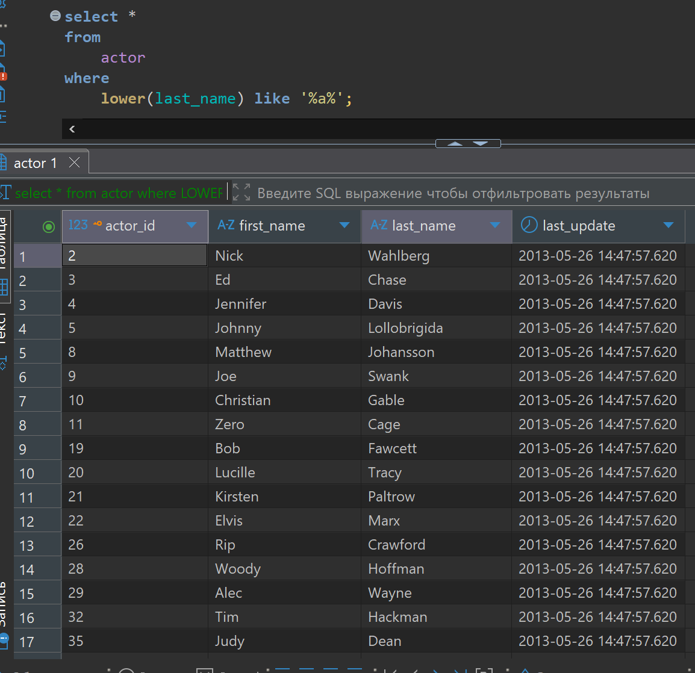
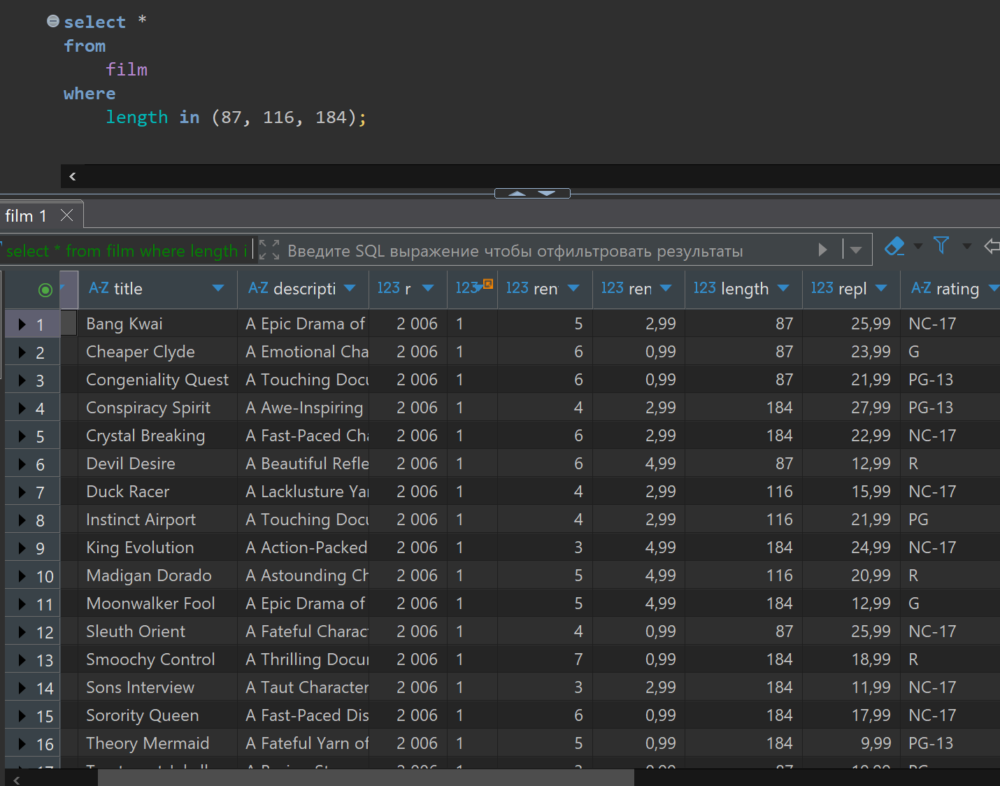

# Домашняя работа

[link video](https://www.youtube.com/watch?v=7nfhTkv9qVs&list=PLzvuaEeolxkz4a0t4qhA0pxmttG8ZbBtd&index=11)

## Задание 1

Получить все платежи (payment) с суммой (amount) более 7 долларов в период (payment_date) c 2007-03-01 по 2007-03-31.

Решение:

```SQL
select *
from 
    payment
where 
    amount > 7 and 
    payment_date between '2007-03-01' and '2007-03-31';
```

А решение выглядит так в DBeaver



## Задание 2

Получить все платежи (payment) с суммой (amount) более 7 долларов или с суммой (amount) попадающей в диапазон от 3.3 доллара до 5.5 доллара.

Решение:

```SQL
select *
from 
    payment
where 
    amount > 7 or amount between 3.3 and 5.5;
```

А решение выглядит так в DBeaver



## Задание 3

Получить все платежи (payment), исключив платежи с суммой (amount) более 7 долларов и исключив платежи, у которых сумма (amount) попадает в диапазон от 
3.3 доллара до 5.5 доллара.

```SQL
select *
from
    payment
where
    not amount > 7 and
    not amount between 3.3 and 5.5;
```

А решение выглядит так в DBeaver



## Задание 4

Получить все платежи (payment), у которых последняя цифра идентификатора (payment_id) - равна 1 (другими словами - остаток от деления payment_id на 10 равен 1).

```SQL
select *
from
    payment
where
    payment_id % 10 = 1;
```

А решение выглядит так в DBeaver



## Задание 5

Получить всех актеров (actor), чье имя (first_name) начинается на "R".

```SQL
select *
from
    actor
where
    first_name like 'R%';
```

А решение выглядит так в DBeaver



## Задание 6

Вывести всех актеров (actor), у которых в фамилии (last_name) есть буква "a".

```SQL
select *
from
    actor
where
    lower(last_name) like '%a%';
```

А решение выглядит так в DBeaver



## Задание 7

Получить все фильмы (films), у которых продолжительность (length) принимает одно из значений: 87, 116, 184.

```SQL
select *
from
    film
where
    length in (87, 116, 184);
```

А решение выглядит так в DBeaver


