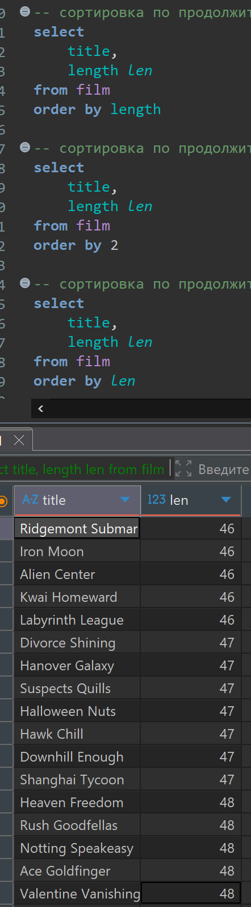
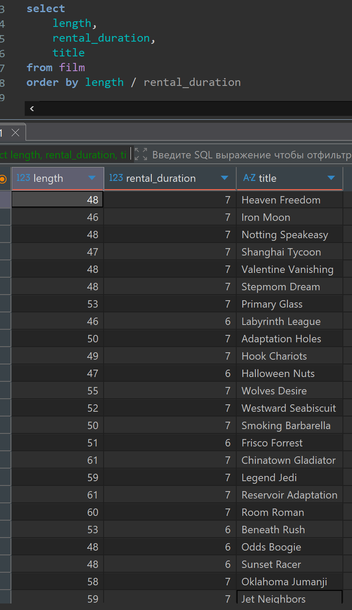
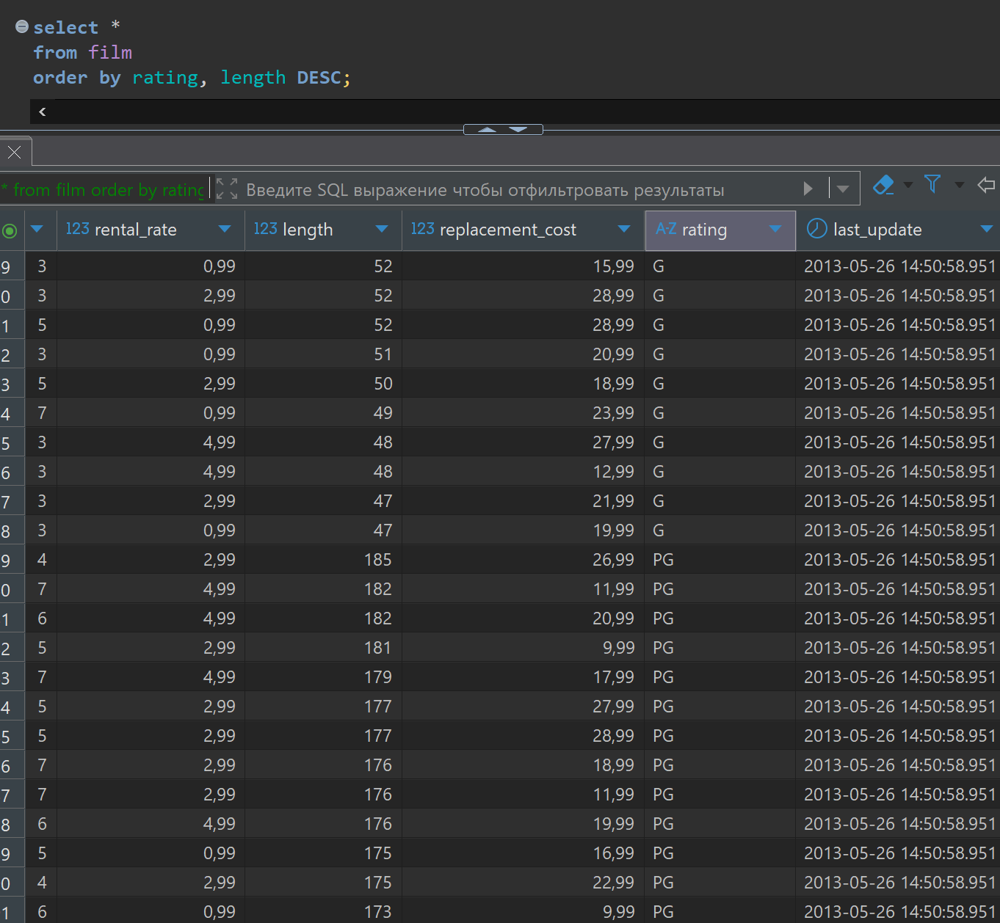

# Домашняя работа по сортировкам

[link video](https://www.youtube.com/watch?v=ox5enx2GFFE&list=PLzvuaEeolxkz4a0t4qhA0pxmttG8ZbBtd&index=16)

## Задание 1

Из таблицы фильмов (film) запросить 2 поля: title и length. Полю length дать имя "len". Отсортировать полученный результат по продолжительности фильма (по полю length). Написать запрос в 3 вариантах с сортировкой:

- a. по имени поля в таблице (length)
- b. по номеру столбца в результирующем наборе
- c. по имени столбца в результирующем наборе

Решение:

```SQL
-- условие a
select 
    title,
    length len
from film
order by length 

-- условие b
select 
    title,
    length len
from film
order by 2 

-- условие c
select 
    title,
    length len
from film
order by len
```

А решение выглядит так для всех трех вариантов кода в DBeaver



## Задание 2

Из таблицы фильмов (film) запросить 3 поля: length, rental_duration, title.
Отсортировать по возрастанию следующего выражения: length / rental_duration

Решение:

```SQL
select 
    length,
    rental_duration,
    title
from film
order by length / rental_duration
```

А решение выглядит так в DBeaver



## Задание 3

Из таблицы фильмов (film) запросить все поля с помощью *. Отсортировать полученный набор сначала по рейтингу (rating) по возрастанию, а фильмы с одинаковым рейтингом по убыванию продолжительности (length)

Решение:

```SQL
select *
from film
order by rating, length DESC;
```

А решение выглядит так в DBeaver


