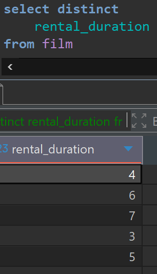
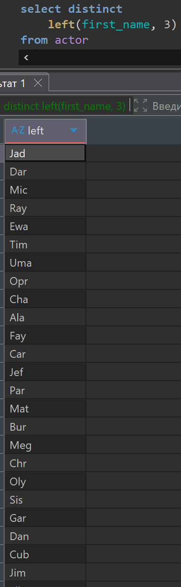
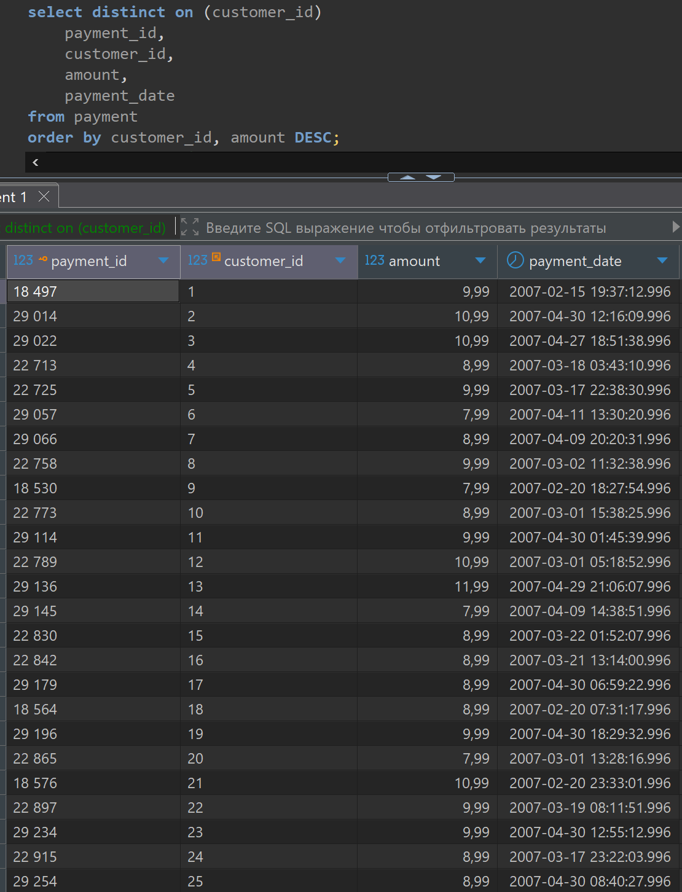
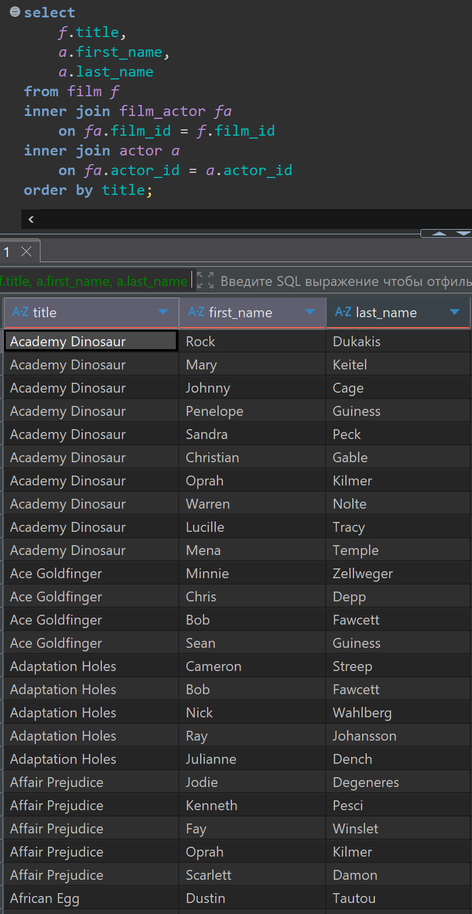
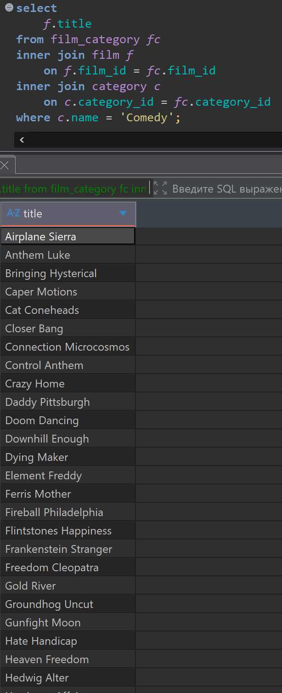
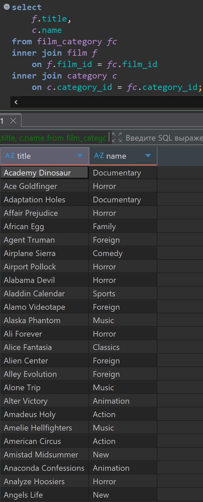
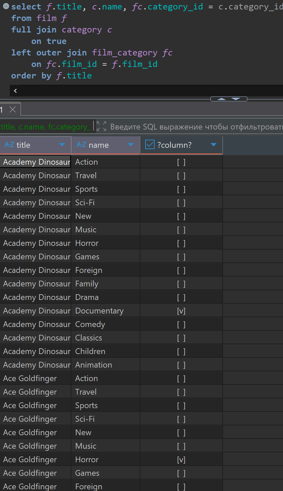
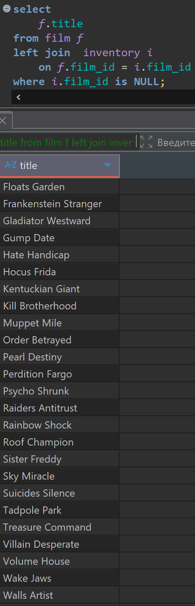

# Домашняя работа по получению уникальных (DISTINCT) значений и по соединению таблиц (JOIN)

[link video](https://www.youtube.com/watch?v=wC8JTEpnFOM&list=PLzvuaEeolxkz4a0t4qhA0pxmttG8ZbBtd&index=19)

## Задание 1 (DISTINCT)

Получить список уникальных значений из колонки продолжительности сдачи в аренду (rental_duration) таблицы с фильмами (film).

Решение:

```SQL
select distinct
    rental_duration
from film
```

А решение выглядит так в DBeaver



## Задание 2 (DISTINCT)

Из таблицы актеров (actor) у имени (first_name) каждого актера берем только первые три символа. Выводим один столбец с уникальными значениями полученного выражения.

Решение:

```SQL
select distinct
    left(first_name, 3)
from actor
```

получилось 114 уникальных значений

А решение выглядит так в DBeaver



## Задание 3 (DISTINCT)

Из таблицы платежей (payment) получить для каждого покупателя (customer_id) последний платеж по дате платеже (payment_date). Вывести поля: номер платежа (payment_id), номер покупателя (customer_id), сумму платежа (amount), дату платежа (payment_date).

Решение:

```SQL
select distinct on (customer_id)
    payment_id,
    customer_id,
    amount,
    payment_date
from payment
order by customer_id, amount DESC;
```

А решение выглядит так в DBeaver



## Задание 1 (JOIN)

Нам известно название фильма (значение поля title таблицы film).
Задача: получить список всех актеров, снявшихся в этом фильме. По каждому актеру (запись из таблицы actor) нужно вывести 2 поля: имя (first_name) и фамилию (last_name). Связь между таблицами фильмов и актером производится посредством промежуточной таблицы film_actor.

Решение:

```SQL
select
    f.title,
    a.first_name,
    a.last_name 
from film f
inner join film_actor fa
    on fa.film_id = f.film_id
inner join actor a 
    on fa.actor_id = a.actor_id
order by title;
```

А решение выглядит так в DBeaver



## Задание 2 (JOIN)

Получить список фильмов (film) из категории (category) "Comedy" (значение поля "name"). По каждому найденному фильму нужно вывести название из поля "title". Связи между фильмами и категориями осуществляется с помощью промежуточной таблицы film_category.

Решение:

```SQL
select 
    f.title
from film_category fc 
inner join film f 
    on f.film_id = fc.film_id
inner join category c 
    on c.category_id = fc.category_id 
where c.name = 'Comedy';
```

получилось 58 фильмов в категории "Comedy"

А решение выглядит так в DBeaver



## Задание 3 (JOIN)

Вывести список пар: название фильма (film.title) - название категории (category.name).Если один фильм попадает в несколько категорий, то вывести  несколько строк для этого фильма. Связь между таблицами фильмов (film) и категорий (category) осуществляется посредством промежуточной таблицы film_category.

Решение:

```SQL
select 
    f.title,
    c.name
from film_category fc 
inner join film f 
    on f.film_id = fc.film_id
inner join category c 
    on c.category_id = fc.category_id;
```

всего получилось 1000 записей о фильмах и их категориях, получили что каждый фильм относится к одной категории.

А решение выглядит так в DBeaver



## Задания со звездочкой ***

## Задание 1

 Вывести список пар: название фильма (film.title) и название категории (category.name) (сделать декартово произведение фильмов и категорий) Для каждой пары вывести true в третьей колонке, если данный фильм относится к указанной категории. Иначе вывести false.

Решение:

```SQL
select f.title, c.name, fc.category_id = c.category_id  
from film f
full join category c 
    on true
left outer join film_category fc
    on fc.film_id = f.film_id  
order by f.title
```

Получилось 16000 записей.

А решение выглядит так в DBeaver



## Задание 2

Вывести список всех фильмов (film.title), по которым в магазине нет дисков в наличии (то есть по таким фильмам нет записей в таблице inventory).

Решение:

```SQL
select 
    f.title
from film f 
left join  inventory i
    on f.film_id = i.film_id
where i.film_id is NULL;

```

Получилось 42 строки из фильмов которых нет в прокате

А решение выглядит так в DBeaver


