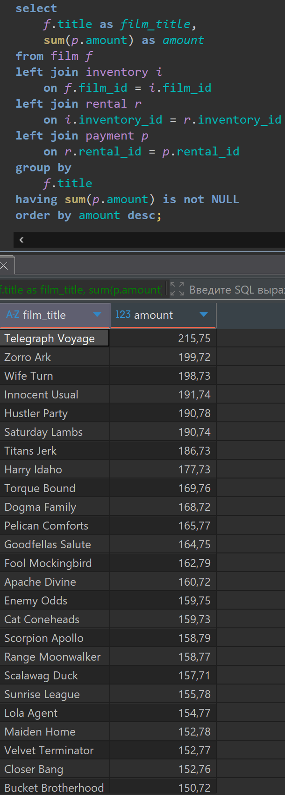
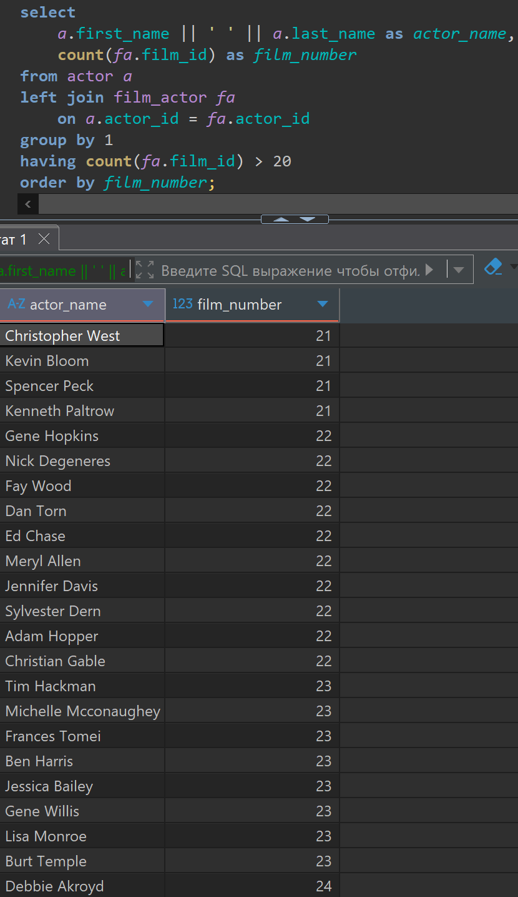
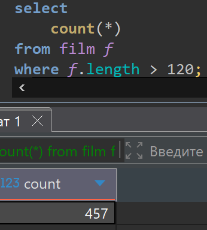
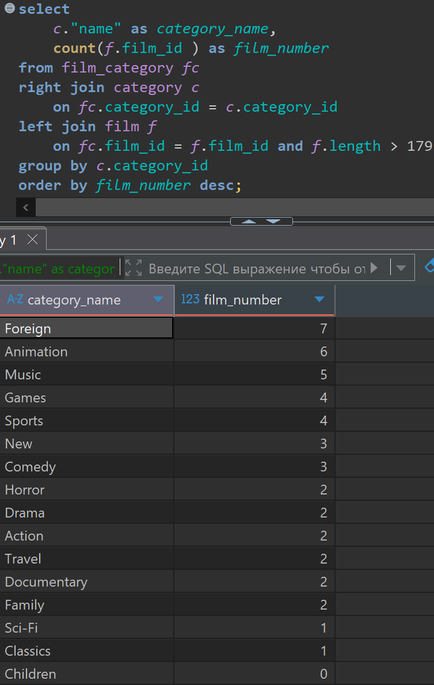

# Домашняя работа по получению Группировкам. (Group By, Having)

[link video](https://www.youtube.com/watch?v=5JSYy1ZZ8u8&list=PLzvuaEeolxkz4a0t4qhA0pxmttG8ZbBtd&index=27)

## Задание 1

По каждому фильму (film), по которому были платежи, вывести общую сумму вырученных платежей (payment.amount) с проката. Вывести две колонки:
1 film_title - с названием фильма (film.title). Каждый фильм, должен быть указан в этой колонке один раз;
2 amount - общая сумма, на которую фильм сдавался в прокат (payment.amount). Отсортировать полученный результат в порядке убывания общей суммы сдачи в прокат. Связь таблиц происходит следующим образом: film <-- inventory; inventory <-- rental; rental <-- payment.

Решение:

```SQL
select 
    f.title as film_title,
    sum(p.amount) as amount
from film f 
left join inventory i 
    on f.film_id = i.film_id 
left join rental r 
    on i.inventory_id = r.inventory_id
left join payment p
    on r.rental_id = p.rental_id
group by 
    f.title
having sum(p.amount) is not NULL
order by amount desc;
```

А решение выглядит так в DBeaver



## Задание 2

По каждому актеру (actor) вывести в скольких фильмах он снимался. Вывести 2 колонки в результате:
1 actor_name - имя (actor.first_name) и фамилия (actor.last_name) актера через пробел;
2 film_number - количество фильмов (film), в которых снимался актер. Отобразить только актеров, которые снимались более чем в 20 фильмах.

Решение:

```SQL
select 
    a.first_name || ' ' || a.last_name as actor_name,
    count(fa.film_id) as film_number
from actor a
left join film_actor fa 
    on a.actor_id = fa.actor_id
group by 1
having count(fa.film_id) > 20
order by film_number;
```

А решение выглядит так в DBeaver



## Задание 3

Вывести одно число - сколько всего фильмов (film) продолжительностью (film.length) более 120 минут

Решение:

```SQL
select 
    count(*)
from film f
where f.length > 120;
```

А решение выглядит так в DBeaver



Получилось 457 фильмов продолжительностью более 120 минут

## Задание * (со звездочкой)

По каждой категории фильмов (category) вывести количество фильмов (film) продолжительностью (film.length) от 180 минут. Вывести 2 поля:
1 category_name - название категории (category.name);
2 film_number - количество фильмов продолжительностью от 180 минут.
Если в категории нет фильмов продолжительностью от 180 минут - ее также нужно вывести, но film_number для нее нужно вывести 0. Отсортировать результат по убыванию количества фильмов в категории.

Решение:

```SQL
select 
    c."name" as category_name,
    count(f.film_id ) as film_number
from film_category fc 
right join category c 
    on fc.category_id = c.category_id 
left join film f 
    on fc.film_id = f.film_id and f.length > 179
group by c.category_id
order by film_number desc;
```

А решение выглядит так в DBeaver


