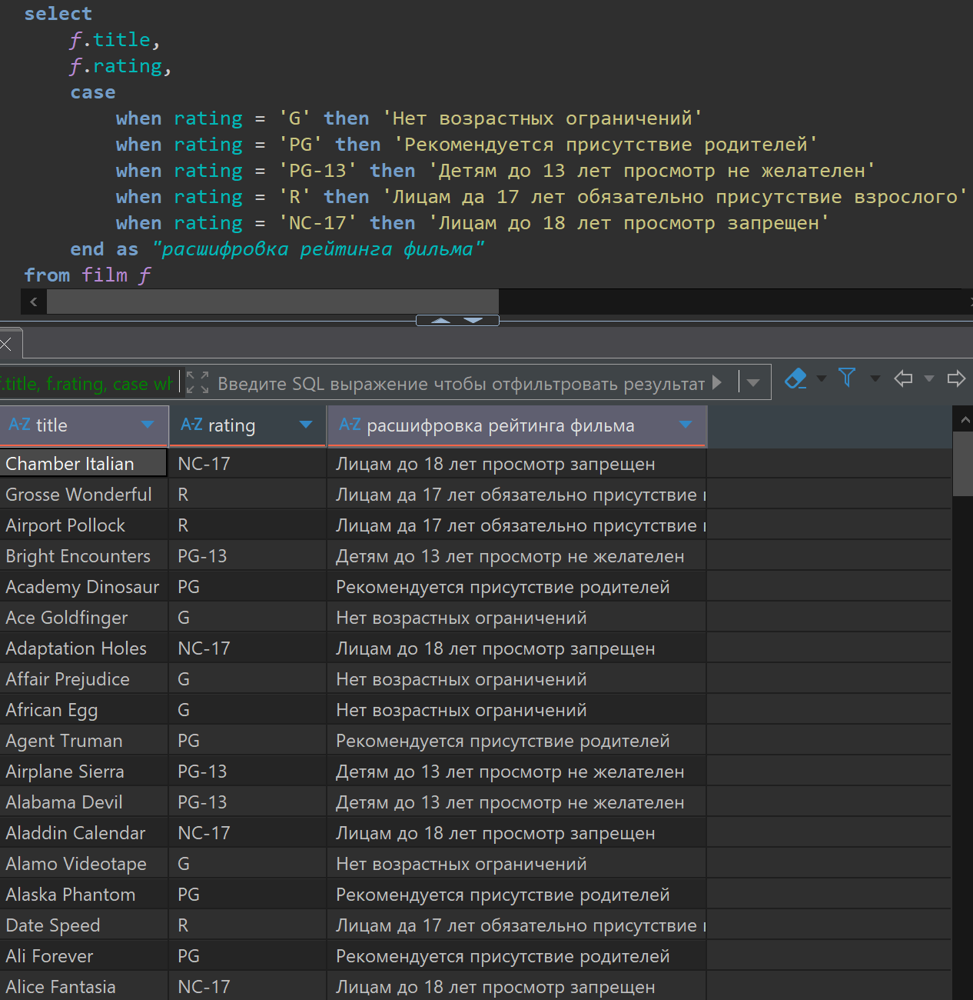
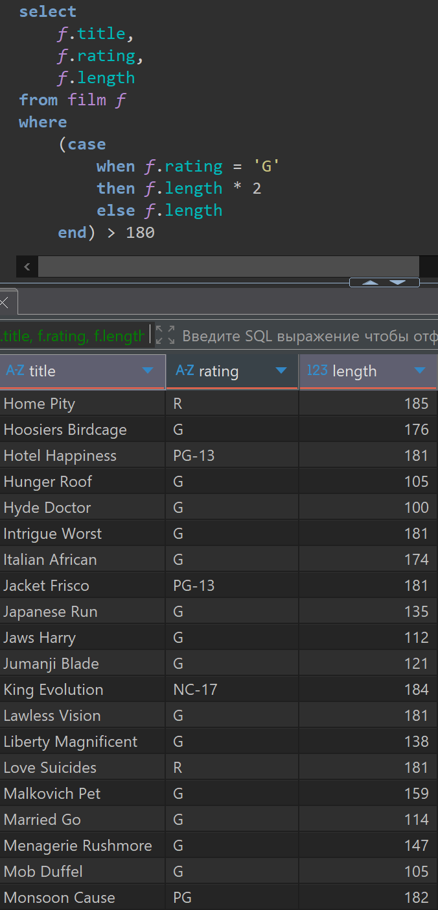
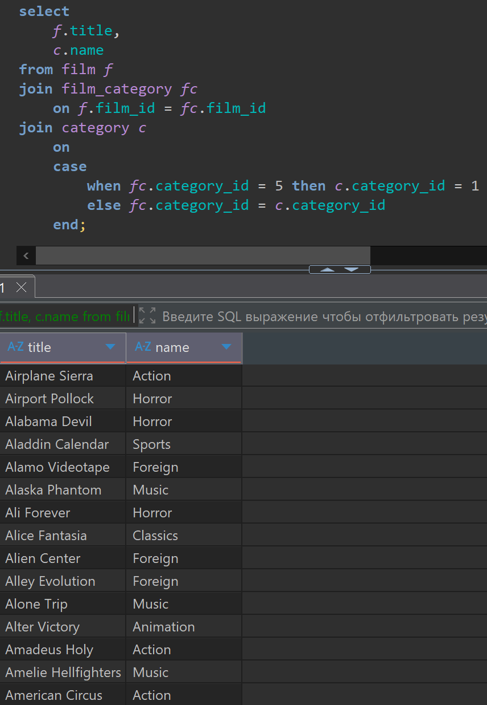
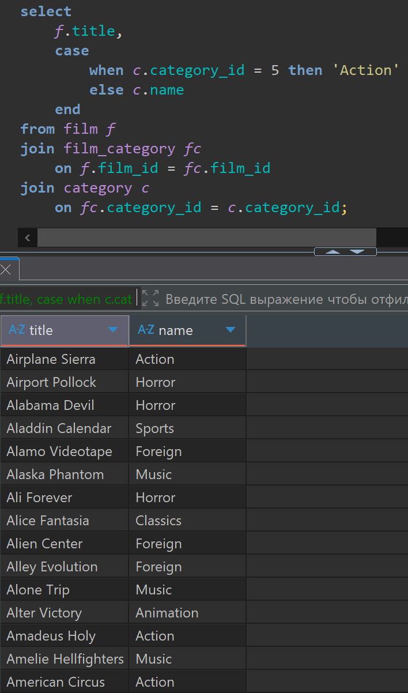

# Домашняя работа по получению условиям CASE

[link video](https://www.youtube.com/watch?v=ya7bAoWPPaI&list=PLzvuaEeolxkz4a0t4qhA0pxmttG8ZbBtd&index=31)

## Задание 1

Вывести список всех фильмов (film). По каждому фильму  отобразить 3 поля:

- название фильма (film.title)
- рейтинг фильма (film.rating)
- расшифровка рейтинга фильма

G - Нет возрастных ограничений

PG - Рекомендуется присутствие родителей

PG-13 - Детям до 13 лет просмотр не желателен

R - Лицам да 17 лет обязательно присутствие взрослого

NC-17 - Лицам до 18 лет просмотр запрещен.

Решение:

```SQL
select 
    f.title,
    f.rating,
    case
        when rating = 'G' then 'Нет возрастных ограничений'
        when rating = 'PG' then 'Рекомендуется присутствие родителей'
        when rating = 'PG-13' then 'Детям до 13 лет просмотр не желателен'
        when rating = 'R' then 'Лицам да 17 лет обязательно присутствие взрослого'
        when rating = 'NC-17' then 'Лицам до 18 лет просмотр запрещен'
    end as "расшифровка рейтинга фильма"
from film f
```

А решение выглядит так в DBeaver



## Задание 2

Вывести 3 колонки:

- название фильма (film.title)
- рейтинг фильма (film.rating)
- продолжительность фильма (film.length). Отобразить только фильмы продолжительностью более 120 минут. Для фильмов с рейтингом 'G' при проверке брать удвоенную продолжительность.

Решение:

```SQL
select 
    f.title,
    f.rating,
    f.length
from film f
where
    (case
        when f.rating = 'G'
        then f.length * 2
        else f.length 
    end) > 180
```

А решение выглядит так в DBeaver



## Задание 3

Вывести список фильмов (film). По каждому фильму нужно отобразить 2 колонки:

- название фильма (film.title)
- название категории фильмы (category.name).
Если фильм относится к категории с category_id = 5, то вместо категории с идентификатором 5 нужно отобразить категорию с category_id = 1.
Связь между таблицей фильмов (film) и таблицей категорий (category) осуществляется через таблицу (film_category)

Решение вариант 1-ый:

```SQL
select 
    f.title,
    c.name
from film f
join film_category fc
    on f.film_id = fc.film_id 
join category c 
    on 
    case 
        when fc.category_id = 5 then c.category_id = 1
        else fc.category_id = c.category_id
    end
```

А решение выглядит так в DBeaver



Вариант 2-ой решения

```SQL
select 
    f.title,
    case
        when c.category_id = 5 then 'Action'
        else c.name
    end
from film f
join film_category fc
    on f.film_id = fc.film_id 
join category c 
    on fc.category_id = c.category_id
```

А решение выглядит так в DBeaver



Оба варианта дают одинаковый результат.
