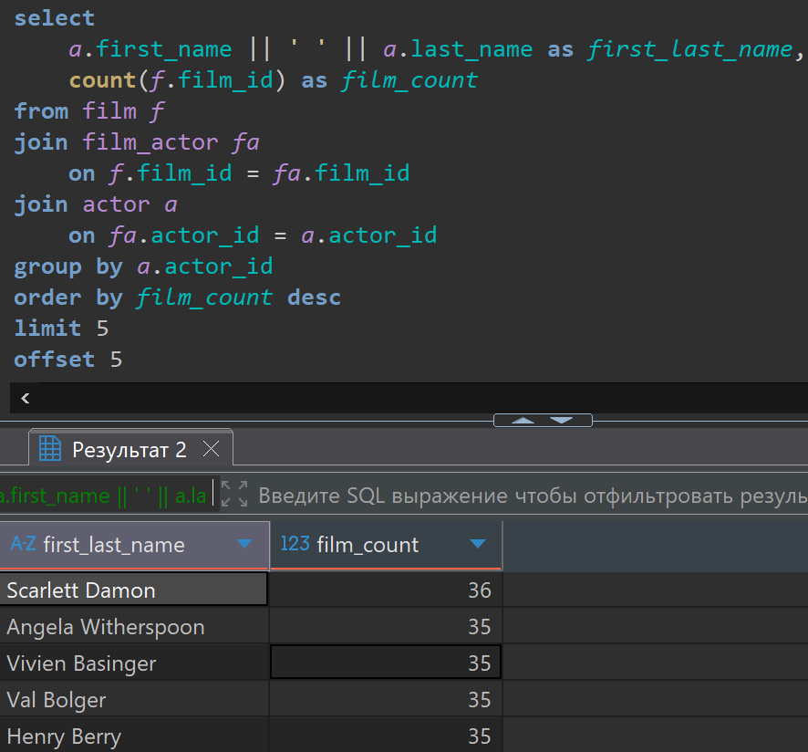
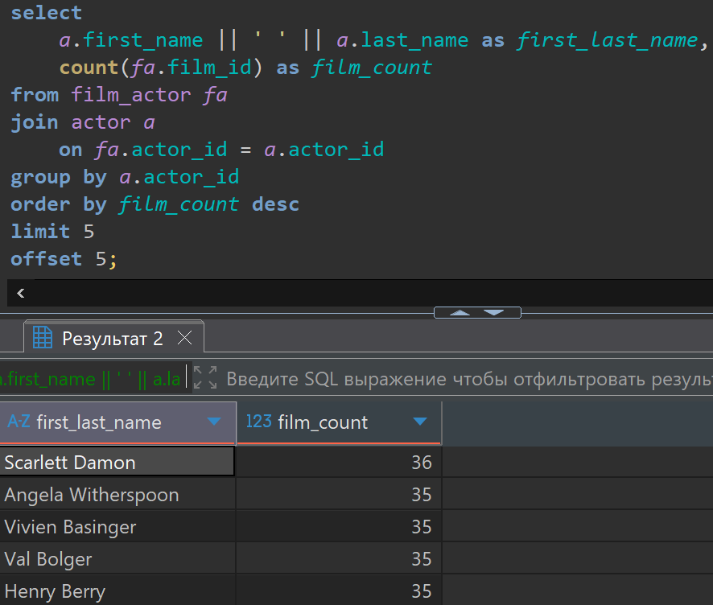
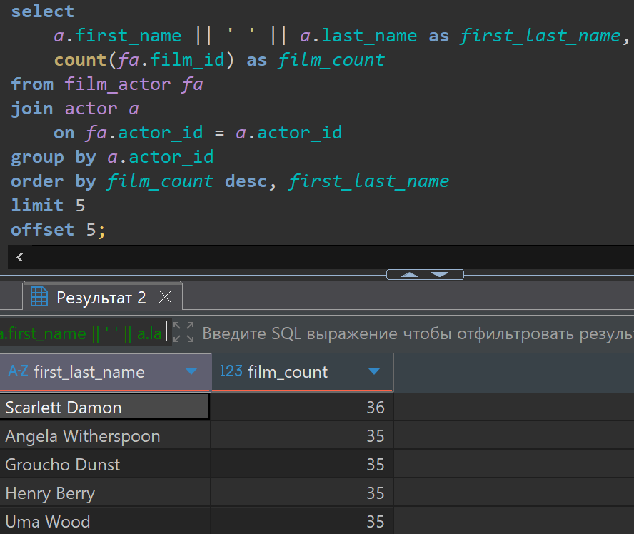
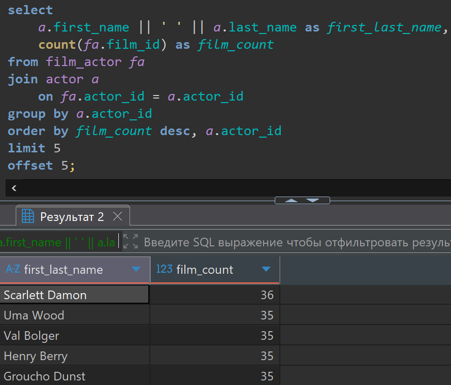

# Домашняя работа по получение части строк из результата с помощью Limit и Offset

[link video](https://www.youtube.com/watch?v=3t06-NorCM4&list=PLzvuaEeolxkz4a0t4qhA0pxmttG8ZbBtd&index=34)

## Задание 1

Написать запрос, который возвращает 2 колонки:

- Имя (first_name) и фамилию (last_name) актера через запятую.
- Количество фильмов, в которых снялся актер.

Нужно вывести вторую пятерку актеров (пять актеров, начиная с шестого) в порядке убывания количества фильмов, в которых они снимались

Решение:

```SQL
select 
    a.first_name || ' ' || a.last_name as first_last_name,
    count(f.film_id) as film_count
from film f
join film_actor fa 
    on f.film_id = fa.film_id 
join actor a 
    on fa.actor_id = a.actor_id 
group by a.actor_id
order by film_count desc
limit 5
offset 5;
```

А решение выглядит так в DBeaver



Можно сократить

```SQL
select 
    a.first_name || ' ' || a.last_name as first_last_name,
    count(fa.film_id) as film_count
from film_actor fa 
join actor a 
    on fa.actor_id = a.actor_id 
group by a.actor_id
order by film_count desc
limit 5
offset 5;
```

А решение выглядит так в DBeaver



Мы видим что у нас есть актеры с одинаковым количеством фильмов, а значит их порядок может поменяться, поэтому лучше добавить еще один параметр явной сортировки.

```SQL
select 
    a.first_name || ' ' || a.last_name as first_last_name,
    count(fa.film_id) as film_count
from film_actor fa 
join actor a 
    on fa.actor_id = a.actor_id 
group by a.actor_id
order by film_count desc, first_last_name
limit 5
offset 5;
```

А решение выглядит так в DBeaver



Но тут скрыта ошибка, так как у нас в базе есть актеры с одинаковыми фамилией и именем, то-есть мы их суммируем, это не правильно, поэтому лучше сгруппировать по a.actor_id, и отсортировать значения по количеству фильмов и потом в порядке следования a.actor_id.

```SQL
select 
    a.first_name || ' ' || a.last_name as first_last_name,
    count(fa.film_id) as film_count
from film_actor fa 
join actor a 
    on fa.actor_id = a.actor_id 
group by a.actor_id 
order by film_count desc, a.actor_id 
limit 5
offset 5;
```

А решение выглядит так в DBeaver


