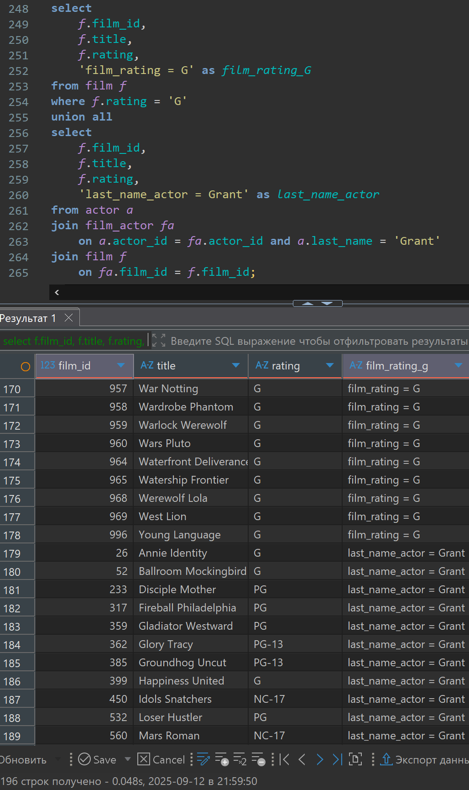
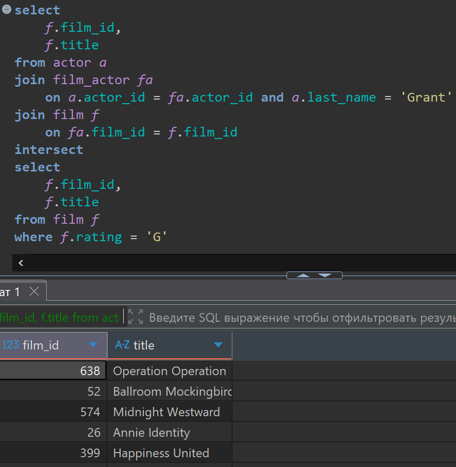
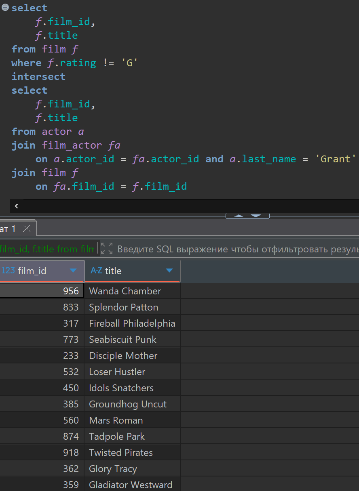

# Домашняя работа по UNION, UNION ALL, EXCEPT, INTERSECT

[link video](https://www.youtube.com/watch?v=9XiU61SyaNI&list=PLzvuaEeolxkz4a0t4qhA0pxmttG8ZbBtd&index=38)

## Задание 1

Получить список названий всех фильмов (film.title), рекомендованных для просмотра самыми маленькими зрителями.
Для этого нужно объединить результаты выполнения двух запросов:

- Получить все фильмы (film) с рейтингом 'G' (film.rating)
- Получить все фильмы (film), в которых снимался актер с фамилией Grant (actor.last_name = 'Grant'), этот актер которому у нас доверие, он снимается только в фильмах для самых маленьких вне зависимости от проставленного рейтинга.

Если какой-то фильм попадает в оба запроса, то его нужно вывести дважды. Решить задачу с использованием union all /или/ union /или/ except /или/ intersect

Логично использовать union all

Решение:

```SQL
select
    f.film_id,
    f.title,
    f.rating,
    'film_rating = G' as film_rating_G
from film f
where f.rating = 'G'
union all
select
    f.film_id,
    f.title,
    f.rating,
    'last_name_actor = Grant' as last_name_actor
from actor a
join film_actor fa 
    on a.actor_id = fa.actor_id and a.last_name = 'Grant'
join film f 
    on fa.film_id = f.film_id;
```

А решение выглядит так в DBeaver
Видим 196 строк в ответе



## Задание 2

Получить список названий всех фильмов (film.title) с рейтингом 'G' (film.rating), в которых снимался актер с фамилией Grant (actor.last_name = 'Grant') Решить задачу используя union all /или/ union /или/ except /или/ intersect

Решение:

```SQL
select
    f.film_id,
    f.title
from actor a
join film_actor fa 
    on a.actor_id = fa.actor_id and a.last_name = 'Grant'
join film f 
    on fa.film_id = f.film_id
intersect 
select
    f.film_id,
    f.title
from film f
where f.rating = 'G';
```

А решение выглядит так в DBeaver  получим всего 5 строк



## Задание 3

Получить список названий фильмов (film.title) с рейтингом НЕ 'G' (film.rating <> 'G'), в которых снимался актер с фамилией Grant (actor.last_name = 'Grant') Решить задачу используя union all /или/ union /или/ except /или/ intersect

Решение:

```SQL
select
    f.film_id,
    f.title
from film f
where f.rating != 'G'
intersect
select
    f.film_id,
    f.title
from actor a
join film_actor fa 
    on a.actor_id = fa.actor_id and a.last_name = 'Grant'
join film f 
    on fa.film_id = f.film_id;
```

Или вот так еще можно

```SQL
select
    f.film_id,
    f.title
from actor a
join film_actor fa 
    on a.actor_id = fa.actor_id and a.last_name = 'Grant'
join film f 
    on fa.film_id = f.film_id
except
select
    f.film_id,
    f.title
from film f
where f.rating = 'G';
```

А решение выглядит так в DBeaver получим всего 13 строк


