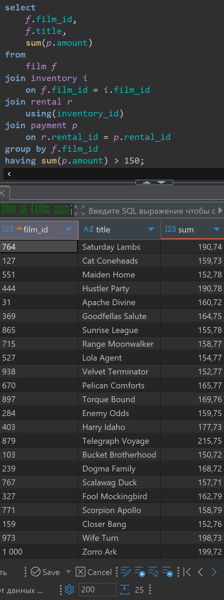
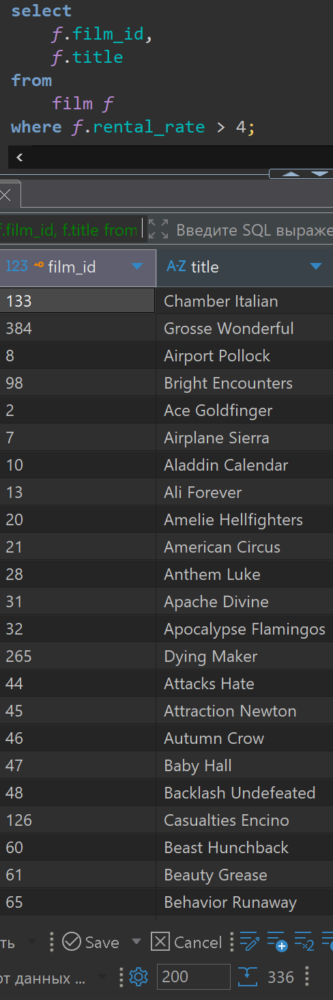
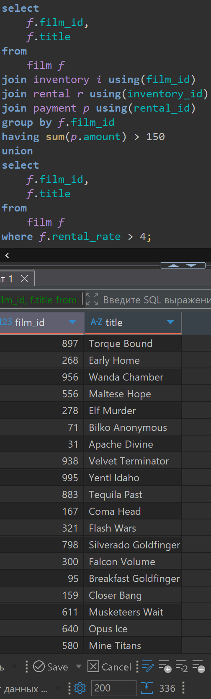
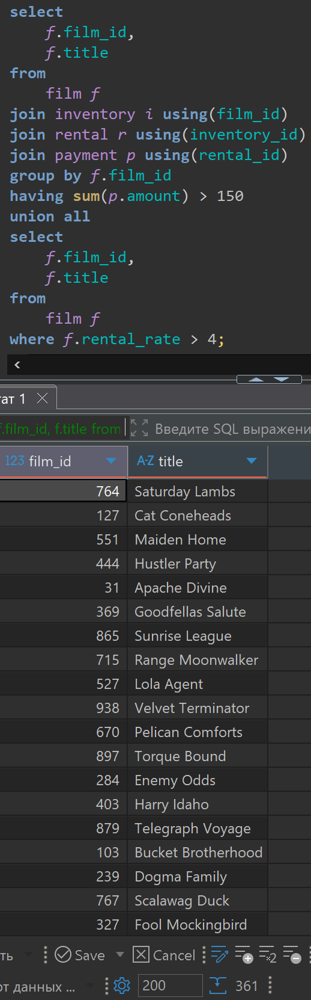
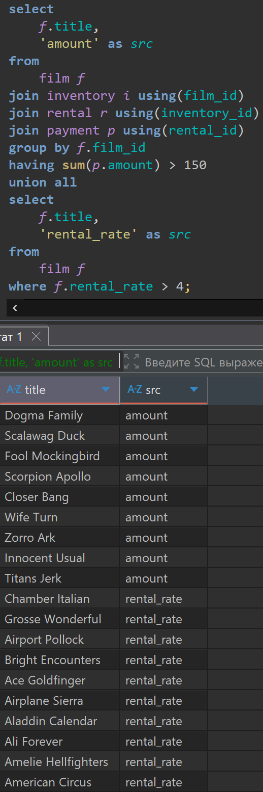
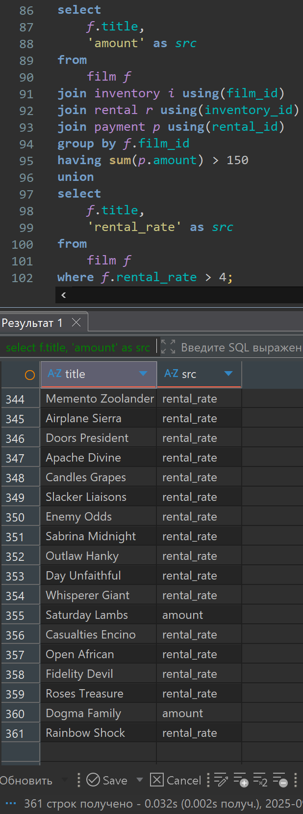
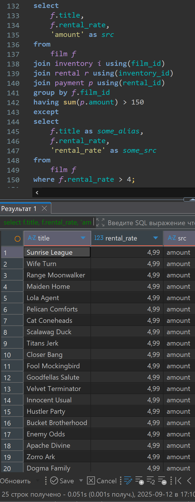
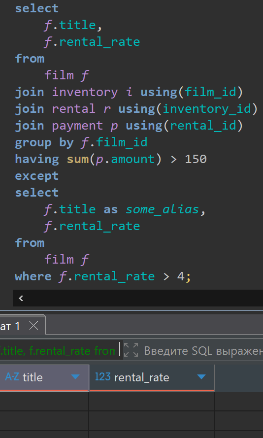
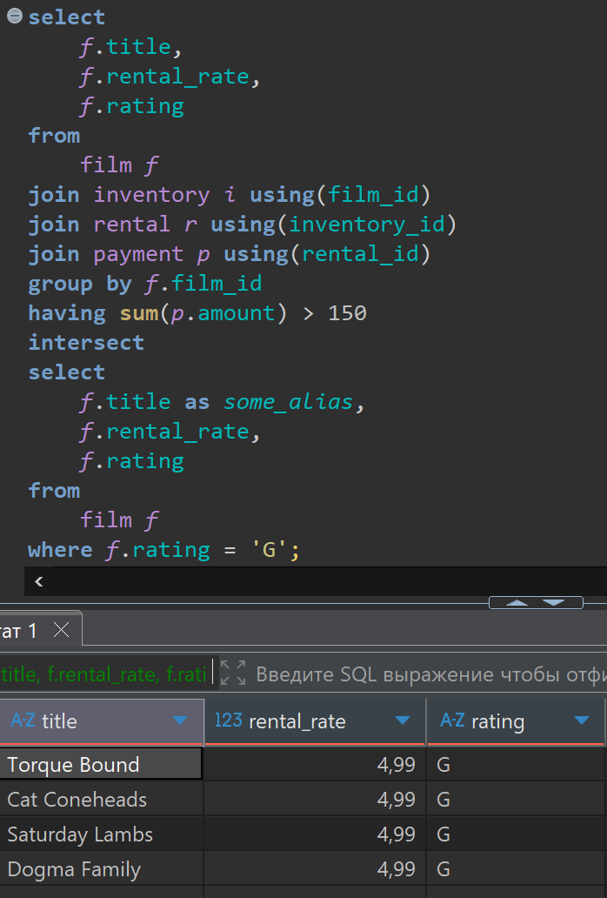

# Lesson 9

## Links

[link lesson](https://www.youtube.com/watch?v=LopLhQUGZjE&list=PLzvuaEeolxkz4a0t4qhA0pxmttG8ZbBtd&index=37)

## Объединение результатов запросов с помощью UNION (соединение с удалением дубликатов) UNION ALL(соединение без удалением дубликатов), EXCEPT (исключение), INTERSECT (объединение)

Бывают ситуации когда нам нужно сделать один запрос, затем еще один, и потом объединить результаты этих двух запросов

Для примера получим список самых топовых фильмов которые у нас есть в магазинах, но у нас есть несколько критериев топовых фильмов. Один из критериев это продажи таких фильмов должны быть больше 150. Второй критерий эти фильмы должны иметь rental_rate (арендная плата) больше 4. Если любой из условий соблюдается, то фильм считаем топовым

Можем сделать два различных запроса:
первый запрос получит фильмы по первому критерию, а
второй запрос получит фильмы по второму критерию

Получим все фильмы с объемом продаж больше 150

Решим вот так

```sql
select
    f.film_id,
    f.title,
    sum(p.amount)
from 
    film f
join inventory i
    on f.film_id = i.film_id 
join rental r 
    using(inventory_id) 
join payment p 
    on r.rental_id = p.rental_id
group by f.film_id 
having sum(p.amount) > 150;
```

Запрос в DBeaver выглядит так получится 25 строк фильмов которые удовлетворяют этому условию



Получим все фильмы которые имеют rental_rate (арендная плата) больше 4

Решим вот так

```sql
select
    f.film_id,
    f.title
from 
    film f
where f.rental_rate > 4;
```

Запрос в DBeaver выглядит так получится 336 строк фильмов которые удовлетворяют этому условию



Теперь если мы хотим объединить все фильмы из первого запроса и все фильмы из второго запроса, мы должны между этими запросами сделать объединение UNION

Причем при использовании оператора UNION у нас объединяться все записи обоих запросов при этом автоматически удалятся все дубликаты. После него останутся только уникальные строки.

Решим вот так

```sql
select
    f.film_id,
    f.title
from 
    film f
join inventory i using(film_id)
join rental r using(inventory_id) 
join payment p using(rental_id)
group by f.film_id 
having sum(p.amount) > 150
union
select
    f.film_id,
    f.title
from 
    film f
where f.rental_rate > 4;

```

Запрос в DBeaver выглядит так получится 336 строк фильмов в действительности первый наш запрос содержит в себе все записи второго запроса, так что все верно



Если мы хотим получить все строки из первого запроса и все строки из второго запроса не удаляя дубликаты, нам нужно использовать UNION ALL

Решим вот так

```sql
select
    f.film_id,
    f.title
from 
    film f
join inventory i using(film_id)
join rental r using(inventory_id) 
join payment p using(rental_id)
group by f.film_id 
having sum(p.amount) > 150
union all
select
    f.film_id,
    f.title
from 
    film f
where f.rental_rate > 4;
```

Запрос в DBeaver выглядит так получится уже 361 строка фильмов



Так же есть возможность указать по какому именно критерию фильм попал в наш список, добавив характерный признак назовем это поле src

Решим вот так

```sql
select
    f.title,
    'amount' as src
from 
    film f
join inventory i using(film_id)
join rental r using(inventory_id) 
join payment p using(rental_id)
group by f.film_id 
having sum(p.amount) > 150
union all
select
    f.title,
    'rental_rate' as src
from 
    film f
where f.rental_rate > 4;
```

Запрос в DBeaver выглядит так те-же 361 строк фильмов, только размечена признаком src. Который указывает причину попадания в наш список.



И в этом случае еще сделаем объединение с использованием  UNION

Решим вот так

```sql
select
    f.title,
    'amount' as src
from 
    film f
join inventory i using(film_id)
join rental r using(inventory_id) 
join payment p using(rental_id)
group by f.film_id 
having sum(p.amount) > 150
union
select
    f.title,
    'rental_rate' as src
from 
    film f
where f.rental_rate > 4;
```

Запрос в DBeaver увидим тоже 361 строк фильмов, только размечена признаком src. Который указывает причину попадания в наш список. Так как теперь у нас все строки уникальные из-за появления дополнительного признака src



Нужно понимать, что при использовании UNION база данных выполняет дополнительную работу, после объединения результатов она проводить сортировку, находит все одинаковые значения и их удалит, это нагружает систему, поэтому нужно это использовать, только если это действительно нужно для задачи.

UNION ALL действует проще он просто объединяет два результата запроса, ничего дополнительно не делает.

Можно обратить внимание что для каждой колонки у нас есть название, это название всегда берется из первого запроса, то есть если во втором, из объединяемых запросов, указать другие псевдонимы, в результирующе таблице названия останутся из первой таблицы

Условиями объединения двух запросов являются следующие:

- Количество столбцов в каждом из объединяемых запросов должно быть одинаковым.
- Типы данных столбцов в каждом из объединяемых запросов должны быть сопоставимы.

Так же само можно объединять и большее количество запросов.

Между двумя запросами можно делать не только объединение но, и например исключать записи в первом запросе содержащиеся во втором запросе.
Операция исключения результатов запроса одного из второго EXCEPT

Сделаем список всех фильмов у которых во первых, выручка (amount) по всем продажам больше 150, а во вторых, у которых rental_rate не больше 4

Решим вот так (это не правильный вариант)

```sql
select
    f.title,
    f.rental_rate,
    'amount' as src
from 
    film f
join inventory i using(film_id)
join rental r using(inventory_id) 
join payment p using(rental_id)
group by f.film_id 
having sum(p.amount) > 150
except 
select
    f.title as some_alias,
    f.rental_rate,
    'rental_rate' as some_src
from 
    film f
where f.rental_rate > 4;
```

Запрос в DBeaver увидим так 25 строк, попали соответственно записи только с маркировкой 'amount'
Видим что у нас на самом деле ни одна из строк не была удалена из первого запроса, так как у нас есть поле src, и оно не одинаково в обоих запросах, и не будет удалено при исключении ни одна запись
Это такая особенность этой операции.



Поэтому правильно будет решить так:

```sql
select
    f.title,
    f.rental_rate
from 
    film f
join inventory i using(film_id)
join rental r using(inventory_id) 
join payment p using(rental_id)
group by f.film_id 
having sum(p.amount) > 150
except 
select
    f.title as some_alias,
    f.rental_rate
from 
    film f
where f.rental_rate > 4;
```

Запрос в DBeaver увидим так 0 строк, Видим что на самом деле у нас все фильмы попавшие в первый запрос имеют 'rental_rate' больше 4. Можно убедится выполнив первый запрос что у всех его строчек rental_rate равен (4,99). Поэтому они все и исключаются.



Теперь рассмотрим третий тип объединения запросов, это пересечение запросов INTERSECT

Для примера сделаем список фильмов у которых во первых, выручка (amount) по всем продажам больше 150, а во вторых, у которых rating 'G' (Нет возрастных ограничений)

```sql
select
    f.title,
    f.rental_rate,
    f.rating
from 
    film f
join inventory i using(film_id)
join rental r using(inventory_id) 
join payment p using(rental_id)
group by f.film_id 
having sum(p.amount) > 150
intersect
select
    f.title as some_alias,
    f.rental_rate,
    f.rating
from 
    film f
where f.rating = 'G';
```

Запрос в DBeaver увидим так 4 строки.



По приоритетам выполнения этих операций от самого приоритетного в порядке убывания
union all
union
except

intersect
