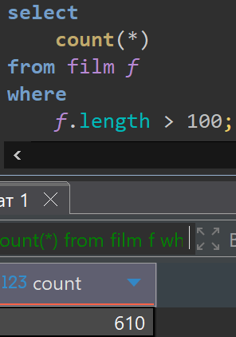

# Lesson 10

## Links

[link lesson](https://www.youtube.com/watch?v=_ooZ053KwGk&list=PLzvuaEeolxkz4a0t4qhA0pxmttG8ZbBtd&index=40)

## Фильтрация в агрегатных функциях FILTER

Эта тема как расширение возможностей группировок из урока урока 9 файл readme_les_7.md

Когда мы не указываем группировку, в group by, но используем группирующую функцию, например COUNT(), то логически весь запрос воспринимается как одна группа, и в нашем примере рассчитывается количество строк всего в запросе.

```sql
select 
    count(*)
from film f;
```

Запрос в DBeaver выглядит так, видим что всего в таблице film всего 1000 строк с фильмами.


Например нам нужно посмотреть сколько фильмов продолжительностью больше 100

```sql
select 
    count(*)
from film f
where 
    f.length > 100;
```

Запрос в DBeaver выглядит так, видим что всего в таблице film всего 610 таких фильмов.



Но можно вычислить одновременно в одном запросе, сколько всего фильмов, и сколько фильмов продолжительностью больше 100. Для этого нужно наложить ограничение для группирующей функции, для этого использовать FILTER() и этой функции передать само ограничение

```sql
select 
    count(*),
    count(*) filter(where f.length > 100)
from film f;
```

Запрос в DBeaver выглядит так, со следующими результатами
всего 1000 строк с фильмами,
а фильмов продолжительностью больше 100 всего 610 строк.


И таким образом можно комбинировать различные условия, выводя нужную информацию применяя FILTER()

При этом можно использовать FILTER() и при группировках GROUP BY.
Например сделаем группировку по рейтингу фильма film.rating

```sql
select
    f.rating,
    count(*),
    count(*) filter(where f.length > 100)
from film f
group by f.rating;
```

Запрос в DBeaver выглядит так


Вот у нас есть такая гибкая возможность применения инструмента фильтрации FILTER()
