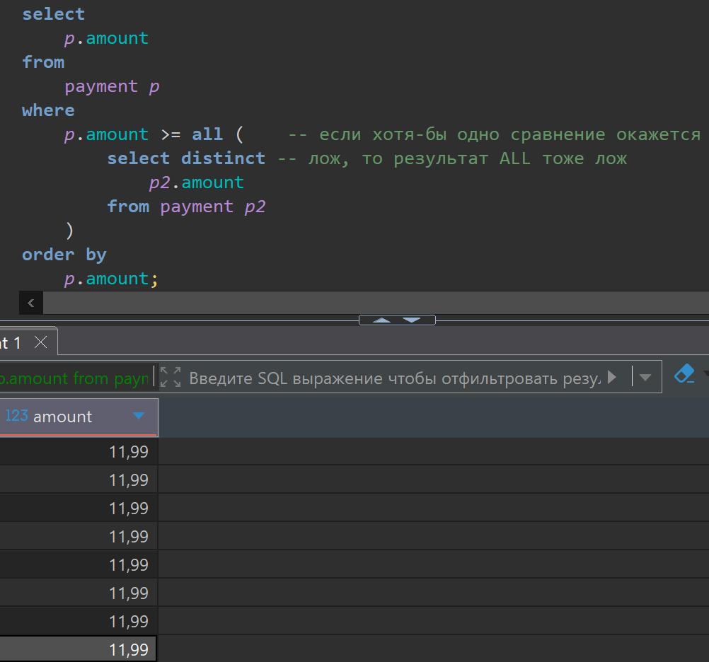

# Lesson 11

## Links

[link lesson](https://www.youtube.com/watch?v=B98hVzEUM-8&list=PLzvuaEeolxkz4a0t4qhA0pxmttG8ZbBtd&index=44)

## Подзапросы

Подзапросы это когда внутри запроса у нас есть другой запрос, у которого есть свои блоки select, from, where, group by, having и так далее.

Подзапросы могут использоваться по разному, есть специальные функции которые используют подзапросы. Так же есть подзапросы бывают при расчете полей в select. При расчете таблиц которые мы присоединяем к другим таблицам в блоке from.

Во первых поговорим про функции которые мы используем, при проверки условий.
Например, представим себе, что у нас база данных очень выросла, и нам нужно удалить все неиспользуемые данные, у нас есть таблица адресов (address) в которой привязаны адреса к конкретным покупателям, еще у нас есть таблица покупатель (customer) где есть его данные и ссылка поле address_id конкретного покупателя в таблице address. Попробуем посмотреть, а есть ли у нас такие адреса, на которые ни один из покупателей не ссылается, может продавец начал заводить на него запись, но покупатель передумал, не стал ничего брать, ушел, а адрес уже введен, вот такие адреса можно найти, и смело все по удалять, тем самым разгрузив базу данных.

Для таких целей есть функция NOT EXISTS()
Функция NOT EXISTS() принимает внутрь себя подзапрос, и проверяет, а вернет ли этот подзапрос хотя-бы одну строчку, если хотя-бы одну строчку вернет, то EXISTS() вернет истину (true), а если ни одной строки не будет, то то EXISTS() вернет лож (false).

Мы пишем подзапрос в котором так-же есть свои select, from, where, и все остальное, запросим данные в таблице покупатели (customer) и наложим условие идентификатор поля (customer.address_id) должен быть равен с идентификатором внешней таблицы (address.address_id)

```sql
select *
from 
    address a 
where
    not exists(
        select 1 -- что бы не нагружать базу запрашивая дополнительно данные из таблицы
        from customer c 
        where
            c.address_id = a.address_id 
    );
```

Запрос в DBeaver выглядит так, получим 4-е идентификатора (address_id) которых нет в покупателях

Такие подзапросы в которых мы ссылаемся на внешнюю таблицу, называют Коррелирующие (зависимые)
Коррелированный подзапрос отличается от некоррелированного подзапроса тем, что он выполняется не один раз перед выполнением запроса, в который он вложен, а для каждой строки, которая может быть включена в окончательный результат


Рассмотрим другой пример функция IN
Она тоже умеет использовать подзапросы. Для примера получим все фильмы, из категорий в которых, больше 70-и фильмов суммарно.

```sql
select 
    f.title,
    c.name 
from film f 
join film_category fc
    on f.film_id = fc.film_id 
join category c 
    on fc.category_id  = c.category_id 
where 
    c.category_id in (
                        select 
                            fc.category_id
                        from film_category fc 
                        group by 
                            fc.category_id
                        having count(*) > 70
                     );
```

Запрос в DBeaver выглядит так, получим 147 строк с фильмами


Здесь подзапрос не ссылается на внешнюю таблицу, поэтому это не коррелирующий подзапрос. Такой запрос выполнится один раз, и затем его результат будет использоваться для проверки каждой строчки внешнего запроса.

Среди значений в функции IN могут быть NULL

```sql
select 1 in (1, 2); -- true
select 1 in (2, 3); -- false

select 1 in (1, 2, null); -- true
select 1 in (2, 3, null); -- NULL
select null in (1, 2, null); -- NULL
select null in (2, 3); -- NULL
```

Лучше NULL исключить из результатов подзапросов и их не искать в результатах подзапросов.

Еще в where для подзапросов можно использовать функцию SOME (ANY) они идентичны по поведению и работе

Например, мы хотим в таблице payment найти все платежи кроме самых маленьких, будем делать запрос из таблицы (payment), имеется ввиду кроме нуля.

Когда мы используем ANY (SOME) и подзапрос возвращает нам строки и выражение будет сравниваться с каждой из строк, и если сравнение будет истина хотя бы для одной из строк, то все выражение будет истина.

```sql
select 
    p.amount 
from 
    payment p 
where
    p.amount > any (     -- если хотя-бы одно сравнение окажется 
        select distinct  -- истина, то результат any тоже истина  
            p2.amount 
        from payment p2
    )
order by 
    p.amount;
```

Запрос в DBeaver выглядит так увидим что нулевые платежи запрос исключил


Противоположным образом ведет себя функция ALL()
Например мы хотим вывести самые крупные платежи. Для этого мы пишем что наш payment.amount >= всех значений, получим в итоге самые крупные платежи в базе, тут наше выражение будет сравниваться с каждой из строк, и если сравнение будет истина со всеми строками подзапроса, то все выражение будет истина, если хотя-бы одно сравнение будет лож то и все выражение ложно.

```sql
select 
    p.amount 
from 
    payment p 
where
    p.amount >= all (    -- если хотя-бы одно сравнение окажется 
        select distinct -- лож, то результат ALL тоже лож  
            p2.amount 
        from payment p2
    )
order by 
    p.amount;
```

Запрос в DBeaver выглядит так увидим самые крупные платежи из всей базы


Хорошей практикой использования подзапросов, это использование их при расчете значения поля в select.
Для такого расчета этот подзапрос должен возвращать ровно одну строку с одной ячейкой, и значение этой ячейки и будет выведено в результате.

Как пример выведем список всех фильмов, для каждого фильма выведем его название, рейтинг, а также сколько всего фильмов с таким рейтингом в базе, также хотим отобразить сколько всего фильмов в базе данных, еще одним полем выведем название категории фильма.

В итоге будет связный (коррелирующий) запрос он будет рассчитан для каждого фильма, очень затратный запрос, лучше такого не делать на самом деле, но для примера мы делаем

Для нахождения название категории фильма тоже понадобится коррелирующий запрос, решение будет работать в случае когда у каждого фильма только одна категория, как в нашей базе.

```sql
select 
    f.title,
    f.rating,
    (
        select 
            count(*)
        from 
            film f2
        where
            f2.rating = f.rating 
    ) as film_rating_count,
    (
        select count(*)
        from film f3
    ) as film_all_count,
    (
        select c.name
        from film_category fc
        join category c 
            on fc.category_id = c.category_id 
        where fc.film_id = f.film_id 
    ) as category_name
from film f;
```

Запрос в DBeaver выглядит так


Еще один способ использования подзапросов, это использование их как отдельных таблиц, и использование их в блоке from.
Например, мы хотим получить список всех фильмов в которых снялось больше 10 актеров.
Реализуем просто запросом выводящим нам список из film_id с такими фильмами

```sql
select
    fa.film_id
from film_actor fa
group by fa.film_id 
having count(fa.actor_id) > 10;
```

Запрос в DBeaver выглядит так, получим 27 фильмов в которых снялось больше 10 актеров


Теперь можем использовать это как подзапрос в блоке where для получения информации о фильмах

```sql
select f.title 
from film f
where 
    10 < (
        select count(*)
        from film_actor fa 
        where fa.film_id  = f.film_id 
    );
```

Запрос в DBeaver выглядит так, получим те-же 27 фильмов. Это получился коррелирующий запрос который не эффективный.


Теперь можем использовать это как подзапрос в блоке from, такое можно применять, это довольно частый метод применения подзапросов.

```sql
select f.title, fi.actor_count 
from film f
join (
    select
    fa.film_id,
    count(fa.actor_id) as actor_count
    from film_actor fa
    group by fa.film_id 
    having count(fa.actor_id) > 10
) as fi
    on fi.film_id = f.film_id;
```

Запрос в DBeaver выглядит так, получим те-же 27 фильмов. Это получится несвязный подзапрос который нормальный по эффективности.


Или вот еще пример с рейтингами фильмов, и количеством фильмов такого рейтинга тоже с подзапросом в блоке from.

```sql
select f.title, f.rating, fr.cnt 
from film f 
join (
    select 
        f.rating, 
        count(*) as cnt
    from film f
    group by f.rating 
) as fr
    on f.rating = fr.rating;
```

Запрос в DBeaver выглядит так, получим для всех 100 фильмов в базе. Это получится несвязный подзапрос который нормальный по эффективности.


В дальнейшем мы еще научимся писать код красивее, используя немного другие конструкции (cte).
