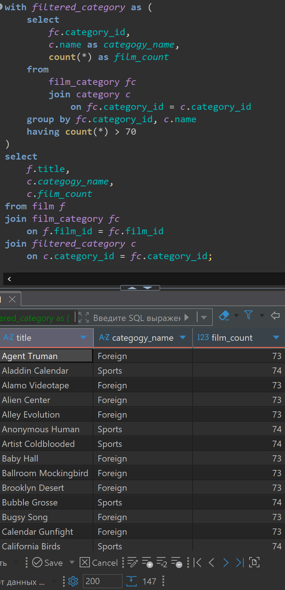
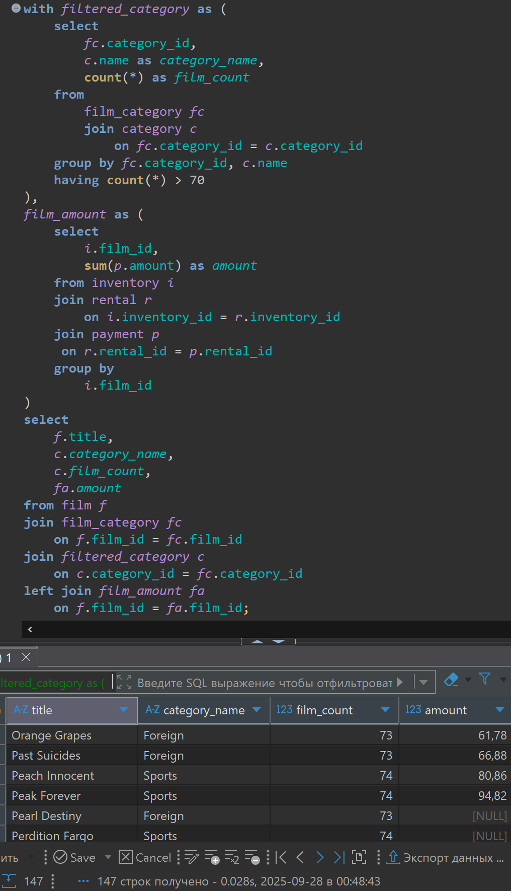
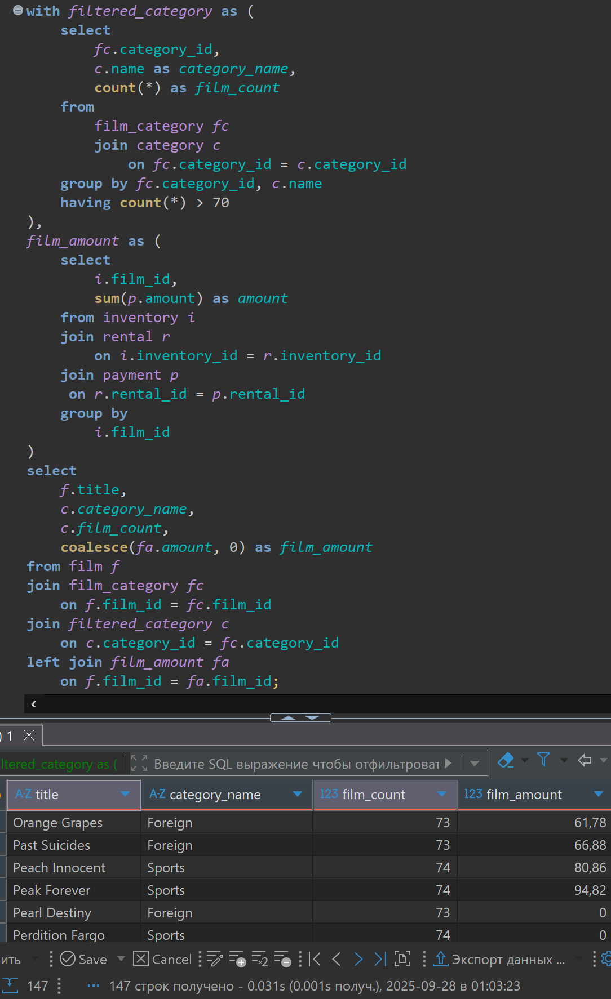

# Lesson 12

## Links

[link lesson](https://www.youtube.com/watch?v=At3z4JQYc8E&list=PLzvuaEeolxkz4a0t4qhA0pxmttG8ZbBtd&index=47)

## Общие табличные выражения common table expression (CTE)

Расшифровывается CTE как common table expression (общие табличные выражения)

Они существуют для упрощения читабельности запроса, когда мы один большой запрос можем разделить на
небольшие части и каждая часть будет читабельна и понятна.

Мы помним что можем использовать подзапросы в блоке FROM, и соединять их с другими таблицами,
но при этом, сам запрос становится тяжело читаемым. Для избегания такого утяжеления восприятия запросов
и созданы общие табличные выражения.

Представим такую задачу, нам нужно вывести все фильмы из категорий в которых больше 70 фильмов.
Нам нужно вывести название фильма, название категории фильма, а также сколько всего фильмов в этой категории фильмов.
Для решения будем использовать CTE.

Для создания CTE мы используем ключевое слово WITH и используем его до использования SELECT.
Даем название этому with выражению (в нашем случае назовем filtered_category). Далее ключевое
слово AS и в круглых скобках, пишем запрос результат которого будет являться общим табличным выражением (CTE)

```sql
with filtered_category as (
    select
        fc.category_id,
        c.name as category_name,
        count(*) as film_count
    from 
        film_category fc 
        join category c 
            on fc.category_id = c.category_id 
    group by fc.category_id, c.name
    having count(*) > 70
)
select 
    f.title,
    c.category_name,
    c.film_count
from film f 
join film_category fc 
    on f.film_id = fc.film_id
join filtered_category c
    on c.category_id = fc.category_id;
```

Запрос в DBeaver выглядит так, видим всего 147 фильмов попало в выборку, и у нас всего 2-е категории которые попадают под условие.


Получившейся запрос хорошо читается, легко понять что где происходит, в отличии от использования подзапросов

Точно так же мы можем использовать и несколько общих табличных выражений.

Например к той же задаче мы например хотим добавить общий объем выручки для каждого фильма из этой выборки.
При этом мы этот расчет выручки сделаем отдельным общим табличным выражением

Когда у нас несколько CTE, после написания первого, после круглых скобок () мы указываем , (запятую)
и пишем название второго CTE (в нашем случае это будет film_amount)

```sql
with filtered_category as (
    select
        fc.category_id,
        c.name as category_name,
        count(*) as film_count
    from 
        film_category fc 
        join category c 
            on fc.category_id = c.category_id 
    group by fc.category_id, c.name
    having count(*) > 70
),
film_amount as (
    select
        i.film_id,
        sum(p.amount) as amount
    from inventory i
    join rental r
        on i.inventory_id = r.inventory_id 
    join payment p 
     on r.rental_id = p.rental_id
    group by 
        i.film_id
)
select 
    f.title,
    c.category_name,
    c.film_count,
    fa.amount
from film f 
join film_category fc 
    on f.film_id = fc.film_id
join filtered_category c
    on c.category_id = fc.category_id
left join film_amount fa
    on f.film_id = fa.film_id;
```

Запрос в DBeaver выглядит так, видим всего 147 фильмов попало в выборку, и у нас всего 2-е категории которые попадают под условие.
Так же видно, что у нас есть фильмы по которых не было в прокате (нет продаж по дискам) у них NULL


Чтобы значений NULL не было, а были нуль 0, что более адекватно, то есть нулевые продажи напишем так. Применим функцию coalesce()

Функция COALESCE возвращает первый попавшийся аргумент, отличный от NULL. Если же все аргументы равны NULL, результатом тоже будет NULL. Это часто используется при отображении данных для подстановки некоторого значения по умолчанию вместо значений NULL:

`SELECT COALESCE(description, short_description, '(none)')`
Этот запрос вернёт значение description, если оно не равно NULL, либо short_description, если оно не NULL, и строку (none), если оба эти значения равны NULL.

```sql
with filtered_category as (
    select
        fc.category_id,
        c.name as category_name,
        count(*) as film_count
    from 
        film_category fc 
        join category c 
            on fc.category_id = c.category_id 
    group by fc.category_id, c.name
    having count(*) > 70
),
film_amount as (
    select
        i.film_id,
        sum(p.amount) as amount
    from inventory i
    join rental r
        on i.inventory_id = r.inventory_id 
    join payment p 
     on r.rental_id = p.rental_id
    group by 
        i.film_id
)
select 
    f.title,
    c.category_name,
    c.film_count,
    coalesce(fa.amount, 0) as film_amount
from film f 
join film_category fc 
    on f.film_id = fc.film_id
join filtered_category c
    on c.category_id = fc.category_id
left join film_amount fa
    on f.film_id = fa.film_id;
```

Запрос в DBeaver выглядит так


Так же при расчете 2-ого CTE мы можем использовать 1-е CTE то есть то которое уже объявлено заранее. Имена CTE должны быть разными, иначе будет ошибка. Если задать имя CTE такое же как название таблицы, то ошибки не будет, но так делать не стоит, так как тогда мы не сможем использовать ту таблицу в нашем запросе, так как имя CTE его займет. Такой нюанс следует учитывать.

При использовании CTE, следует учитывать что они существуют только в рамках запроса перед которым эти CTE указаны. В следующем запросе они уже будут недоступны.

При использовании CTE создаются в памяти базы данных временные таблицы, что является лишним нагружением базы данных, ведь их нужно создавать, затем удалять, когда они уже выполнились, в новых версиях postgres мы можем сами решать создавать временную таблицу или использовать CTE так же как обычные подзапросы, выполняя его прямо во время выполнения, ничего предварительно не рассчитывая. Делается это так. Если мы хотим что бы создавались временные таблицы, то мы пишем после AS ключевое слово MATERIALIZED. Если не хотим что бы создавалась временная таблица пишем NOT MATERIALIZED

Если мы не указываем эти ключевые слова, указывающие явно создаем мы временную таблицу или нет, то если CTE используется только один раз, то временная таблица не создается, а подставляется подзапросом, а если используется больше 2-х раз в запросе, то временная таблица создается.

```sql
with filtered_category as materialized (
    select
        fc.category_id,
        c.name as category_name,
        count(*) as film_count
    from 
        film_category fc 
        join category c 
            on fc.category_id = c.category_id 
    group by fc.category_id, c.name
    having count(*) > 70
),
film_amount as not materialized (
    select
        i.film_id,
        sum(p.amount) as amount
    from inventory i
    join rental r
        on i.inventory_id = r.inventory_id 
    join payment p 
     on r.rental_id = p.rental_id
    group by 
        i.film_id
),
total_amount as not materialized (
    select sum(fa.amount) as total_amount
    from film_amount fa
)
select 
    f.title,
    c.category_name,
    c.film_count,
    coalesce(fa.amount, 0) as film_amount,
    (select total_amount from total_amount)
from film f 
join film_category fc 
    on f.film_id = fc.film_id
join filtered_category c
    on c.category_id = fc.category_id
left join film_amount fa
    on f.film_id = fa.film_id;
```

Это такой тоже нюанс, возможно он и не пригодится в реальной работе, можно отдавать это на усмотрение самой базы данных, но знать нужно, и при необходимости использовать.
