# Lesson 13

## Links

[link lesson](https://www.youtube.com/watch?v=Y03xFWa9yGU&list=PLzvuaEeolxkz4a0t4qhA0pxmttG8ZbBtd&index=51)

## Оконные функции

Оконные функции играют огромную роль, они появились в стандарте SQL относительно недавно, в 2003 году
в 2008 году стандарт были дополнен. Так сложилось исторически, что до этого все работали и без них, но
они помогают упростить ряд запросов, и нужно знать как ими пользоваться, по важности функционал сравним с функционалом группировок.

На примере запишем запрос, в котором получим список всех фильмов, по каждому фильму выведем название фильма, рейтинг фильма, продолжительность фильма, и мы хотим выяснить какая минимальная продолжительность фильма среди всех с рейтингом 'NC-17'
Мы можем написать так к любой агрегатной функции дописать функцию OVER() которая говорит что эта функция будет оконной. Внутри функции OVER() пишем описание окна для всех оконных функций оно стандартное.
Пишем PARTITION BY (аналог group by) и указываем на какие группы мы хотим делить все строки и какую группу взять.
Мы возьмем поле rating это будет значить что при расчете этой функции у нас будут взяты все строки в таблице film c таким же значением f.rating как у текущей строки (в нашем случае для первой строки это NC-1, для второй это 'R' и так далее).
Дадим этой строке название min_rating_length. То есть рассчитаем минимальную продолжительность фильма с таким же рейтингом. Результат автоматически будет отсортирован по рейтингу (но на это рассчитывать не стоит).

```sql
select 
    f.title,
    f.rating,
    f.length,
    min(f.length) over(partition by f.rating) as min_rating_length
from film f 
order by
    f.rating,
    f.length;
```

Запрос в DBeaver выглядит так

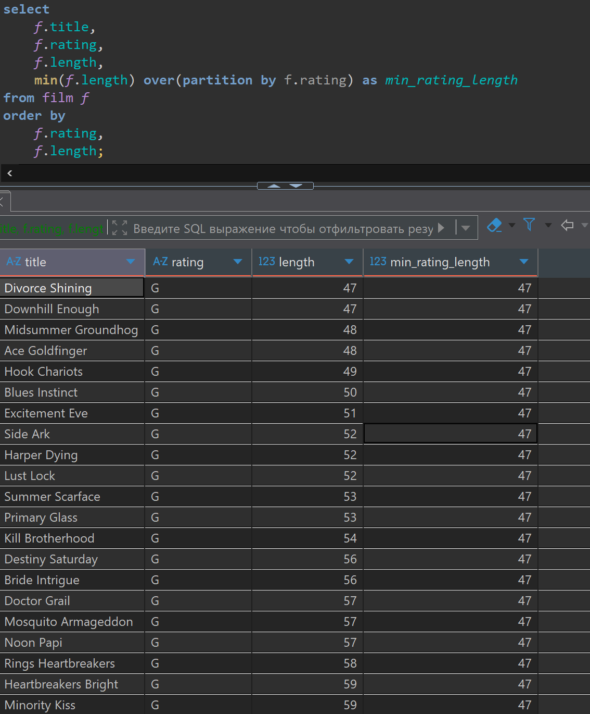

Если не написать PARTITION BY, то в этом случае буду взяты все строки, они не будут разбиты по группам все строки попадут в одну, таким образом для всех фильмов, не зависимо от рейтинга получим минимальную продолжительность для всех строчек.

```sql
select 
    f.title,
    f.rating,
    f.length,
    min(f.length) over(partition by f.rating) as min_rating_length,
    min(f.length) over() as min_length
from film f 
order by
    f.rating,
    f.length;
```

Запрос в DBeaver выглядит так

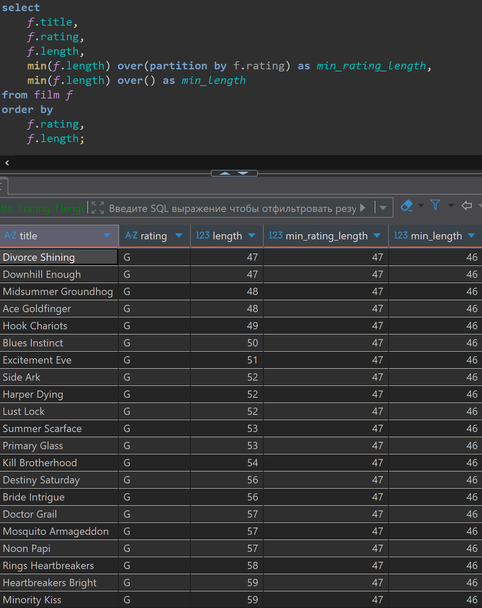

Какие функции могут быть оконными: во первых это все агрегатные функции
min(), max(), avg(), sum(), count()

Если у нас повторяется тело оконной функции (внутри OVER()) то, можно это окно определить отдельно, а потом использовать внутри функции OVER().
Для определения оконной функции пишем WINDOW затем название окна (в нашем примере 'w') затем AS и в круглых скобках само определение функции. И функция WINDOW должна идти до ORDER BY

```sql
select 
    f.title,
    f.rating,
    f.length,
    min(f.length) over w as min_rating_length,
    max(f.length) over w as max_rating_length,
    avg(f.length) over w as avg_rating_length,
    sum(f.length) over w as sum_rating_length,
    count(f.length) over w as count_rating_length
from film f 
window w as (partition by f.rating)
order by
    f.rating,
    f.length;
```

Запрос в DBeaver выглядит так

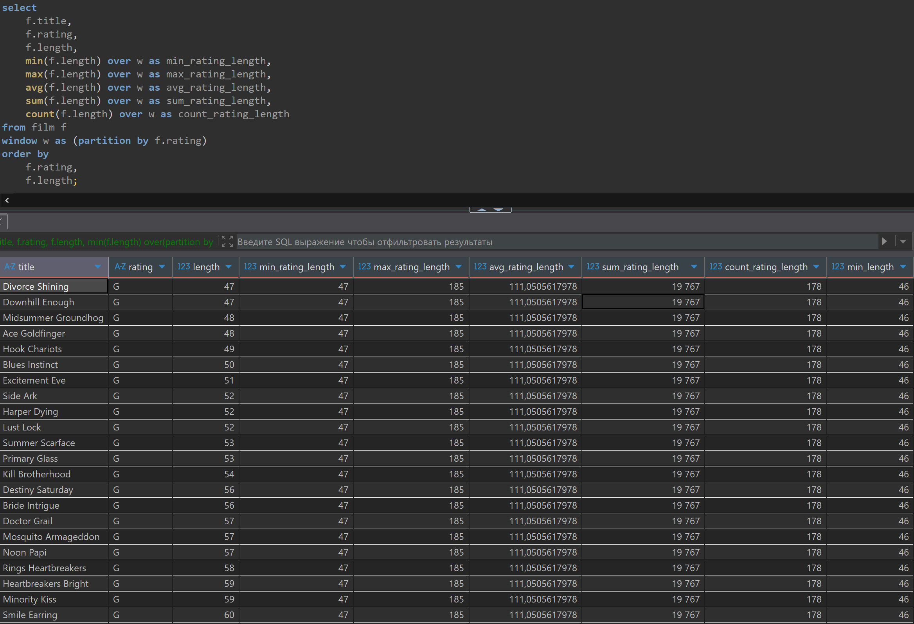

Во вторых, помимо агрегатных функций, есть другие оконные функции, и они очень важные, это ранжирующие функции, они каждой строке дают какой то номер. Рассмотрим пример.
Будем так же из таблицы film выводить название фильма (title), рейтинг фильма (rating), продолжительность фильма (length), и мы хотим каждому фильму в рамках рейтинга дать свой номер, пронумеровать фильмы каждого рейтинга, для этого есть функция ROW_NUMBER().
Если мы хотим не просто в любом порядке пронумеровать, то мы можем внутри OVER() использовать ORDER BY,
сортировать будем по продолжительности (length) фильма.

```sql
select 
    f.title,
    f.rating,
    f.length,
    row_number() over(partition by f.rating) as rn
from film f;
```

Запрос в DBeaver выглядит так

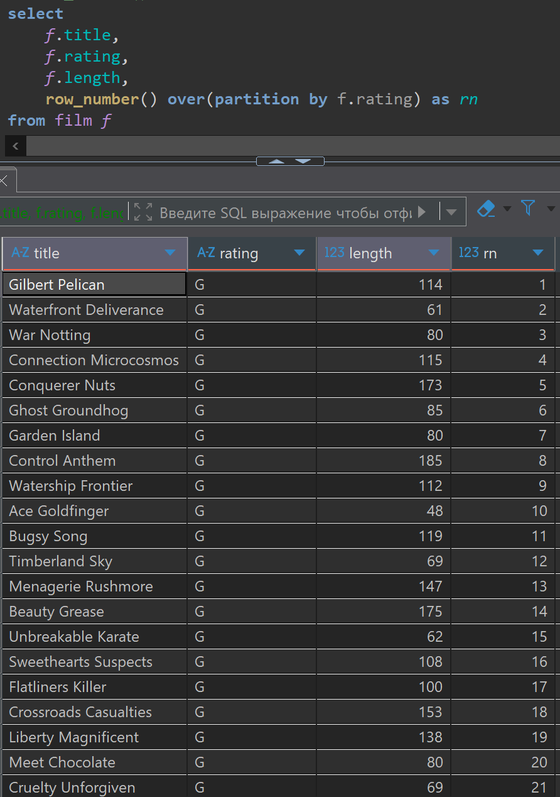

```sql
select 
    f.title,
    f.rating,
    f.length,
    row_number() over(partition by f.rating order by f.length) as rn
from film f;
```

Запрос в DBeaver выглядит так

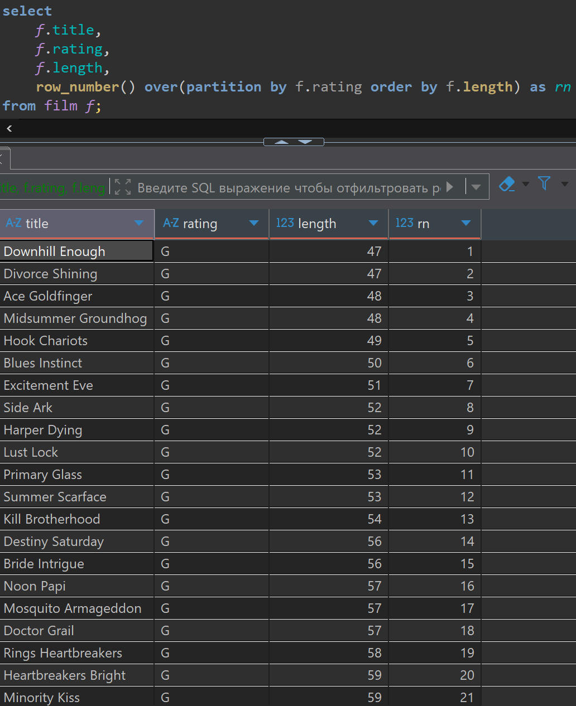

ROW_NUMBER() всегда дает строкам разные номера, но есть еще другие ранжирующие функции

Функция RANK() с таким же окном как предыдущий вариант, у строк порядок сортировки которых одинаковый им дается одинаковый номер, а именно номер первой строчки с таким порядком, следующему элементу с другой продолжительностью фильма функция присвоит номер такой же как в поле c функцией row_number

и
Функция DENSE_RANK() с таким же окном как предыдущий вариант, строкам с одинаковым приоритетом сортировки даем
одно и тоже значение, но следующей группе строк у которых другой приоритет сортировки, мы даем номер на единицу больше.

Эти функции очень полезны и помогают решать различные задачи, поэтому их обязательно нужно знать.

```sql
select 
    f.title,
    f.rating,
    f.length,
    row_number() over(partition by f.rating order by f.length) as r_n,
    rank() over(partition by f.rating order by f.length) as rank,
    dense_rank() over(partition by f.rating order by f.length) as d_rank
from film f;
```

Запрос в DBeaver выглядит так

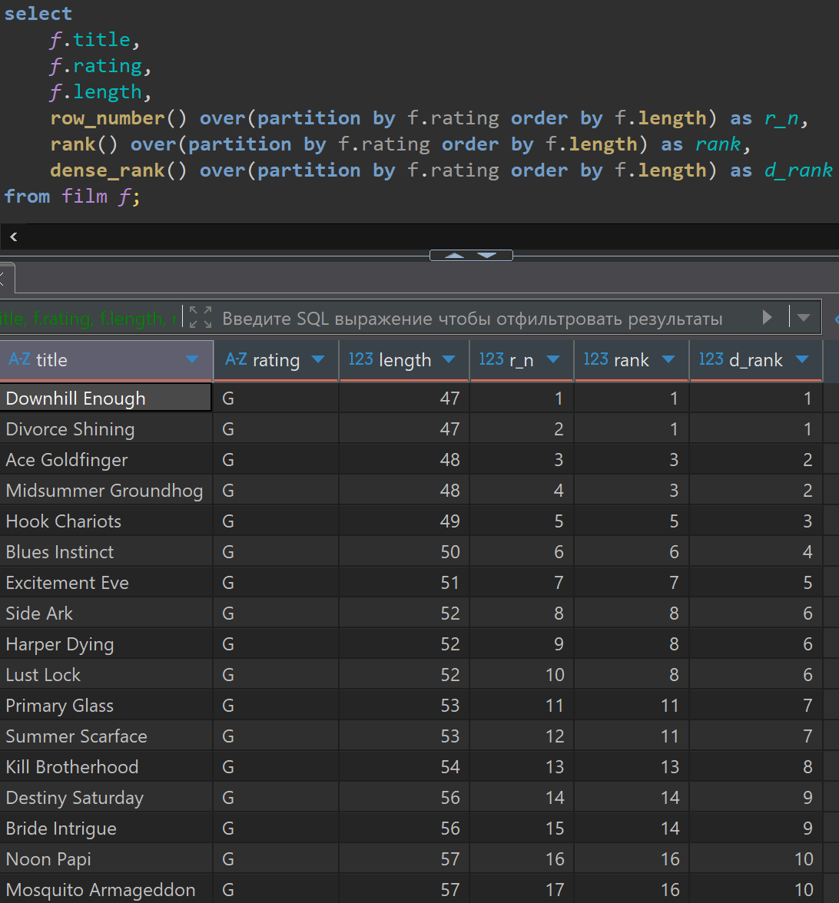

Есть еще две важные функции получения предыдущей строки в окне, или следующей строки в окне,
воспользуемся тем же запросом что и в предыдущем примере, но допустим мы хотим получить продолжительность предыдущего фильма с таким же рейтингом, а так же узнать на сколько текущий фильм длиннее относительно предыдущего. Такие запросы могут быть полезны при работе с датами, когда мы строим например суммы выручки по дням относительно текущей даты и вчерашнего дня.

И так, есть функция LAG() ей мы передаем значение поля которого мы хотим получить относительно предыдущей строки, и указываем шаг на какой нам нужно сместится выше при работе. Увидим что в первой строчке у нас будет NULL так как
для нее предыдущего значения нет.

```sql
select 
    f.title,
    f.rating,
    f.length,
    lag(f.length, 1) over(partition by f.rating order by f.length) as prev_length
from film f;
```

Запрос в DBeaver выглядит так

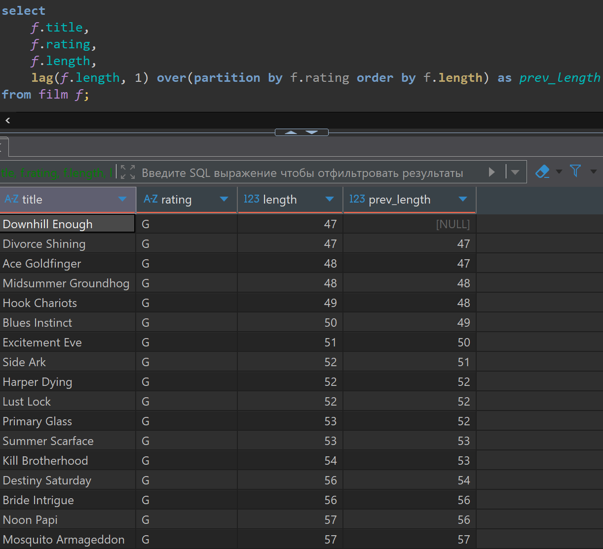

Что бы получить продолжительность следующего фильма относительно текущего, мы можем использовать аналогичную
Функцию LEAD() ей мы передаем значение поля которое мы хотим получить относительно следующей строки, и указываем шаг на какой нам нужно сместится ниже при работе.

```sql
select 
    f.title,
    f.rating,
    f.length,
    lag(f.length, 1) over(partition by f.rating order by f.length) as prev_length,
    lead(f.length, 1) over(partition by f.rating order by f.length) as next_length
from film f;
```

Запрос в DBeaver выглядит так

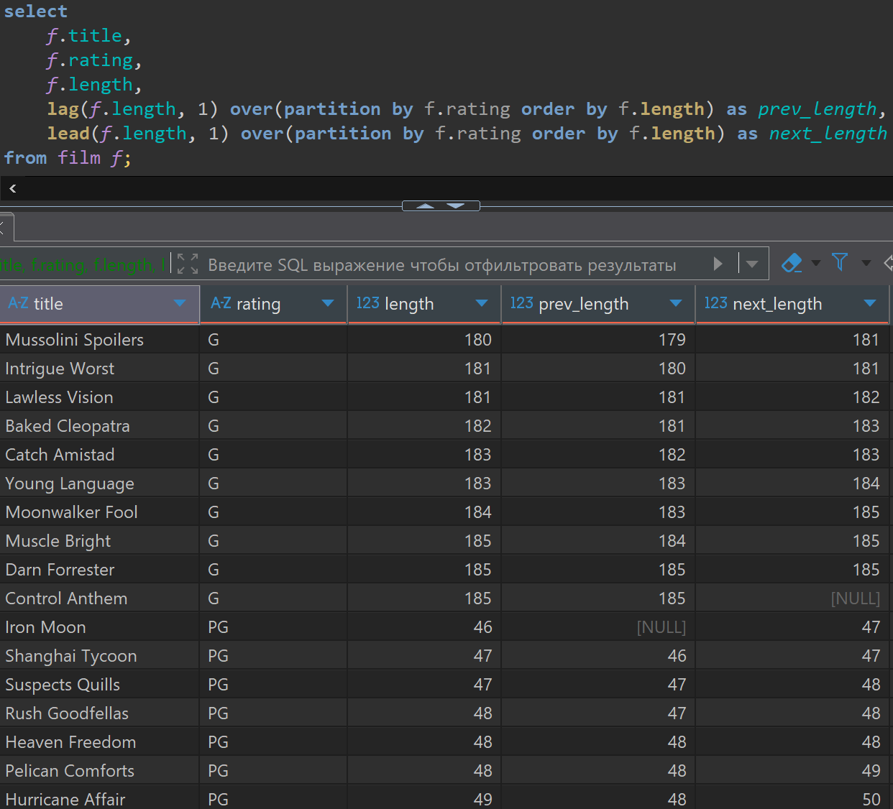

Теперь для получения разницы, а на сколько длина каждого фильма отличается от длины предыдущего фильма,
для решения можем записать так. Мы берем длину текущего фильма (f.length) и вычитаем из нее выражение в котором получим длину предыдущего фильма (всю оконную функцию) и дадим этому полю название diff_length

```sql
select 
    f.title,
    f.rating,
    f.length,
    lag(f.length, 1) over(partition by f.rating order by f.length) as prev_length,
    lead(f.length, 1) over(partition by f.rating order by f.length) as next_length,
    f.length - lag(f.length, 1) over(partition by f.rating order by f.length) as diff_length
from film f;
```

Запрос в DBeaver выглядит так

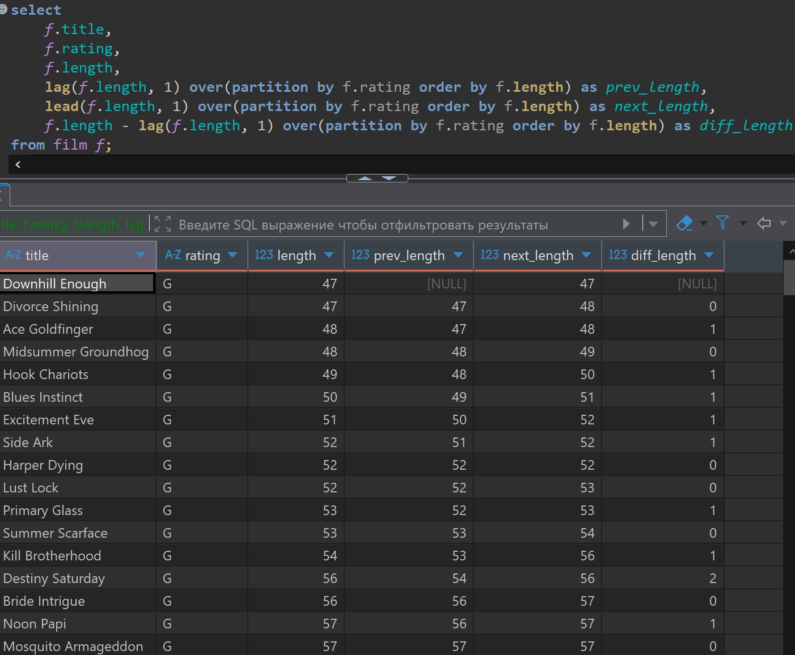

Эти оконные функции это основное что нужно знать хорошо и надежно.
Дальше то что будем смотреть, это встречается крайне редко.

--------------------------------------------------------------------------------------------------------------

Во первых, мы можем все строки разделить на несколько групп, например у нас есть шестнадцать категорий фильмов в таблице category, мы получим их все, представим что у нас в магазине 8 (восемь) стеллажей и нам нужно по этим 8-ми стеллажам распределить все 16 категорий.
Понимаем что в каждый стеллаж будет распределено по 2-е категории фильмов. То есть диски с фильмами этих категорий. База данных (СУБД) может сама нам пронумеровать на какой стеллаж какой фильм нужно поместить.

Для этого можем использовать функцию NTILE() ей в качестве аргумента передаем количество групп (это 8 в нашем случае) на которые нужно разделить, и внутри OVER() мы можем указать в рамках каких групп нам делить на эти группы, в нашем случае мы все фильмы хотим, поэтому тут ничего на группы не делим (не используем partition by), а укажем сортировку по category_id назовем поле с этой разбивкой на восемь категорий как group_id

```sql
select 
    c."name",
    c.category_id,
    ntile(8) over(order by c.category_id) as group_id
from category c;
```

Запрос в DBeaver выглядит так

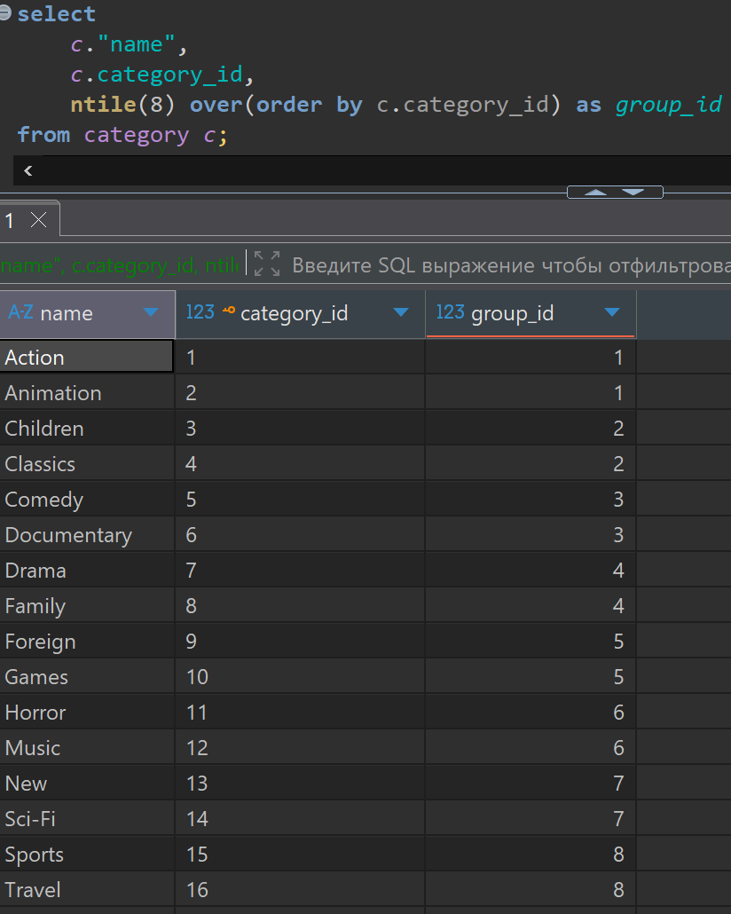

Рассмотрим еще случай когда нам нужно совместить группировку с оконной функцией. Например нужно посчитать на каждую дату сколько было фактов сдачи в аренду в эту дату. И так же на сколько в эту дату у нас отличается сдача в аренду от предыдущей даты.
Для решения мы можем написать запрос выберем из таблицы rental все даты сдачи в аренду rental.rental_date.
И сгруппируем эти данные по дате и посчитаем количество аренд в каждой дате.
И в конце уже сделаем сравнение с количеством аренд в предыдущую дату, изначально для решения отсортируем данные по дате.
Нужно понимать что при формировании запроса, вначале происходит соединение всех таблиц в блоке FROM, затем те строки которые получены фильтруются в блоке WHERE (если этот блок есть), отфильтрованные там строки группируются в блоке GROUP BY (если он есть). После мы фильтруем полученные данные в блоке HAVING (если он есть). Только после этого мы начинаем рассчитывать оконные функции.

```sql
select 
    date(r.rental_date) as date,
    count(*) as count_for_date,
    lag(count(*), 1) over(order by date(r.rental_date)),
    count(*) - lag(count(*), 1) over(order by date(r.rental_date)) as diff_cnt
from rental r
group by
    date    
order by
    date;
```

Запрос в DBeaver выглядит так, видим что где-то есть рост количества аренд, есть и отрицательные числа.

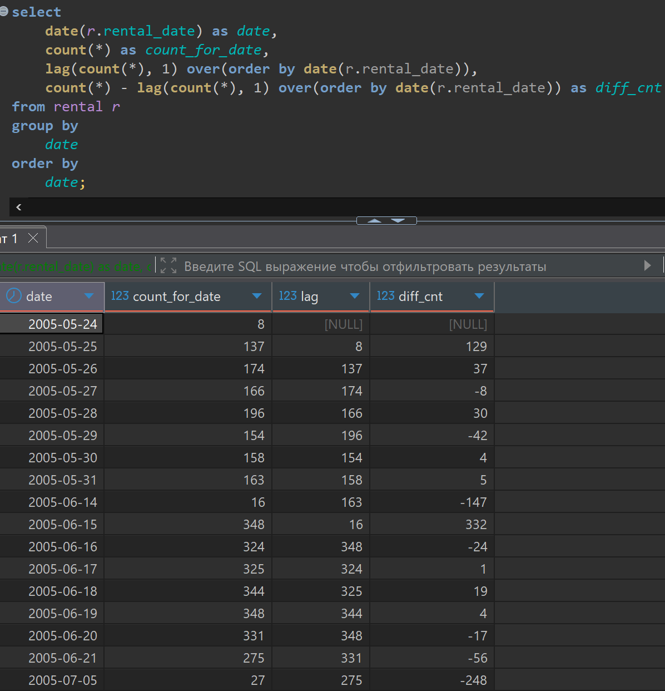

Вывод можно сделать такой - внутри оконных функций мы можем использовать функции группировок, но не наоборот

Еще одно понятие в рамках оконных функций - задание рамок окна. Что это такое, мы рассмотрим на примере, для которого воспользуемся общим табличным выражением (CTE), что-бы было проще, в нем на каждый день рассчитаем сколько у нас было фактов сдачи в аренду дисков.

Затем на основе этого запроса, мы хотим получить значения колебаний сдач в аренду за каждые три дня работы.
За текущую дату, за вчера, и за позавчера.

Это делается с помощью ROWS BETWEEN 2 PRECEDING AND CURRENT ROW (между двумя предыдущими и текущей строками) и дадим табличному выражению название three_days_cnt

```sql
with rent_day as (
    select 
        date(r.rental_date) as day_date,
        count(*) as count_for_date
    from 
        rental r 
    group by
        day_date
)
select 
    r.day_date,
    r.count_for_date,
    sum(r.count_for_date) over(order by r.day_date rows between 2 preceding and current row) as tree_days_cnt
from 
    rent_day r;
```

Запрос в DBeaver выглядит так, видим суммы между двумя предыдущими и текущей строками.

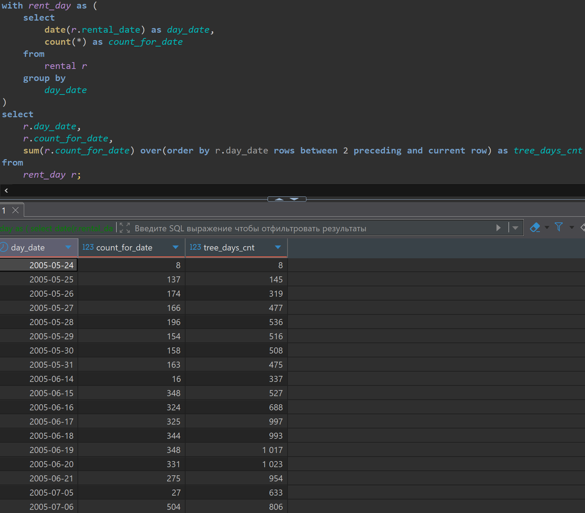

Нужно разобрать как нам можно задавать диапазон, мы указываем начало диапазона и конец диапазона.
Можно указать
CURREN ROW (текущая строка)
PRECEDING (предыдущий)
FOLLOWING (следующих)

Если мы хотим просуммировать три дня до и три дня после, то мы запишем так
sum(r.count_for_date) over(order by r.day_date rows between 2 preceding and 3 following) as week_cnt

Так же можно указать в качестве начала диапазона брать все строки до текущей строки.
А в качестве окончания диапазона можно указать все строки после текущей строки.

Например хотим посчитать накопительный итог сколько у нас аренды накопилось к каждому дню.
Используем
sum(r.count_for_date) over(order by r.day_date rows between unbounded preceding and current row) as week_cnt
UNBOUNDED (безграничный)

И можем указать что хотим все строки до текущей строки и все строки после текущей строки. Тут в каждой строке будет общая сумма, так как рамок у окна нет.
Используем
sum(r.count_for_date) over(order by r.day_date rows between unbounded preceding and unbounded following) as total_cnt

Вот таким образом можно эти ключевые слова использовать в оконных функциях для достижения нужного результата вычислений.

```sql
with rent_day as (
    select 
        date(r.rental_date) as day_date,
        count(*) as count_for_date
    from 
        rental r 
    group by
        day_date
)
select 
    r.day_date,
    r.count_for_date,
    sum(r.count_for_date) over(order by r.day_date rows between 2 preceding and current row) as tree_days_cnt,
    sum(r.count_for_date) over(order by r.day_date rows between current row and current row) as current_cnt,
    sum(r.count_for_date) over(order by r.day_date rows between 3 preceding and 3 following) as week_cnt,
    sum(r.count_for_date) over(order by r.day_date rows between unbounded preceding and current row) as week_cnt,
    sum(r.count_for_date) over(order by r.day_date rows between unbounded preceding and unbounded following) as total_cnt
from 
    rent_day r;
```

Запрос в DBeaver выглядит так, видим следующее

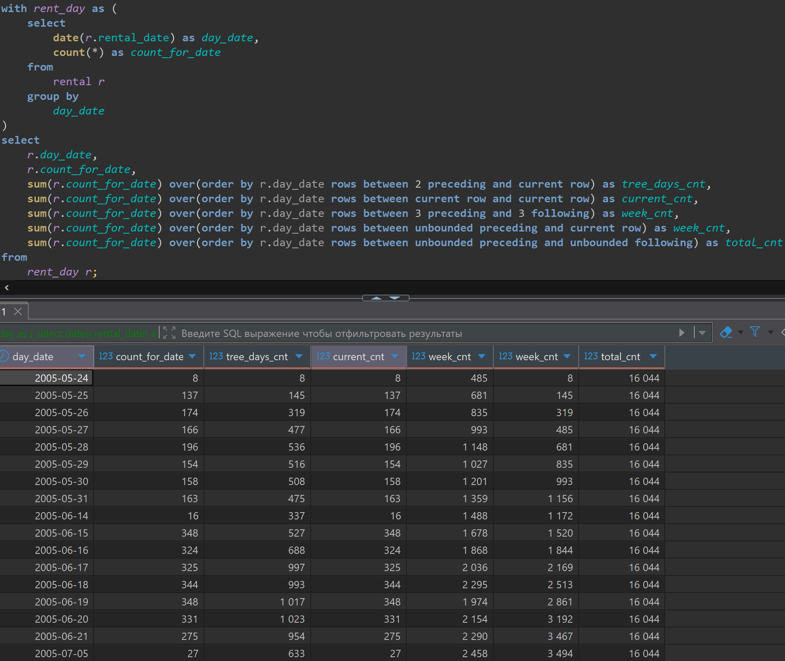

Есть еще один формат записи диапазонов, это когда мы пишем вместо ROWS а RANGE, для примера возьмем предыдущий пример где мы из фильмов получаем их название, рейтинг и продолжительность и будем рассчитывать накопительным итогом, в рамках фильмов с одинаковым рейтингом отсортируем их по продолжительности, и будем показывать общую сумму продолжительности фильмов от текущего и взяв все фильмы с меньшей продолжительностью

```sql
select 
    f.title,
    f.rating,
    f.length,
    sum(f.length) over(partition by f.rating order by f.length rows between unbounded preceding and current row) as cum_len_row
from film f;
```

Запрос в DBeaver выглядит так, видим следующее

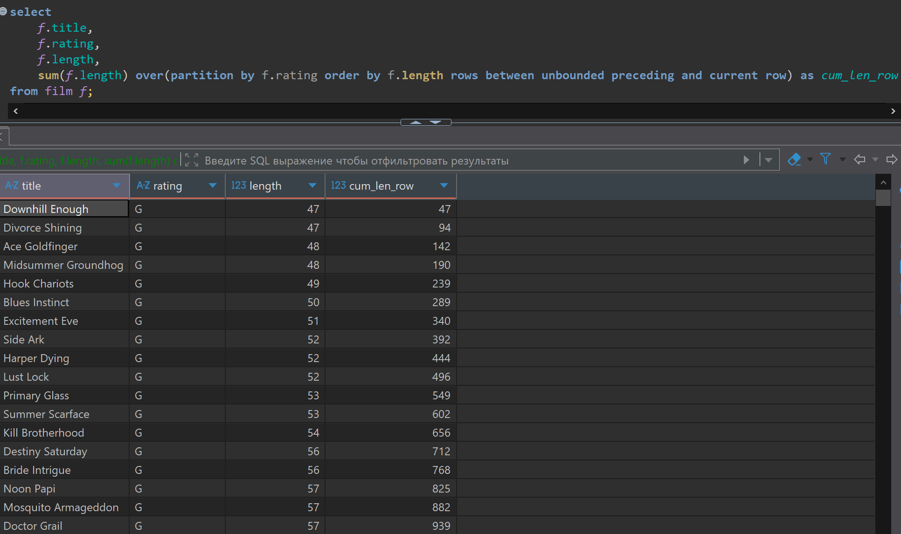

А теперь применим RANGE. Для понимания как это работает, нужно ввести понятие родственных строк.
Мы отсортировали все фильмы по продолжительности, но фильмы с одинаковой продолжительностью являются родственными, то-есть при выполнении запроса с ROWS мы действительно берем весь указанный диапазон строк и текущую строку, и делаем то что написано, когда используется RANGE то мы берем указанный диапазон, текущую строку, а так же добавляем все родственные строки для текущей

```sql
select 
  f.title,
  f.rating,
  f.length,
  sum(f.length) over(partition by f.rating order by f.length rows between unbounded preceding and current row) as cum_l_row,
  sum(f.length) over(partition by f.rating order by f.length range between unbounded preceding and current row) as cum_l_range
from film f;
```

Запрос в DBeaver выглядит так, видим следующее

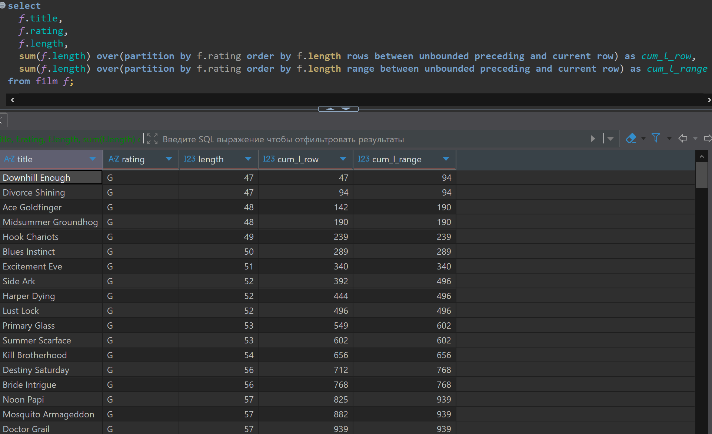

Какое есть следствие из такой логики, а мы попробуем выполнить расчет общую суммарную продолжительность всех фильмов с рейтингом как у текущего фильма, когда мы не задаем явно рамки окна, с помощью ROWS или RANGE, то у нас, по умолчанию, проставляется рамка окна вот такая `range between unbounded preceding and current row`.
Но при этом, если сортировка не заданна отсутствует (order by), то у нас все строки, в рамках одной группы являются родственными, так как мы не знаем как их сортировать. А если сортировка заданна, то мы уже действительно берем только строки которые идут до текущей строки, текущую строку и родственные текущей если они есть. Поэтому у нас получается накопительный итог такой своеобразный.

```sql
select 
  f.title,
  f.rating,
  f.length,
  sum(f.length) over(partition by f.rating),
  sum(f.length) over(partition by f.rating order by f.length)
from film f;
```

Запрос в DBeaver выглядит так, видим следующее

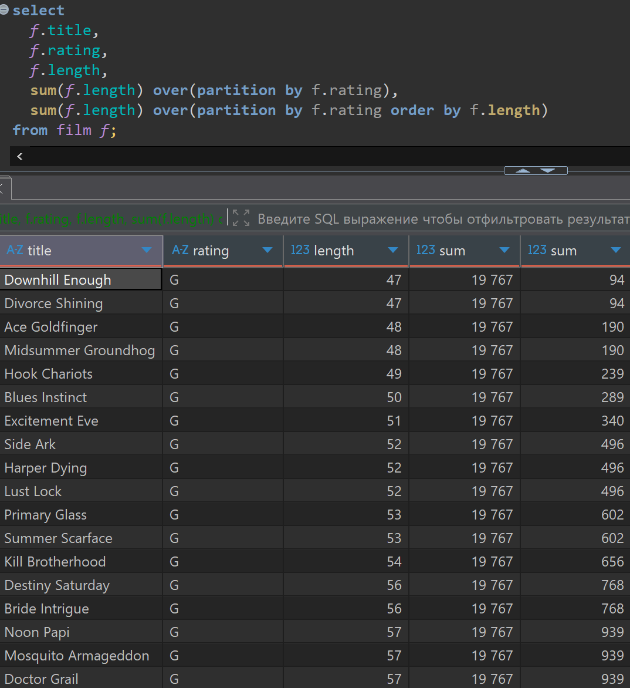

Вот такой способ, тоже нужно знать.

Когда мы используем RANGE мы можем использовать рамки окна, точно так же как при использовании ROWS.
Только мы не можем использовать конкретное количество строк до или после. Так как если брать родственные строки в рамки окна то например в две предыдущие строки и в три после текущей уже будет сложно определить еще родственные строки. Поэтому тут исключили эти возможности указать количество строк в диапазоне.

```sql
select 
  f.title,
  f.rating,
  f.length,
  sum(f.length) over(partition by f.rating),
  sum(f.length) over(partition by f.rating order by f.length),
  sum(f.length) over(partition by f.rating order by f.length, f.film_id),
  sum(f.length) over(partition by f.rating order by f.length range between current row and unbounded following)
from film f;
```

Запрос в DBeaver выглядит так, видим следующее

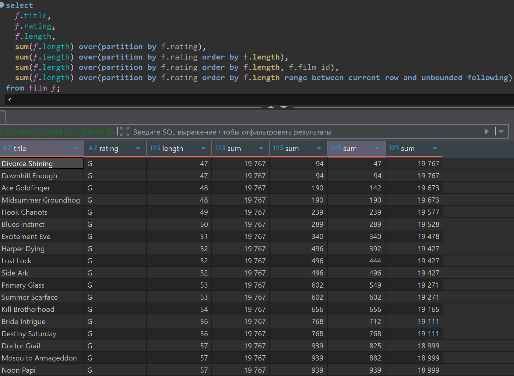

Посмотри еще три функции оконные.
Это получение первой строки в рамках окна, последней строки в рамках окна.

Например мы хотим получить продолжительность первого фильма по возрастанию продолжительности фильмов, среди фильмов с таким же рейтингом. Для этого используют функцию FIRST_VALUE()

```sql
select 
  f.title,
  f.rating,
  f.length,
  first_value(f.length) over(partition by f.rating order by f.length) as first_length
from film f;
```

Запрос в DBeaver выглядит так, видим следующее

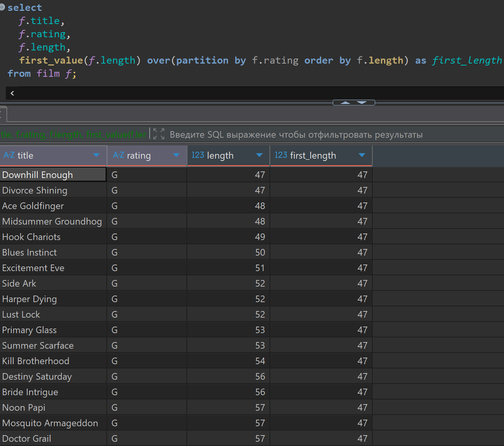

Есть еще функция LAST_VALUE() которая выводит последнее значение в рамках значений окна.

```sql
select 
  f.title,
  f.rating,
  f.length,
  first_value(f.length) over(partition by f.rating order by f.length) as first_length,
  last_value(f.length) over(partition by f.rating order by f.length) as lst_length,
  last_value(f.length) over(partition by f.rating order by f.length range between unbounded preceding and current row) as l_len,
  last_value(f.length) over(partition by f.rating order by f.length range between unbounded preceding and unbounded following) as l_len
from film f;
```

Запрос в DBeaver выглядит так, видим следующее

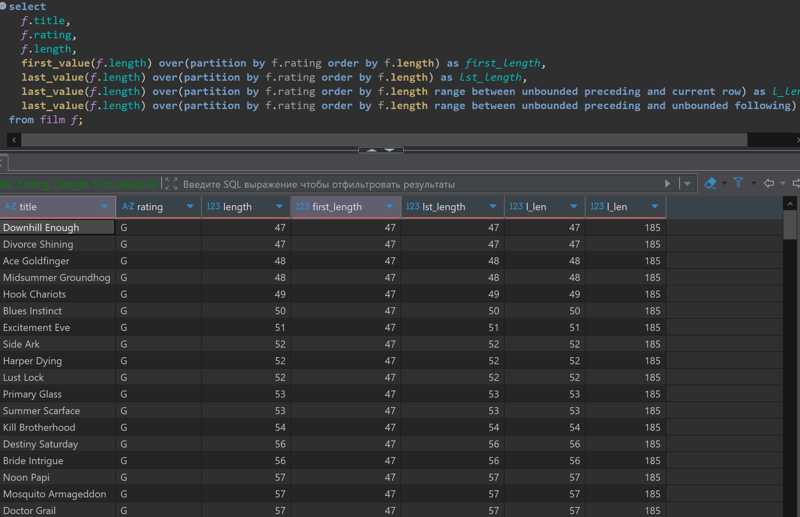
