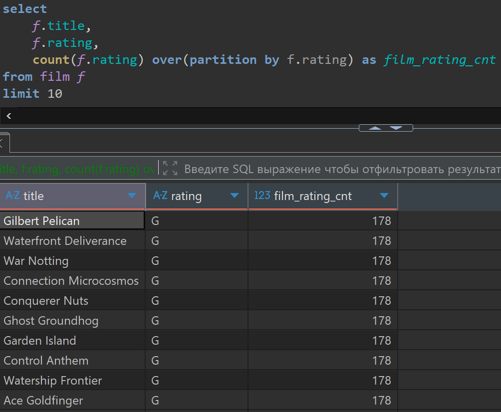
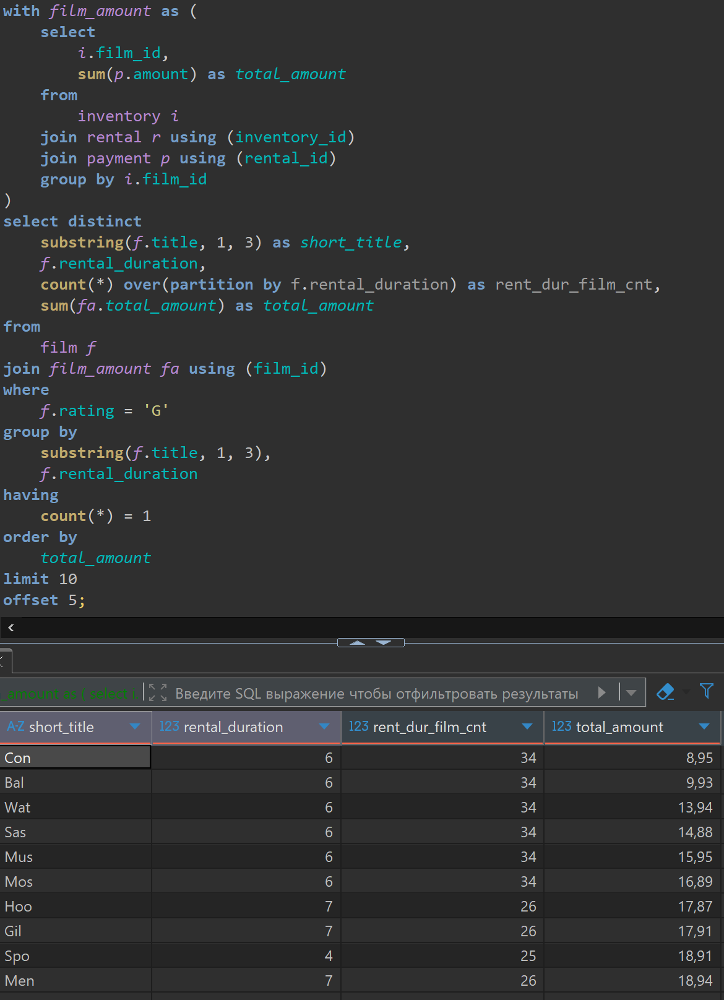

# Lesson 14

## Links

[link lesson](https://www.youtube.com/watch?v=OArMFjvWNg0&list=PLzvuaEeolxkz4a0t4qhA0pxmttG8ZbBtd&index=54)

## Порядок выполнения частей запроса

Это понимание очень важно, но не всегда очевидно, поэтому будем разбираться на примерах.

Для начала из таблицы FILM получим название (title), рейтинг (rating), и посчитаем для каждого фильма сколько у нас всего фильмов с таким рейтингом.

Такой запрос будет выполнятся так:

Первым делом возьмется весь список фильмов, на основе этого списка будет рассчитываться оконная функция,
то-есть по каждому фильму рассчитается сколько всего в таблице film записей с таким рейтингом.
Потом взяв эту оконную функцию, мы возьмем остальное в расчет, например количество выводимых строк в LIMIT

```sql
select 
    f.title,
    f.rating,
    count(f.rating) over(partition by f.rating) as film_rating_cnt
from film f 
limit 10
```

Запрос в DBeaver выглядит так, мы видим что всего у нас фильмов с рейтингом 'G' 178 штук



Рассмотрим еще другой большой запрос, в котором будет много блоков SQL которые могут встретится в SELECT
помимо объединения запросов (UNION и так далее)

У нас будет общее табличное выражение, которое для каждого film_id фильма рассчитает сумму продаж

```sql
with film_amount as (
    select 
        i.film_id,
        sum(p.amount) as total_amount
    from 
        inventory i 
    join rental r using (inventory_id)
    join payment p using (rental_id)
    group by i.film_id
)
select distinct 
    substring(f.title, 1, 3) as short_title,
    f.rental_duration,
    count(*) over(partition by f.rental_duration) as rent_dur_film_cnt,
    sum(fa.total_amount) as total_amount
from
    film f
join film_amount fa using (film_id)
where 
    f.rating = 'G'
group by
    substring(f.title, 1, 3),
    f.rental_duration
having 
    count(*) = 1
order by 
    total_amount 
limit 10
offset 5;
```

Запрос в DBeaver выглядит так



1) В первую очередь выполняется with (CTE) (общее табличное выражение)
2) После выполнения всех табличных выражений, выполняется соединение таблиц в блоке FROM.
3) После соединения всех таблиц, и у нас есть результат их соединения, выполняется фильтрация по условиям в блоке WHERE

Такой порядок означает что у нас сначала все фильмы будут соединены с нужными таблицами, это может быть гигантское количество операций, и только после этого мы отфильтруем наши фильмы рейтинга 'G' в нашем примере.
4) После фильтрации мы полученный результат группируем, если есть группировка GROUP BY
5) После завершения группировки, если она есть, мы выполняем фильтрацию HAVING

Соответственно остались только те строчки которые нужны, удовлетворяющие условию которые написаны
6) Теперь после группировки и всех фильтраций, мы можем приступить к блоку SELECT
Тем самым вычислим все поля в это блоке, и именно тут будут рассчитаны оконные функции в OVER
7) После чего мы вычисляем уникальные строки если есть DISTINCT
8) Только после всего этого мы сортируем полученный результат если сортировка указанна в ORDER BY
9) И на конец-то накладываем ограничение на количество строк вывода LIMIT и OFFSET

В реальной работе, если есть сомнения в том как написанный запрос отрабатывает можно пойти на сайт
[google](https://www.google.com/search?q=postgresql+select&sca_esv=7e03d9ee9bc2dbda&rlz=1C1CHZO_ruBY1110BY1110&sxsrf=AE3TifPq0jNl39IdH4xuJ7FSaoLO443njg%3A1763317766700&ei=BhgaaYy7Kp-Bxc8P_Jme4Qg&ved=0ahUKEwiM1vDIpveQAxWfQPEDHfyMJ4wQ4dUDCBE&uact=5&oq=postgresql+select&gs_lp=Egxnd3Mtd2l6LXNlcnAiEXBvc3RncmVzcWwgc2VsZWN0MgoQABiwAxjWBBhHMgoQABiwAxjWBBhHMgoQABiwAxjWBBhHMgoQABiwAxjWBBhHMgoQABiwAxjWBBhHMgoQABiwAxjWBBhHMgoQABiwAxjWBBhHMgoQABiwAxjWBBhHMg0QABiABBiwAxhDGIoFMg0QABiABBiwAxhDGIoFSI4NUABYAHABeAGQAQCYAQCgAQCqAQC4AQPIAQCYAgGgAhOYAwCIBgGQBgqSBwExoAcAsgcAuAcAwgcDMy0xyAcO&sclient=gws-wiz-serp)

это будет введен запрос:
`postgresql select`
Получим ссылку на документацию или на [русском postgrespro.ru](https://postgrespro.ru/docs/postgresql/current/sql-select) или на [английском postgresql.org](https://www.postgresql.org/docs/current/sql-select.html)

Там можно посмотреть общую структуру запроса, и порядок выполнения там очень подробно рассмотрен.
