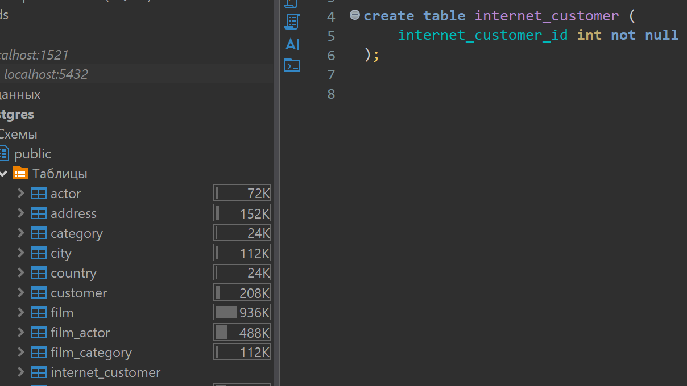
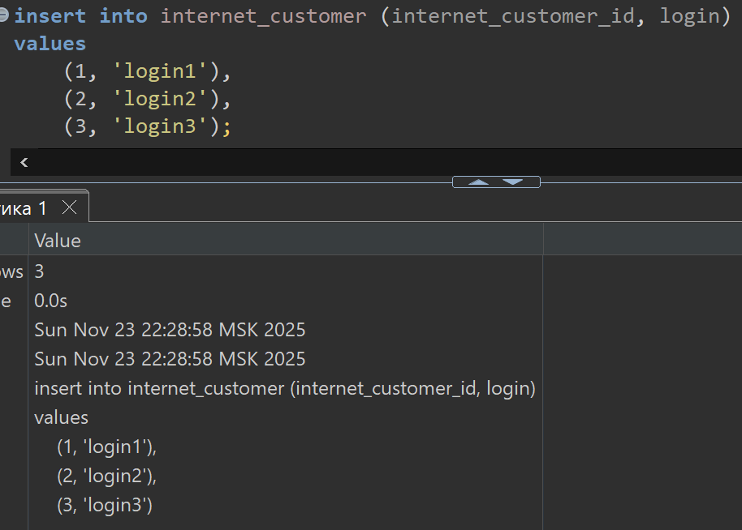
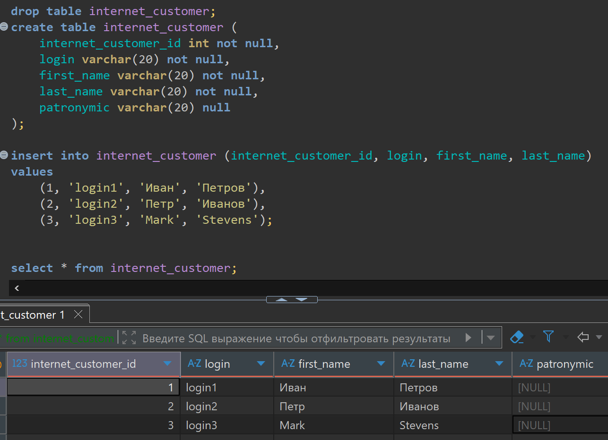
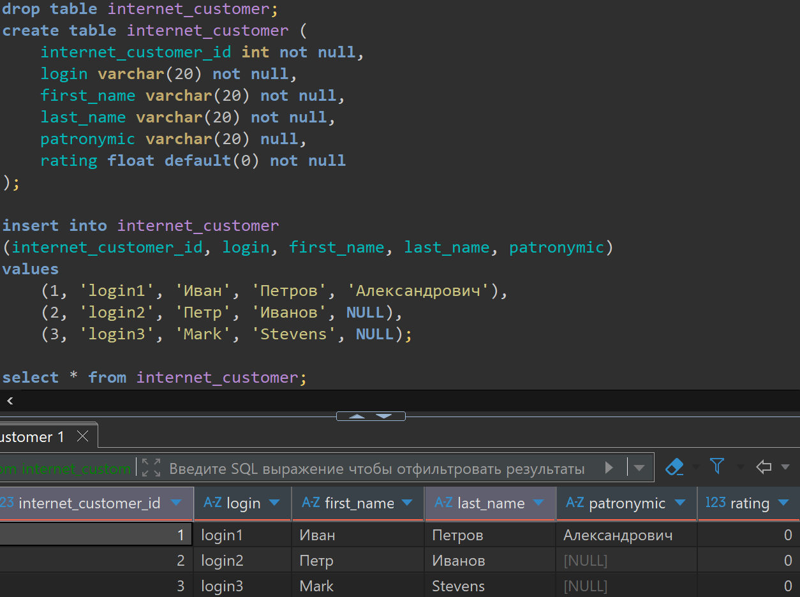
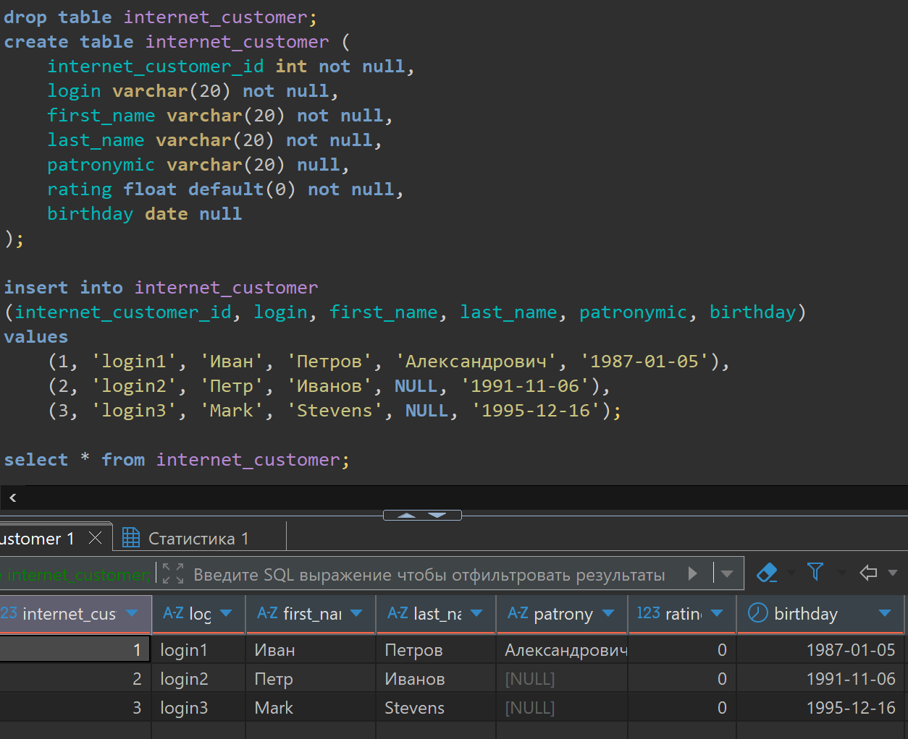
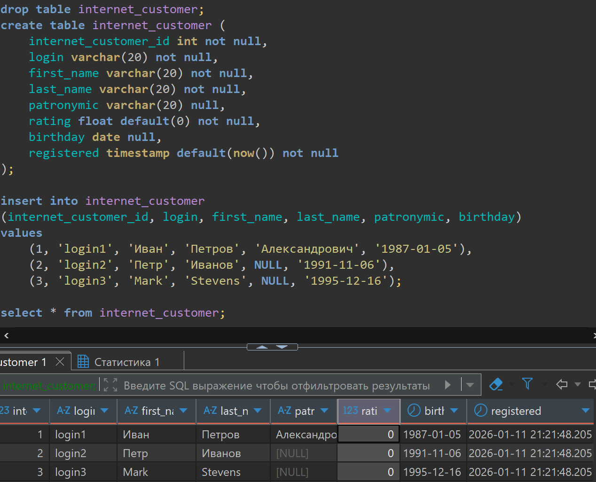
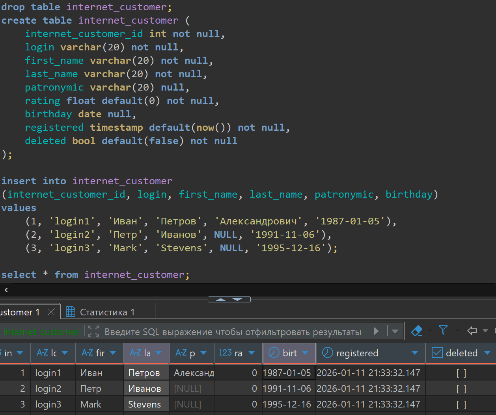
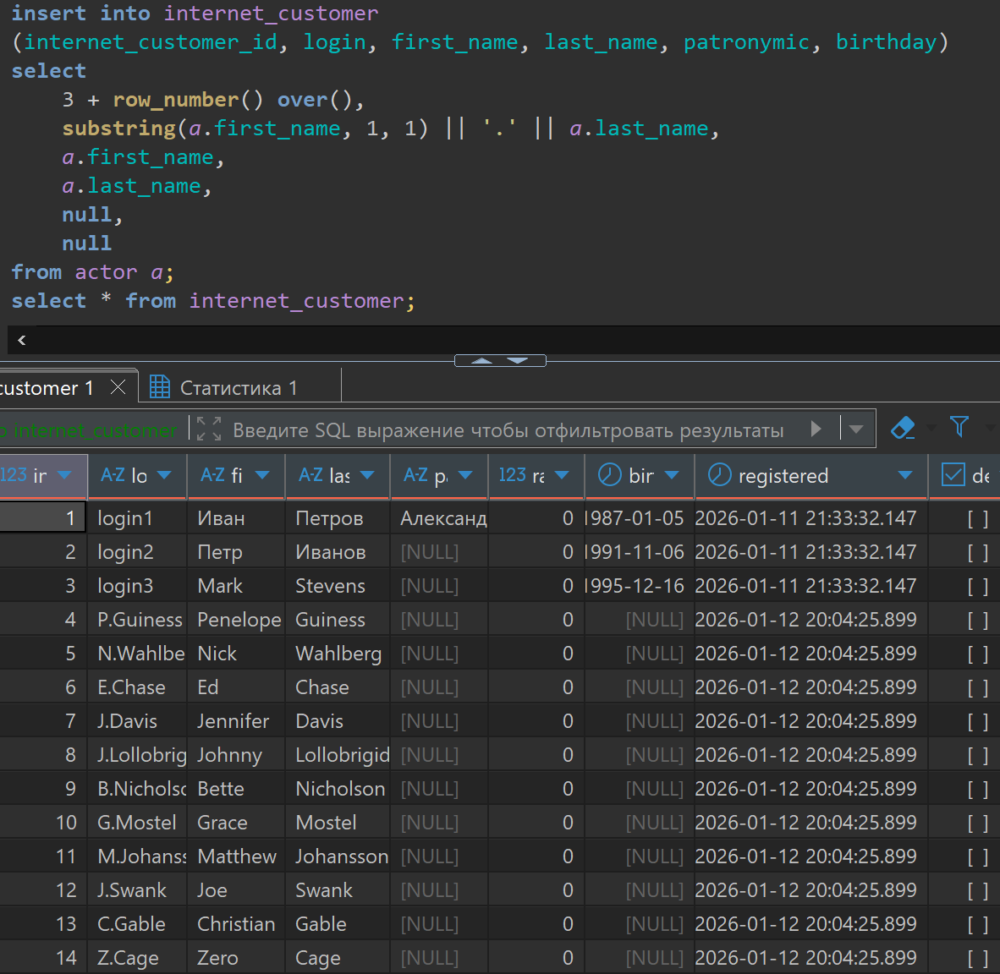
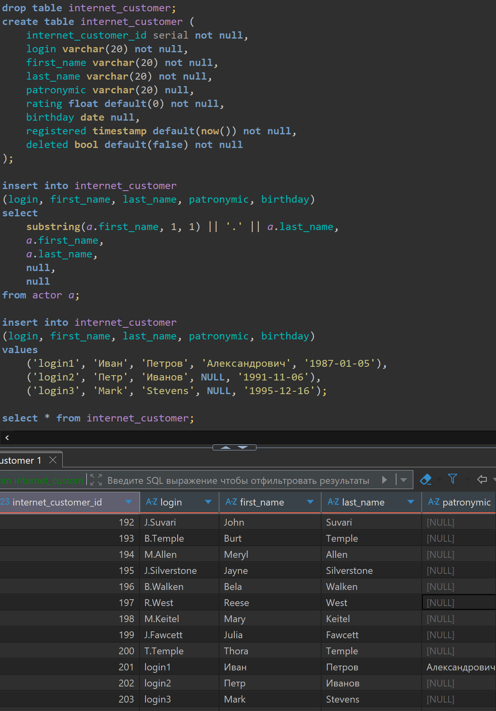
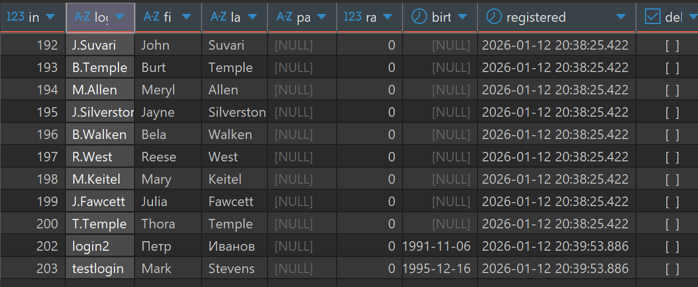

# Lesson 15

## Links

[link lesson](https://www.youtube.com/watch?v=K8L-0H0MWBg&list=PLzvuaEeolxkz4a0t4qhA0pxmttG8ZbBtd&index=55)

## Создание и наполнение таблиц. Типы данных. Изменение, вставка, удаление данных из таблиц

Начнем с создания таблиц, удаление и изменения данных в таблицах.

Представим себе что наш магазин проката, решил выйти в интернет, нам нужно что-бы пользователи могли регистрироваться, и онлайн взять фильмы в прокат.

Вот для такой задачи нам нужно переделать нашу базу данных.
Первым делом мы создадим новую таблицу с пользователями которые регистрируются через наш сайт.
Для этого используем конструкцию CREATE TABLE назовем таблицу internet_customer
и в скобках () перечисляем все поля которые будут в этой таблице.
Пишем название поля идентификатор пользователя (internet_customer_id) затем тип этого поля (int) и затем указываем могут ли быть в этом поле нулевые значения (NULL) или не могут быть (NOT NULL) если не указывать, то это будет значить что нулевые значения могут быть.

Для выполнения скрипта создания таблицы, достаточно одного поля, такой скрипт можно выполнить

```sql
create table internet_customer (
    internet_customer_id int not null
);

```

Запрос в DBeaver выглядит так, видим что таблица (internet_customer) создалась.



Пока в этой таблице, нет строк, но она уже существует.

Посмотрим на типы данных:
INT - тип данных который умеет хранить целые числа, всего таких типов, умеющих хранить целые числа, три:

- smallint (выделяется 2 байта) (числа от -32768 до +32767)
- int (выделяется 4 байта) (числа от -2 147 483 648 до +2 147 483 647)
- bigint (выделяется 8 байта) (числа от -9 223 372 036 854 775 808 до +9 223 372 036 854 775 807)

Мы выбрали тип INT подразумевая что мы не выйдем за пределы его диапазона.
Но можно в будущем перейти на больший тип, если будет нужно.

Теперь, мы хотим добавить поле login, поле с помощью которого можно будет логиниться у нас на сайте.
мы через запятую можем добавить другое поле в скобках. Путь будет такое название login тип его будет
VARCHAR(20) - то-есть поле которое может хранить строки, длиной до 20 символов, это поле будет обязательно NOT NULL, так-как без логина, ни как нельзя совершать операции у нас на сайте.

Строковые типы могут быть:

- character его псевдоним char (имеет фиксированную длину, если указать 20 символов то, хранится будет строка именно 20 символов, а недостающие символы будут пробельными в базе данных)
- character varying его псевдоним varchar (у него тоже можно установить ограничение например 20 символов, но при этом если мы укажем меньше при заполнении, база их не дополнит, и в строке будет столько сколько укажем при заполнении, но больше тоже нельзя ввести)
- text (это тип который позволяет хранить любое количество символов, ограничение только по ресурсам)

И так, мы добавили новое поле, и если мы вновь выполним этот код, то нам скажут что таблица уже существует, так не пойдет. Нам нужно удалить таблицу, если она уже существует, для пересоздания.

Это делается с  помощью конструкции DROP TABLE и название удаляемой таблицы

```sql
drop table internet_customer;
create table internet_customer (
    internet_customer_id int not null,
    login varchar(20) not null
);
```

Если выполнить такие два запроса одновременно, то сначала таблица будет удалена, и потом создана новая

Что-бы нам было интереснее, мы можем добавить в нашу таблицу значения.
Добавление строк в таблицу делается с помощью INSERT INTO после этой конструкции мы указываем название таблицы куда добавляем значения, затем в круглых скобках указываем список колонок, в порядке, в котором, потом будем их добавлять. Затем VALUES и в круглых скобках перечисляем значения для указанных ранее полей. И таких записей можем перечислить сколько нам нужно через запятую.

```sql
insert into internet_customer (internet_customer_id, login)
values 
    (1, 'login1'),
    (2, 'login2'),
    (3, 'login3');
```

Запрос в DBeaver выглядит так, видим что значения в таблицу (internet_customer) добавились.



Нам для нашего пользователя может еще понадобится, фамилия, имя, отчество нашего покупателя, для общения с ним. Поэтому сделаем еще поле first_name пусть у него будет тип varchar максимальной длиной 20 символов, обязательное not null.
Плюс еще last_name пусть у него будет тип varchar максимальной длиной 20 символов, обязательное not null.
Плюс поле отчество patronymic (отчество) у него будет тип varchar максимальной длиной 20 символов, но оно у нас может быть null, так как будем считать что его необязательно заполнять null

Теперь, так как мы изменили поля в таблице, то нужно пересмотреть и добавляемые данные, так как у нас появились дополнительные обязательные поля, которые тоже нужно заполнить, пустые значения в них запрещены. И также, можно обратить внимание что в поле patronymic добавились значения NULL

```sql
drop table internet_customer;
create table internet_customer (
    internet_customer_id int not null,
    login varchar(20) not null,
    first_name varchar(20) not null,
    last_name varchar(20) not null,
    patronymic varchar(20) null
);

insert into internet_customer (internet_customer_id, login, first_name, last_name)
values 
    (1, 'login1', 'Иван', 'Петров'),
    (2, 'login2', 'Петр', 'Иванов'),
    (3, 'login3', 'Mark', 'Stevens');

select * from internet_customer;
```

Запрос в DBeaver выглядит так, видим что значения в таблицу (internet_customer) добавились.



Также, нам никто не мешает поле patronymic (отчество) также самим заполнять

Еще мы хотим добавить рейтинг фильма, чем выше рейтинг, там соответственно этот покупатель чаще берет в аренду фильмы, соответственно мы хотим делить пользователей по этому полю.

Назовем это поле rating, тип у него будет float, и по умолчанию, мы будем пользователю проставлять рейтинг ноль (0)
rating float default(0) not null

```sql
drop table internet_customer;
create table internet_customer (
    internet_customer_id int not null,
    login varchar(20) not null,
    first_name varchar(20) not null,
    last_name varchar(20) not null,
    patronymic varchar(20) null,
    rating float default(0) not null
);

insert into internet_customer 
(internet_customer_id, login, first_name, last_name, patronymic)
values 
    (1, 'login1', 'Иван', 'Петров', 'Александрович'),
    (2, 'login2', 'Петр', 'Иванов', NULL),
    (3, 'login3', 'Mark', 'Stevens', NULL);

select * from internet_customer;
```

Запрос в DBeaver выглядит так, видим что значения в таблицу (internet_customer) добавились.
И в новое поле rating добавилось значение по умолчанию (default)


Теперь поговорим о числах с плавающей точкой, один из таких типов это FLOAT
Таких типов данных всего три

- Тип FLOAT или, что тоже самое FLOAT4, или, что тоже самое REAL это все число с плавающей точкой, на хранение которого выделяется 4 байта.
- Тип DOUBLE PRECISION, или, что тоже самое FLOAT8 это число с плавающей точкой, на хранение которого выделяется 8 байта.
- Тип NUMERIC(n, m), или, что тоже самое DECIMAL(n, m) в этом типе мы явно указываем точность (n) (сколько всего значащих цифр) и масштаб (m) (сколько из всех значащих цифр использовать на дробную часть). Например для числа 1 234 567.890 модно записать numeric(10, 3)

Для операций вычисления, например, с деньгами, подходит только numeric тип, так как он самый точный, под него выделяется больше всего памяти, а два других типа могут округлять числа, при вычислениях

Теперь познакомимся с датами и временем. У нас пусть у каждого пользователя будет информация о его дне рождения, мы сможем с пользой использовать эту дату, для например акций. Добавим поле birthday это поле пусть может быть со значением NULL не каждый пользователь захочет оставить нам дату своего рождения.
birthday date null

```sql
drop table internet_customer;
create table internet_customer (
    internet_customer_id int not null,
    login varchar(20) not null,
    first_name varchar(20) not null,
    last_name varchar(20) not null,
    patronymic varchar(20) null,
    rating float default(0) not null,
    birthday date null
);
```

И добавим нашим пользователям данные

```sql
insert into internet_customer 
(internet_customer_id, login, first_name, last_name, patronymic, birthday)
values 
    (1, 'login1', 'Иван', 'Петров', 'Александрович', '1987-01-05'),
    (2, 'login2', 'Петр', 'Иванов', NULL, '1991-11-06'),
    (3, 'login3', 'Mark', 'Stevens', NULL, '1995-12-16');

select * from internet_customer;
```

И в новое поле birthday добавились значение даты к нашей таблице internet_customer


Какие еще могут быть значения для работы с датами в postgres

- date
тут хранится только дата мы ее только что использовали, она неявно может приводится из строки в том формате как у нас был '1991-11-06' в формате 'год-месяц-дата'

- timestamp
этот тип хранит дату и время

- time
этот тип хранит только время

- interval
тип интервал, которых хранит интервал времени то-есть, например сколько времени прошло с регистрации пользователя до оплаты первого фильма.

Добавим в нашу таблицу еще поле даты регистрации (дата регистрации в системе) назовем ее registered
тип у нее назначим timestamp, мы будем знать точную дату и время когда пользователь зарегистрировался.
Мы можем эту дату ставить автоматически в default поставим функцию now() которая возвращает текущее время. Так же укажем что это поле у нас not null

```sql
drop table internet_customer;
create table internet_customer (
    internet_customer_id int not null,
    login varchar(20) not null,
    first_name varchar(20) not null,
    last_name varchar(20) not null,
    patronymic varchar(20) null,
    rating float default(0) not null,
    birthday date null,
    registered timestamp default(now()) not null
);
```

Вставку данных будем делать туже что в предыдущем примере

И в новое поле registered добавились дата и время добавления пользователей в таблицу internet_customer


- BOOL
Это еще один, основной, тип данных он логический это тип boolean (bool), он принимает значение либо true, либо false.
Для примера добавим поле deleted, где будет хранится удален наш пользователь или нет, то-есть мы наших пользователей физически не будем удалять данные о них, а просто, при удалении будем помечать это поле.
Если пользователь помечен как удаленный, то он уже не сможет залогиниться и совершать какие-то действия. По умолчанию все пользователи буду не удаленные и это полее у нас обязательно к заполнению то-есть deleted bool default(false) not null

```sql
drop table internet_customer;
create table internet_customer (
    internet_customer_id int not null,
    login varchar(20) not null,
    first_name varchar(20) not null,
    last_name varchar(20) not null,
    patronymic varchar(20) null,
    rating float default(0) not null,
    birthday date null,
    registered timestamp default(now()) not null,
    deleted bool default(false) not null
);
```

Вставку данных будем делать туже что в предыдущем примере

И в новое поле registered добавились дата и время добавления пользователей в таблицу internet_customer


Теперь рассмотрим ситуацию, когда у нас уже есть таблицы и данные в них, а мы вдруг поняли что нам нужно еще одно поле confirmed которое нам даст возможность указать подтвердил пользователь свою почту, либо нет, после того как зарегистрировался.
Для этого есть синтаксис  ALTER TABLE после которой есть большое количество вариантов, того что мы можем менять, но мы сейчас попробуем именно колонку добавить к имеющейся таблице с данными. Пишут так:
ALTER TABLE <название_таблицы_которую_меняем> <как именно меняем> (ADD COLUMN в нашем случае) <название_новой_колонки> <тип_новой_колонки> [default(<значение_по_умолчанию>)] [not null]

В нашем случае код будет такой:

```sql
alter table internet_customer add column confirmed bool default(false);
```

Теперь, допустим мы поняли что нам не нужна какая либо колонка, нам нужно воспользоваться DROP COLUMN

```sql
alter table internet_customer drop column confirmed;
```

и колонка confirmed будет удалена

Теперь рассмотрим еще один вариант добавления данных в нашу таблицу, это вариант, когда мы используем запрос из другой таблицы для создания данных в таблице.
Мы, для примера, для каждого актера в таблице actor, создадим свой аккаунт. Что-бы найти идентификатор пронумеруем наших актеров, так как у нас уже есть три записи, то пронумеруем начиная с трех. А всего у нас 200 актеров в таблице actor.
В качестве Login для пользователя введем первую букву имени актера (first_name), затем точку и фамилия актера (last_name).
Дальше заполняем имени актера (first_name), фамилия актера (last_name).
Отчества у нас у актеров нет, поэтому укажем NULL, день рождения тоже мы не знаем укажем NULL.
Остальные значения у нас будут проставлены по умолчанию поля (rating, registered, deleted).

Можно обратить внимание, тут важен порядок колонок и их тип, для правильного добавления значений в уже созданную таблицу. Что бы вставляемы типы, соответствовали типам данных в наших колонках, в которые мы вставляем данные.

В нашем случае код будет такой:

```sql
insert into internet_customer 
(internet_customer_id, login, first_name, last_name, patronymic, birthday)
    select
        3 + row_number() over(),
        substring(a.first_name, 1, 1) || '.' || a.last_name,
        a.first_name,
        a.last_name,
        null,
        null
    from actor a;
select * from internet_customer;
```

В итоге увидим такое содержимое таблицы internet_customer



Так же можно не указывать список колонок в круглых скобках после insert. В таком случае будет подразумеваться что берутся все колонки, ровно в порядке в котором они идут в таблице в которую мы их вставляем. И тогда, если делать аналог предыдущего примера, нам нужно добавить и дефолтные колонки

Тогда будет код таким:

```sql
insert into internet_customer 
select
    3 + row_number() over(),
    substring(a.first_name, 1, 1) || '.' || a.last_name,
    a.first_name,
    a.last_name,
    null,
    0,
    null,
    now(),
    false
from actor a;
```

Продолжим знакомство с еще одним типом данных который умеет хранит целые числа, но при этом, он помнит какое последнее значение в нем хранилось, и умеет сам проставлять следующие значения.

Продолжим наш предыдущий пример, в нем мы проставляли идентификатор пользователя колонка internet_customer_id в ручную, задавая значения. Но мы можем задавать эти значения автоматически использую возможности postgres.

Для демонстрации мы у колонки internet_customer_id зададим тип данных serial, в место типа int который там был.

Тогда будет код таким:

```sql
drop table internet_customer;
create table internet_customer (
    internet_customer_id serial not null,
    login varchar(20) not null,
    first_name varchar(20) not null,
    last_name varchar(20) not null,
    patronymic varchar(20) null,
    rating float default(0) not null,
    birthday date null,
    registered timestamp default(now()) not null,
    deleted bool default(false) not null
);

insert into internet_customer 
(login, first_name, last_name, patronymic, birthday)
select
    substring(a.first_name, 1, 1) || '.' || a.last_name,
    a.first_name,
    a.last_name,
    null,
    null
from actor a;

insert into internet_customer 
(login, first_name, last_name, patronymic, birthday)
values 
    ('login1', 'Иван', 'Петров', 'Александрович', '1987-01-05'),
    ('login2', 'Петр', 'Иванов', NULL, '1991-11-06'),
    ('login3', 'Mark', 'Stevens', NULL, '1995-12-16');

select * from internet_customer;
```

В итоге увидим такое содержимое таблицы internet_customer



Видим что идентификаторы были проставлены в том порядке в котором у нас данные добавлялись.
Это для нас делал тип данных serial

Помимо добавления записей, мы можем, записи, удалять. Для этого есть оператор DELETE.
Удаление данных происходит построчно из таблицы. Используем такой синтаксис:
Вот так, будут удалены все строки:

```sql
delete from internet_customer;
```

Если хотим удалить не все строчки, а некоторые по некоторому условию, то:
Например хотим удалить запись с фамилией пользователя 'Петров'

```sql
delete from internet_customer
where last_name = 'Петров';
```

Помимо этого, мы можем записи редактировать, для этого мы пишем UPDATE название таблицы, и через set указываем что мы хотим изменить:

Например, мы нашему пользователю можем сменить его логин (login).

```sql
update internet_customer
set login = 'testlogin'
where last_name = 'Stevens';
```

В итоге после модификаций так выглядят данные в таблице internet_customer


