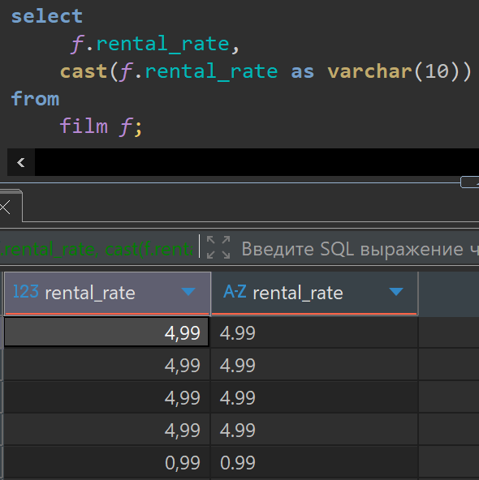
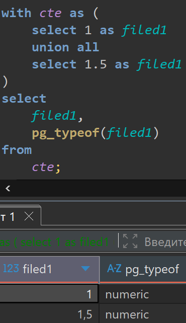
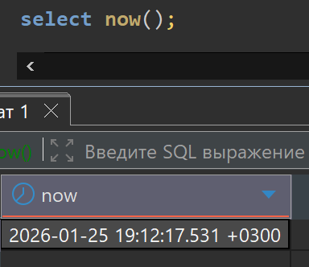
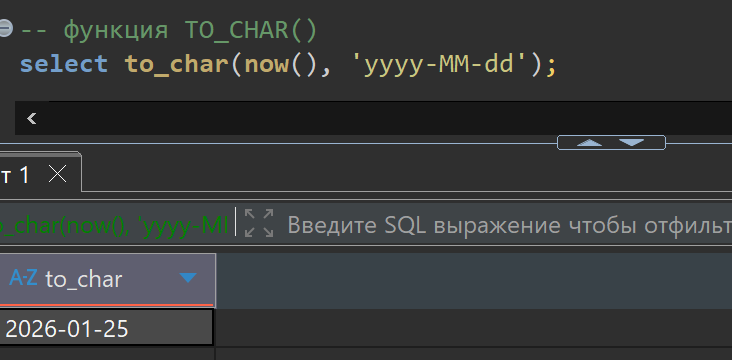
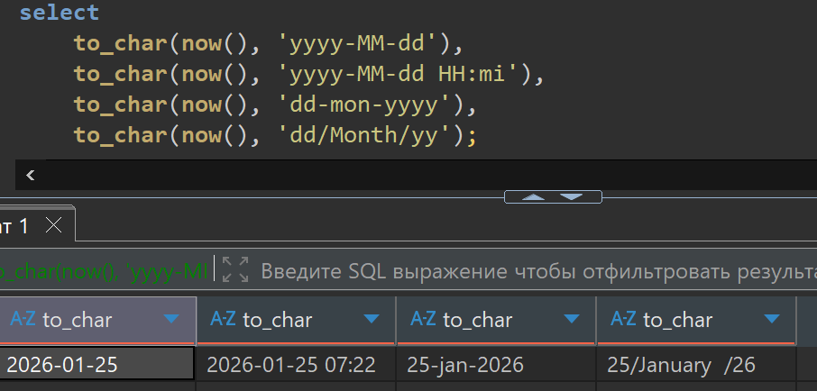
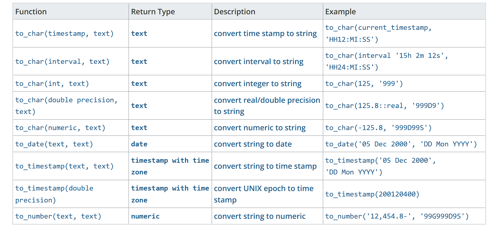
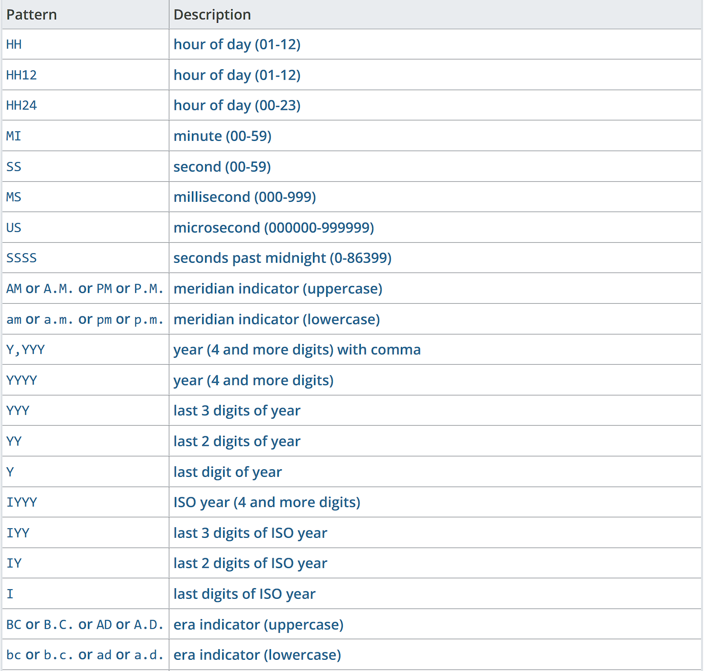
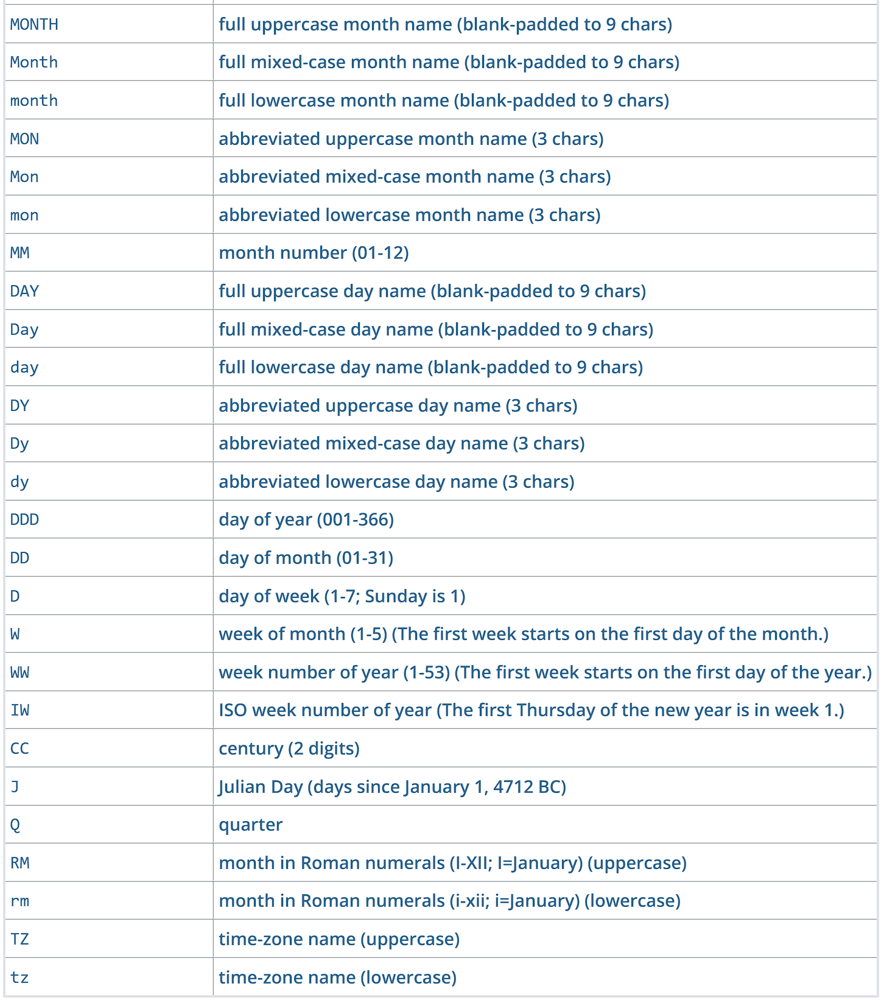
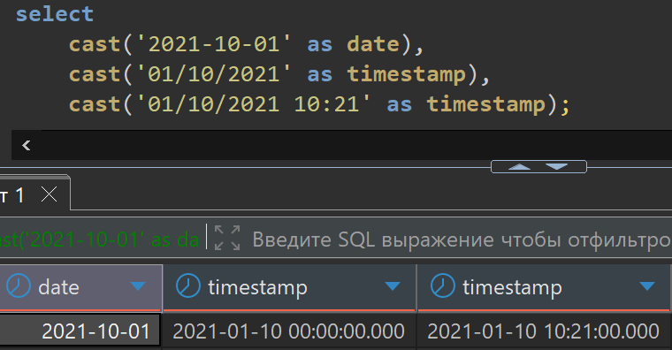
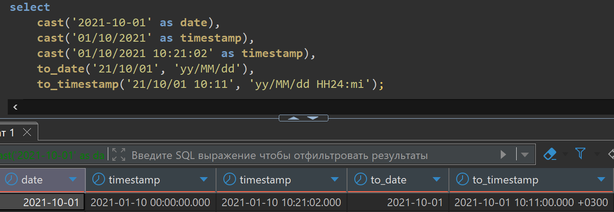

# Lesson 17

## Links

[link lesson](https://www.youtube.com/watch?v=ACUWQpMN9zk&list=PLzvuaEeolxkz4a0t4qhA0pxmttG8ZbBtd&index=59)

## Преобразование типов данных

Тут будем рассматривать ситуации когда нам нужно преобразовать значения одного типа данных к значениям другого типа данных.

Приведем пример. Запросим данные из таблицы film

Увидим что поле rental_rate имеет числовой тип данных (numeric(4,2)).
Нам может понадобится, это значение привести к типу данных строка. Например для формирования строки, где нужно что-бы было значение рейтинга.

Преобразование типов происходит:

1. С помощью самой популярной функции CAST()
Она используется так: CAST(f.rental_rate as varchar(10))
то-есть этой функции передает поле которое нужно преобразовать затем AS и тип к которому нужно привести значение поля.

```sql
select
     f.rental_rate,
    cast(f.rental_rate as varchar(10)) 
from
    film f;
```

Запрос в DBeaver выглядит так, видим что тип данных изменился у поля rental_rate.


2. Порой у нас происходит неявное преобразование типов к нужным.
Например при объединении запросов

```sql
select 1 as filed1
union all
select 1.5 as filed1;
```

обе цифры будут numeric типа.

Как же нам понять какой тип данных у данной колонки, для это есть функция pg.typeof()
которой можно передать поле тип которого нас интересует.

```sql
with cte as (
    select 1 as filed1
    union all
    select 1.5 as filed1
)
select 
    filed1,
    pg_typeof(filed1)
from
    cte
```

Запрос в DBeaver выглядит так, видим что тип данных numeric.



Фактически тут неявно было сделано следующее преобразование:

```sql
select cast(1 as numeric) as filed1
union all
select 1.5 as filed1;
```

Сразу же мы можем привести другой формат преобразования:
такая возможность это не стандарт языка SQL, но он есть в postgres:

```sql
select 1::numeric as filed1
union all
select 1.5 as filed1;
```

с ним запись преобразования становится короче. Но оно имеет тот же самый результат.

А что у нас будет, если мы объединим такие значения:

```sql
select 1 as filed1
union all
select 1 as filed1;
```

получим колонку с типом int4

Теперь попробуем пример, где мы хотим соединить цифру и строку, как же у нас сработает неявное преобразование типов, и сработает ли вообще.

```sql
select 1 as filed1
union all
select '2' as filed1;
```

В итоге все неявно будет приведено к типу int4, '2' эту строка преобразовалось к числу.

Если же указать строку "some text" которая не может быть преобразована к числу, то будет ошибка

invalid input syntax for type integer: "some text"

Если мы хотим, привести это все, например к строке, то нам нужно сделать явное преобразование типа:

```sql
select cast(1 as varchar) as filed1
union all
select '2' as filed1;

select cast(1 as varchar) as filed1
union all
select 'some text' as filed1;
```

Теперь посмотрим еще пример с типом bool:

```sql
select cast(1 as varchar) as filed1
union all
select false as filed1;
```

Такое неявное преобразование не поддерживается будем получать ошибку
UNION types integer and boolean cannot be matched

Отдельной темой является преобразование типов дат к строке, и в обратную сторону из строк в дату.
У нас есть функция NOW() которая возвращает тип данных — это тип TIMESTAMP

```sql
select now();
```

Запрос в DBeaver выглядит так, видим что это тип TIMESTAMP тип данных даты и времени либо тип DATE тип данных только даты.



В этом случае, для преобразования нам функция CAST() не подойдет, так как ей мы не задаем формат поэтому
для типов данных даты, она не подойдет.
Формат: YYYY-MM-DD HH:MM:SS (год-месяц-день часы:минуты:секунды)
Для задания формата и работы с типами даты, у нас есть функции:

TO_CHAR() - когда нам нужно сделать преобразование даты к строке, передается сама дата в формате TIMESTAMP
и формат в который нужно преобразовать дату

```sql
select to_char(now(), 'yyyy-MM-dd');
```

Запрос в DBeaver выглядит так, видим что это теперь строка, и в указанном нами формате.



Если мы хотим еще отображать часы и минуты то формат можно записать так: 'yyyy-MM-dd HH:mi'

Можем создать любую строку используя специальные форматы.

```sql
select 
    to_char(now(), 'yyyy-MM-dd'),
    to_char(now(), 'yyyy-MM-dd HH:mi'),
    to_char(now(), 'dd-mon-yyyy'),
    to_char(now(), 'dd/Month/yy');
```

Запрос в DBeaver выглядит так, видим разные варианты строки, и в указанными нами форматах.



Теперь посмотрим на все варианты задания формата для приведения к нужной строке типов данных времени.

Запрос в google [postgresql date to string](https://www.google.com/search?q=postgresql+date+to+string&sca_esv=5c1233ee610bdfb6&rlz=1C1CHZO_ruBY1110BY1110&sxsrf=ANbL-n6T38SWcoLammd9STDWFzHD4yXapg%3A1769356400773&ei=cDx2aeXsLqvvwPAPlciFsQQ&oq=postgresql+date+to&gs_lp=Egxnd3Mtd2l6LXNlcnAiEnBvc3RncmVzcWwgZGF0ZSB0byoCCAAyBRAAGIAEMgUQABiABDIFEAAYgAQyBRAAGIAEMgUQABiABDIIEAAYgAQYywEyBRAAGIAEMgUQABiABDIFEAAYgAQyBRAAGIAESNzGAVAAWM10cAN4AZABAJgBYKABnAuqAQIxOLgBA8gBAPgBAZgCFaACpw3CAg4QABiABBixAxiDARiKBcICCBAuGIAEGLEDwgIOEC4YgAQYsQMY0QMYxwHCAggQABiABBixA8ICCxAuGIAEGLEDGIMBwgILEAAYgAQYARgKGCrCAgkQABiABBgBGArCAhEQLhiABBgBGNEDGMcBGAoYKsICIBAuGIAEGAEY0QMYxwEYChgqGJcFGNwEGN4EGOAE2AEBwgIKECMYgAQYJxiKBcICChAAGIAEGEMYigXCAgoQABiABBgUGIcCwgIHEAAYgAQYDcICChAAGIAEGAoYywHCAgcQABiABBgKwgIJEAAYgAQYChgLmAMAugYGCAEQARgUkgcEMTYuNaAH74IBsgcEMTMuNbgHhQ3CBwowLjEuNi4xMy4xyAfbAYAIAA&sclient=gws-wiz-serp)

увидим функции преобразований дат в текст и наоборот из текста в даты:



Теперь что касается паттернов для форматирования в строке





Тут представлены все варианты которые мы можем использовать в своих форматах строк.

Единственное это все применимо к postgres, в других СУБД могут эти форматы отличаться, нужно смотреть и проверять.

Теперь, на примере посмотрим обратный процесс преобразования строки в дату. Например у нас есть строка
в которой указана дата, а нам нужно из нее получить ту самую дату.

Для такого преобразования у нас может работать функция CAST() если у нас стандартный формат даты в строке.
например такой '2021-10-01' его postgres понимает, и может преобразовать без указания формата к дате

```sql
select 
    cast('2021-10-01' as date),
    cast('01/10/2021' as timestamp),
    cast('01/10/2021 10:21' as timestamp); 
```

Запрос в DBeaver выглядит так, видим разные варианты преобразования строки, и в дату.



Если же наша строка не является стандартной, то для преобразования к дате, мы можем использовать
формат по которому ее следует преобразовать

```sql
select 
    cast('2021-10-01' as date),
    cast('01/10/2021' as timestamp),
    cast('01/10/2021 10:21:02' as timestamp),
    to_date('21/10/01', 'yy/MM/dd'),
    to_timestamp('21/10/01 10:11', 'yy/MM/dd HH24:mi'); 
```

Запрос в DBeaver выглядит так, видим разные варианты преобразования строки, и в дату.


