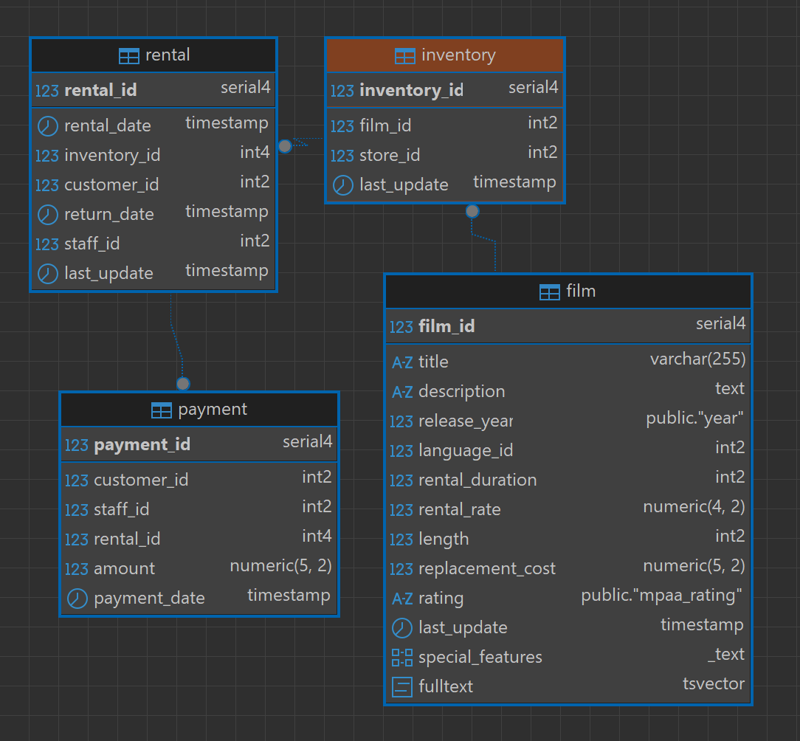
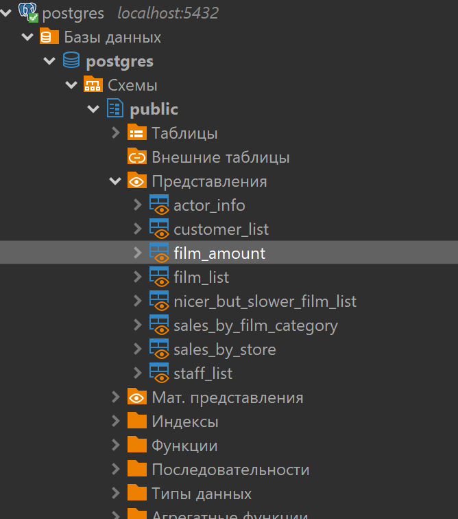
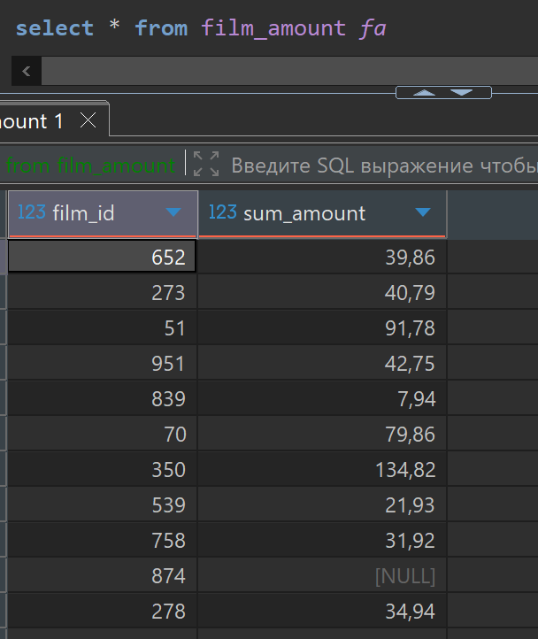
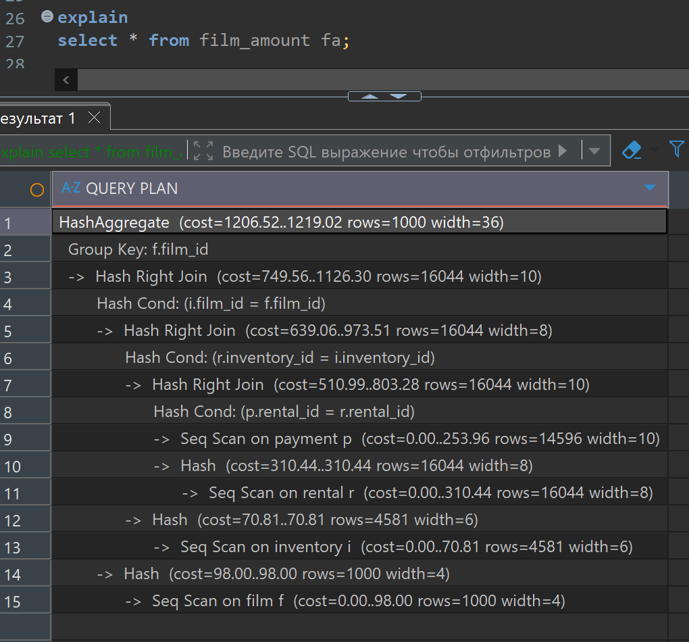
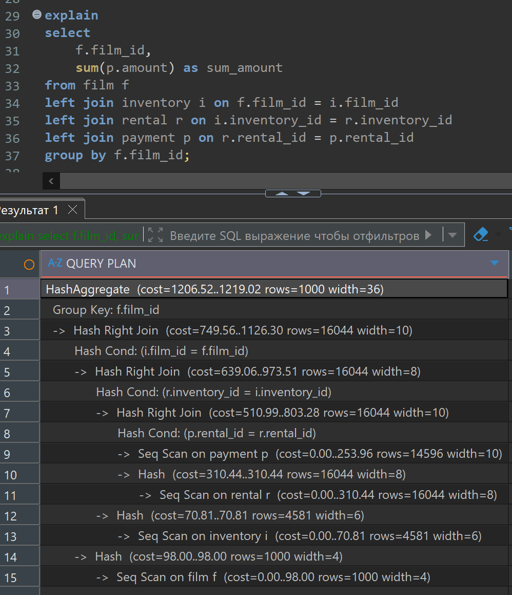
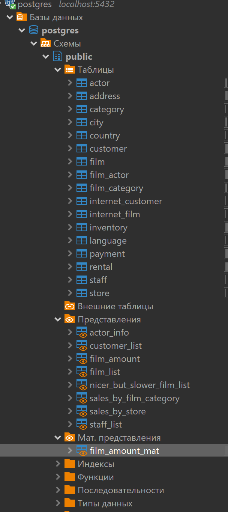
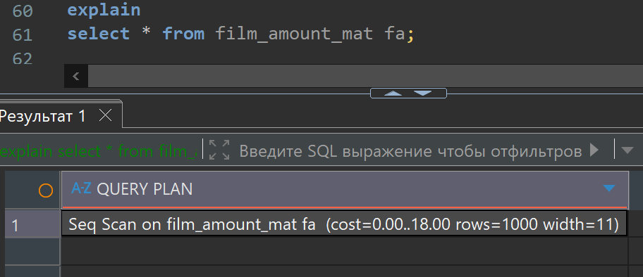

# Lesson 18

## Links

[link lesson](https://www.youtube.com/watch?v=szdL-LLXoNM&list=PLzvuaEeolxkz4a0t4qhA0pxmttG8ZbBtd&index=60)

## Представления Представления (VIEW)

На самом деле они используются довольно часто, это довольно удобно.
Из раннего использования SQL можно заметить что код очень часто дублируется. Например,
мы уже ни раз, писали запрос получения общей суммы продаж наших дисков.

Для избежания такого копирования кода, мы можем использовать представления (VIEW)
Однажды создав псевдоним (alias) такому нужного запроса.

Что-бы задать псевдоним (alias) мы используем ключевое CREATE VIEW затем указываем имя, пусть это будет
film_amount ключевое as и после, просто пишем SELECT запрос который будет этой самой VIEW ('вьюхой')

посмотрим схему соединения таблиц в базе



Так будет выглядеть код создания VIEW:

```sql
create view film_amount as
select 
    f.film_id,
    sum(p.amount) as sum_amount
from film f 
left join inventory i on f.film_id = i.film_id
left join rental r on i.inventory_id = r.inventory_id
left join payment p on r.rental_id = p.rental_id
group by f.film_id;
```

После выполнения этого запроса, не будет выполнен select, и выдан его результат, а будет создано представление (VIEW)

Так будет выглядеть созданное VIEW c заданным именем:



Теперь посмотрим как нам можно работать с этим представлением, а очень просто, так же как будто-бы,
это обычная таблица, мы теперь можем запрашивать данные из этого представления как из простой таблицы.

```sql
select 
    * 
from film_amount fa 
```

После этого мы увидим данные которые были занесены в созданное представление film_amount



Теперь представление с именем film_amount для нас обычная таблица которую можно так же использовать
как все другие таблицы.

Представления (VIEW) могут быть:

- материализованными
- нематериализованными

В нашем случае это было нематериализованное представление, это значит, что каждый раз,
при использовании этого представления в запросе как в предыдущем примере, фактически при выполнении
обращения к имени нашей VIEW будет выполнятся весь запрос написанный в теле самого VIEW.
И даже если мы будем его использовать в запросе несколько раз, каждый раз по новой будет выполнятся
тело самой VIEW.

В SQL есть такое понятие как план построения запроса.
Если до выполнения любого запроса написать ключевое слово

explain

То мы увидим план построения этого запроса.
Увидим что абсолютно одинаковые планы построения запросов у этих запросов

План построения первого запроса

```sql
explain
select * from film_amount fa;
```



План построения второго запроса

```sql
explain
select 
    f.film_id,
    sum(p.amount) as sum_amount
from film f 
left join inventory i on f.film_id = i.film_id
left join rental r on i.inventory_id = r.inventory_id
left join payment p on r.rental_id = p.rental_id
group by f.film_id;
```



Видим что по плану выполнения запросов эти два запроса выполняются одинаково


Теперь посмотрим на Материализованный запрос создания представления VIEW
отличается оно ключевым словом materialized.
Сделаем ему другое имя, что-бы их различать, и что-бы не нужно было удалять старое.
Назовем его film_amount_mat

```sql
create materialized view film_amount_mat as
select 
    f.film_id,
    sum(p.amount) as sum_amount
from film f 
left join inventory i on f.film_id = i.film_id
left join rental r on i.inventory_id = r.inventory_id
left join payment p on r.rental_id = p.rental_id
group by f.film_id;
```

Увидим созданное представление вот таким



Теперь, если мы сделаем запрос из материализованного представления (VIEW)

```sql
select * from film_amount_mat fa;
```

В этом случае, очевидно, уже не будет перевыполняться запрос который указан в теле создания
этого представления. То есть, в этом случае, представление (VIEW) ведет себя совсем как обычная таблица

И если вызвать построение плана запроса, мы увидим что он гораздо короче

```sql
explain
select * from film_amount_mat fa;
```



Если мы захотим, мы можем даже различные представления соединять между собой, если нам это надо.

Материализованные представления бывают полезными, за счет скорости их выполнения, но они свои данные получают только в момент создания материализованного представления.
Нематериализованные представления медленные, зато всегда имеют актуальные данные.

Что-бы перезаписать данные в материализованном представлении существует ключевое слово refresh

```sql
refresh materialized view film_amount_mat;
```

При выполнении этой команды, будут обновлены данные в этом представлении
Будет вновь выполнен запрос указанный в теле создания этого представления VIEW

Нематериализованные представления используются чаще, так как это удобнее.
