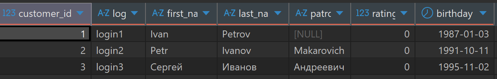
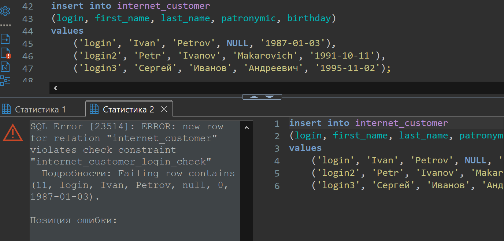
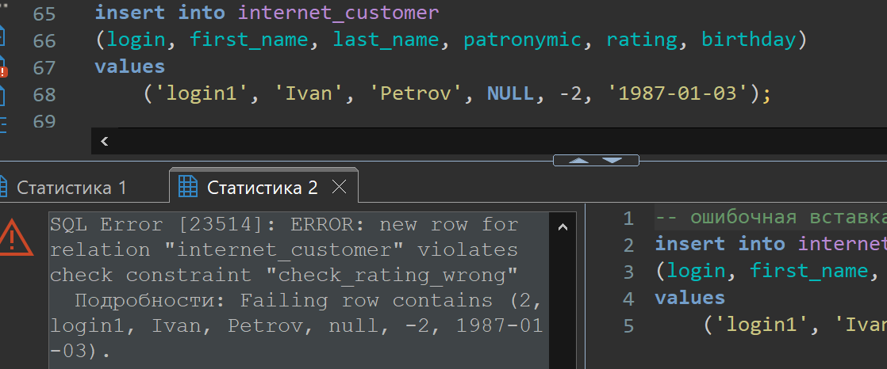
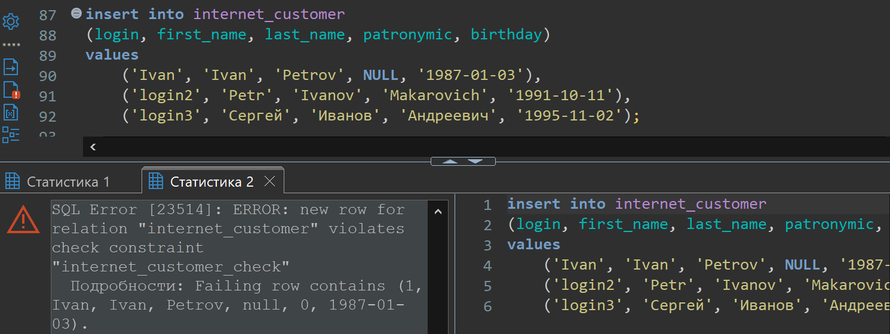
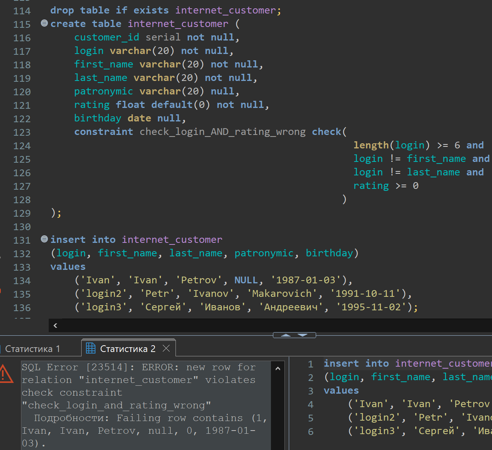

# Lesson 19

## Links

[link lesson](https://www.youtube.com/watch?v=NHlzZk4rVOQ&list=PLzvuaEeolxkz4a0t4qhA0pxmttG8ZbBtd&index=63)

## Ограничения

Помимо ограничений которые мы вводим при создании таблицы, например not null, мы можем накладывать другие ограничения на таблицы. Как это делается мы тут и познакомимся.
Реляционная модель данных, позволяет накладывать ограничения на таблицы и СУБД следить за соблюдением этих ограничений.
Таким образом мы можем быть уверенны что данные корректные, правильные, целостные и соответствуют изначальной задумке.

Возьмем код создания таблицы из занятия по созданию таблиц, и наполним ее данными

```sql
drop table if exists internet_customer;
create table internet_customer (
    customer_id serial not null,
    login varchar(20) not null,
    first_name varchar(20) not null,
    last_name varchar(20) not null,
    patronymic varchar(20) null,
    rating float default(0) not null,
    birthday date null
);

-- Наполним эту таблицу данными
insert into internet_customer 
(login, first_name, last_name, patronymic, birthday)
values 
    ('login1', 'Ivan', 'Petrov', NULL, '1987-01-03'),
    ('login2', 'Petr', 'Ivanov', 'Makarovich', '1991-10-11'),
    ('login3', 'Сергей', 'Иванов', 'Андреевич', '1995-11-02');

-- Запросим эти три строки
select * from internet_customer;
```

Вот так будут выглядеть данные в таблице internet_customer



Видим что три строчки добавлены, можем запросить эти три строки

Теперь посмотрим на то как мы можем накладывать ограничения значений в колонках, по нашим условиям.
Например создадим ограничение, на проверку условий, допустим мы хотим, для безопасности, создавать login
минимальной длины в шесть символов.
Для этого мы при создании таблицы для поля login допишем ключевое слово check и в круглых скобках указываем
логическое выражение, при истинности которого, СУБД позволит вставить такое значение для этого поля

```sql
drop table if exists internet_customer;
create table internet_customer (
    customer_id serial not null,
    login varchar(20) not null check(length(login) >= 6),
    first_name varchar(20) not null,
    last_name varchar(20) not null,
    patronymic varchar(20) null,
    rating float default(0) not null,
    birthday date null
);

insert into internet_customer 
(login, first_name, last_name, patronymic, birthday)
values 
    ('login', 'Ivan', 'Petrov', NULL, '1987-01-03'),
    ('login2', 'Petr', 'Ivanov', 'Makarovich', '1991-10-11'),
    ('login3', 'Сергей', 'Иванов', 'Андреевич', '1995-11-02');
```

Вот так будут выглядеть ошибка при попытке вставки таких данных



При этом вставка из предыдущего примера, будет удовлетворять этому условию, и вставка тех данных пройдет в таблицу.

Теперь каждый раз, при изменении или добавлении данных в таблицу internet_customer, будет проверятся это условие,
и только при его соблюдении вставки или изменение сработают.

Теперь для примера, добавим условие при котором поле rating всегда был >= (больше либо равен) нуля (0).

Как видим из предыдущего примера, при нарушении ограничения указанного в check() у нас возникает исключение с именем "internet_customer_login_check", так вот, мы можем это название указывать явно сами, что-бы мы могли понимать какое именно ограничение нарушено. Посмотрим как теперь задать это имя исключения при такой проверке.
Делается с помощью ключевого слова constraint (ограничение) затем его имя и уже потом chack() и в скобках нужное условие

```sql
drop table if exists internet_customer;
create table internet_customer (
    customer_id serial not null,
    login varchar(20) not null check(length(login) >= 6),
    first_name varchar(20) not null,
    last_name varchar(20) not null,
    patronymic varchar(20) null,
    rating float default(0) not null constraint check_rating_wrong check(rating >= 0),
    birthday date null
);

insert into internet_customer 
(login, first_name, last_name, patronymic, rating, birthday)
values 
    ('login1', 'Ivan', 'Petrov', NULL, -2, '1987-01-03');
```

Вот так будут выглядеть ошибка при попытке вставки таких данных видим уже заданное нами имя ограничения выдаваемого
при сработке СУБД.



Причем в этих проверка мы можем ссылаться на значения других проверок.
Например, мы не хотим позволять поле login сделать равным полю имени (first_name) или равным полю фамилии (last_name).
Будем страховаться от слишком легкого пользовательского login.

```sql
drop table if exists internet_customer;
create table internet_customer (
    customer_id serial not null,
    login varchar(20) not null check( length(login) >= 6 
                                      and login != first_name 
                                      and login != last_name
                                    ),
    first_name varchar(20) not null,
    last_name varchar(20) not null,
    patronymic varchar(20) null,
    rating float default(0) not null constraint check_rating_wrong check(rating >= 0),
    birthday date null
);

insert into internet_customer 
(login, first_name, last_name, patronymic, birthday)
values 
    ('Ivan', 'Ivan', 'Petrov', NULL, '1987-01-03'),
    ('login2', 'Petr', 'Ivanov', 'Makarovich', '1991-10-11'),
    ('login3', 'Сергей', 'Иванов', 'Андреевич', '1995-11-02');
```

Вот так будут выглядеть ошибка при попытке вставки таких данных видим ограничение выдаваемое
при сработке СУБД.



Так же, при создании таких проверок можно использовать другой синтаксис, мы можем писать проверку,
не после создания проверяемого поля, при создании таблицы, а можем писать условия отдельно.

Сделаем таким способом все те же условия из предыдущего примера.

```sql
drop table if exists internet_customer;
create table internet_customer (
    customer_id serial not null,
    login varchar(20) not null,
    first_name varchar(20) not null,
    last_name varchar(20) not null,
    patronymic varchar(20) null,
    rating float default(0) not null,
    birthday date null,
    check( 
           length(login) >= 6 and
           login != first_name and
           login != last_name
         ),
    constraint check_rating_wrong check(rating >= 0)
);
```

Так же мы можем эти условия объединить, что тоже сработает, и будет корректно

```sql
drop table if exists internet_customer;
create table internet_customer (
    customer_id serial not null,
    login varchar(20) not null,
    first_name varchar(20) not null,
    last_name varchar(20) not null,
    patronymic varchar(20) null,
    rating float default(0) not null,
    birthday date null,
    constraint check_login_AND_rating_wrong check( 
                                                   length(login) >= 6 and
                                                   login != first_name and
                                                   login != last_name and 
                                                   rating >= 0
                                                 )
);

insert into internet_customer 
(login, first_name, last_name, patronymic, birthday)
values 
    ('Ivan', 'Ivan', 'Petrov', NULL, '1987-01-03'),
    ('login2', 'Petr', 'Ivanov', 'Makarovich', '1991-10-11'),
    ('login3', 'Сергей', 'Иванов', 'Андреевич', '1995-11-02');
```

При вставке неправильных данных, увидим наше имя созданного нами ограничение, причем, имя выдаваемого
СУБД исключения в нижнем регистре.



Есть еще второй тип ограничений которые мы можем накладывать на таблицу это ограничения на уникальность

Например наше поле login должно быть в системе у каждого пользователя уникальное, иначе мы не поймем кто же у нас
из пользователей входит в систему, и чью информацию нужно отображать.
Делается такое ограничение с помощью ключевого слова UNIQUE

```sql
drop table if exists internet_customer;
create table internet_customer (
    customer_id serial not null,
    login varchar(20) not null unique,
    first_name varchar(20) not null,
    last_name varchar(20) not null,
    patronymic varchar(20) null,
    rating float default(0) not null,
    birthday date null,
    constraint check_login_AND_rating_wrong check( 
                                                   length(login) >= 6 and
                                                   login != first_name and
                                                   login != last_name and 
                                                   rating >= 0
                                                 )
);
```

Еще другим способом задания уникальности поля в таблице, это в отдельной строке, не при создании поля, а отдельно
указав UNIQUE() и в скобках перечислить поля для которых это ограничение выставить

```sql
drop table if exists internet_customer;
create table internet_customer (
    customer_id serial not null,
    login varchar(20) not null,
    first_name varchar(20) not null,
    last_name varchar(20) not null,
    patronymic varchar(20) null,
    rating float default(0) not null,
    birthday date null,
    constraint check_login_AND_rating_wrong check( 
                                                   length(login) >= 6 and
                                                   login != first_name and
                                                   login != last_name and 
                                                   rating >= 0
                                                 ),
    unique(login)                                 
);
```

Например зададим условие уникальности поля login а также хотим что-бы у нас сочетание имени и фамилии в строке были уникальными

```sql
drop table if exists internet_customer;
create table internet_customer (
    customer_id serial not null,
    login varchar(20) not null unique,
    first_name varchar(20) not null,
    last_name varchar(20) not null,
    patronymic varchar(20) null,
    rating float default(0) not null,
    birthday date null,
    constraint check_login_AND_rating_wrong check( 
                                                   length(login) >= 6 and
                                                   login != first_name and
                                                   login != last_name and 
                                                   rating >= 0
                                                 ),
    unique(first_name, last_name)                                 
);
```

Такому написанному ограничению мы тоже можем задать свое имя выдаваемому исключению

```sql
drop table if exists internet_customer;
create table internet_customer (
    customer_id serial not null,
    login varchar(20) not null unique,
    first_name varchar(20) not null,
    last_name varchar(20) not null,
    patronymic varchar(20) null,
    rating float default(0) not null,
    birthday date null,
    constraint check_login_AND_rating_wrong check( 
                                                   length(login) >= 6 and
                                                   login != first_name and
                                                   login != last_name and 
                                                   rating >= 0
                                                 ),
    constraint check_unique_fio unique(first_name, last_name)                                 
);
```

Познакомимся с еще одним (третьим) типом ограничений, он называется ограничение первичного ключа.
Первичный ключ обеспечивает уникальность каждой строки и не может содержать значения NULL. Первичный ключ может состоять из одного или нескольких столбцов (составной ключ), но ограничение PRIMARY KEY применяется к таблице единожды.

Создадим первичный ключ для нашей таблицы. У нас есть поле customer_id которое предполагает что это уникальный
идентификатор для каждой строки в таблице. Первичный ключ это как раз то, что однозначно идентифицирует какаю именно
строку с таблице мы выбираем или имеем в виду. Для задания первичного ключа мы пишем ключевое слово PRIMARY KEY.
Такой первичный ключ называют "суррогатным" (или искусственным) (потому что он является дополнительным, техническим полем, созданным исключительно для уникальной идентификации строки, а не для описания данных предметной области)

А есть еще другой тип первичного ключа это "натуральный" тип первичного ключа, мы его задаем на основе данных которые нам
задает предметная область или ее данные. Например если для нашей таблице возьмем в качестве первичного ключа не
поле customer_id а поле login. При этом поле customer_id можно совсем убрать в нем нет необходимости.

```sql
drop table if exists internet_customer;
create table internet_customer (
    customer_id serial primary key,
    login varchar(20) not null unique,
    first_name varchar(20) not null,
    last_name varchar(20) not null,
    patronymic varchar(20) null,
    rating float default(0) not null,
    birthday date null,
    constraint check_login_AND_rating_wrong check( 
                                                   length(login) >= 6 and
                                                   login != first_name and
                                                   login != last_name and 
                                                   rating >= 0
                                                 ),
    constraint check_unique_fio unique(first_name, last_name)
);

drop table if exists internet_customer;
create table internet_customer (
    login varchar(20) primary key,
    first_name varchar(20) not null,
    last_name varchar(20) not null,
    patronymic varchar(20) null,
    rating float default(0) not null,
    birthday date null,
    constraint check_login_AND_rating_wrong check( 
                                                   length(login) >= 6 and
                                                   login != first_name and
                                                   login != last_name and 
                                                   rating >= 0
                                                 ),
    constraint check_unique_fio unique(first_name, last_name)
);
```

Если мы нарушим условие у нас выведется исключение ограничения первичного ключа.

Посмотрим как первичный ключ (primary key) может быть составным.
Например если мы хотим что-бы каждая строка в таблице имела значение имени (first_name) и фамилии (last_name) были уникальными значениями

```sql
drop table if exists internet_customer;
create table internet_customer (
    login varchar(20) not null unique,
    first_name varchar(20),
    last_name varchar(20),
    patronymic varchar(20) null,
    rating float default(0) not null,
    birthday date null,
    constraint check_login_AND_rating_wrong check( 
                                                   length(login) >= 6 and
                                                   login != first_name and
                                                   login != last_name and 
                                                   rating >= 0
                                                 ),
    constraint check_unique_fio unique(first_name, last_name),
    primary key(first_name, last_name)
);
```

Рекомендуется в каждой таблице иметь первичный ключ.

Есть еще один тип ограничения это Внешние или вторичные ключи FOREIGN KEY.
Для понимания  начнем создавать таблицу заказов от интернет пользователей назовем ее internet_order.
Будем в эту таблицу скидывать информацию о том какой пользователь какой фильм у нас купил.
У каждого заказа будет суррогатный первичный ключ поле internet_order_id.
Также таблица интернет заказов ссылается на таблицу заказчиков с именем internet_customer, для этой связи
в таблице internet_order у нас будет поле internet_customer_id типа int
и мы скажем что это внешний ключ FOREIGN KEY с помощью синтаксиса references internet_customer() (ссылается на
таблицу internet_customer()), а в скобках указываем имя поля на который ссылается.
У нас, пока что таблицы internet_film пока нет (то есть фильмы просмотр которых можно купить в интернете), сделаем
поле film с типом varchar(50) в будущем мы тут будем ссылаться на имеющиеся в продаже фильмы

```sql
drop table if exists internet_customer;
create table internet_customer (
    customer_id serial primary key,
    login varchar(20) not null unique,
    first_name varchar(20) not null,
    last_name varchar(20) not null,
    patronymic varchar(20) null,
    rating float default(0) not null,
    birthday date null,
    constraint check_login_AND_rating_wrong check( 
                                                   length(login) >= 6 and
                                                   login != first_name and
                                                   login != last_name and 
                                                   rating >= 0
                                                 ),
    constraint check_unique_fio unique(first_name, last_name)
);

insert into internet_customer 
(login, first_name, last_name, patronymic, birthday)
values 
    ('login1', 'Ivan', 'Petrov', NULL, '1987-01-03'),
    ('login2', 'Ivan', 'Sergeev', 'Makarovich', '1991-10-11'),
    ('login3', 'Сергей', 'Иванов', 'Андреевич', '1995-11-02');

drop table if exists internet_order;
create table if not exist internet_order (
    internet_order_id serial primary key,
    internet_customer_id int references internet_customer(customer_id),
    film varchar(50)
);

insert into internet_order
(internet_customer_id, film)
values 
    (1, 'Some film');
```

В ограничениях для внешних ключей есть еще возможность определять поведение базы данных если например мы в
таблице internet_customer удалим значение поля customer_id на которое у нас есть записи в таблице internet_order.
Есть вариант каскадного удаления (то-есть при удалении из главной таблице удаляются все записи связанные с удаляемой
по внешнему ключу)
Есть вариант наложения ограничения на удаление, то есть если от пользователя есть ссылки в других таблицах например
есть заказы у этого пользователя, то удаление нельзя будет сделать в родительской таблице, пока не будут удалены все заказы этого пользователя.
