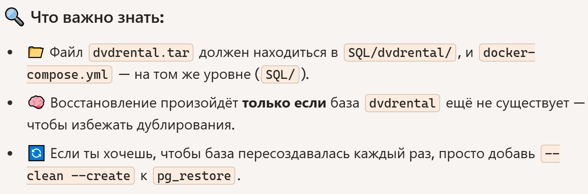
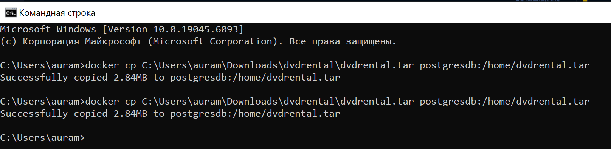
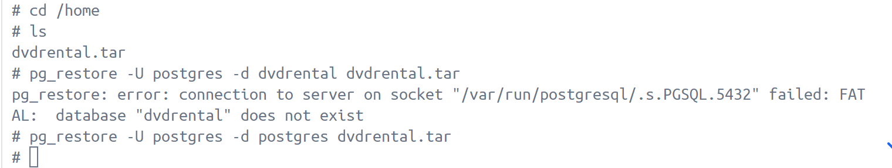
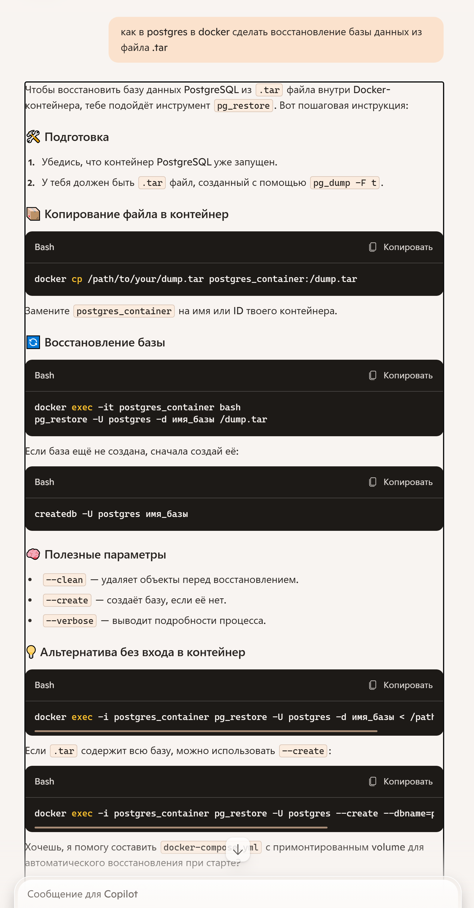
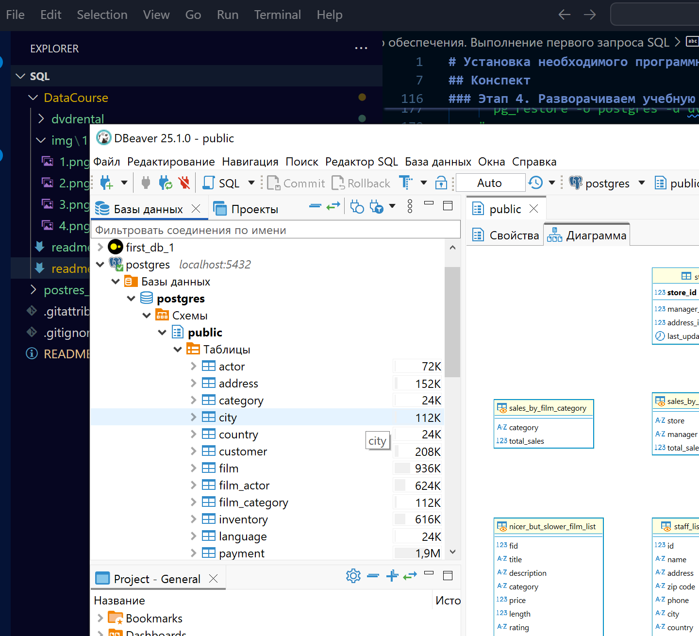
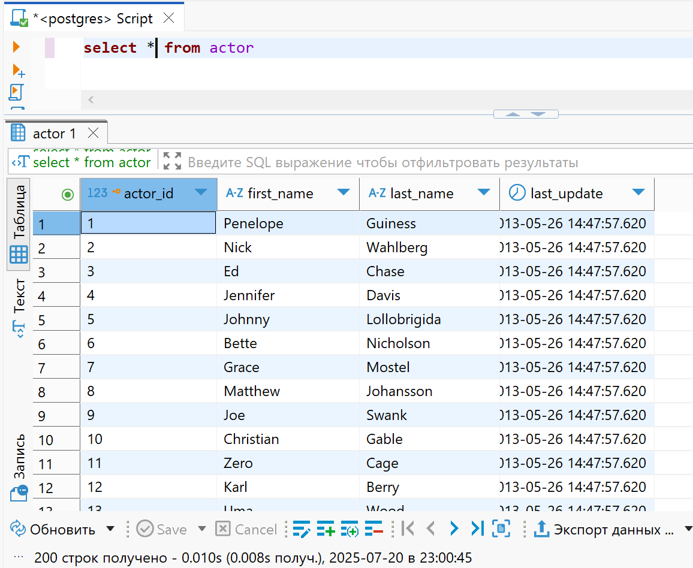

# Установка необходимого программного обеспечения. Выполнение первого запроса SQL

## Links

[link на урок](https://www.youtube.com/watch?v=1c2ZZ3ZaOp0&list=PLzvuaEeolxkz4a0t4qhA0pxmttG8ZbBtd&index=2)

## Конспект

### Этап 1. Установка DBeaver - клиента для работы к СУБД

- Шаг 1. Скачиваем дистрибутив для своей операционной системы по ссылке [ссылке](https://dbeaver.io/download/)

- Шаг 2. Устанавливаем DBeaver из дистрибутива.

- Шаг 3. Запускаем DBeaver, проверяем, что он запущен.


### Этап 2. Установка PostgreSQL

Вариант установки 1. Локально из дистрибутива.

Шаг 1. Скачиваем дистрибутив PostgreSQL с [сайта](https://www.enterprisedb.com/downloads/postgres-postgresql-downloads).

Выбираем дистрибутив c последней доступной версии на вашей операционной системе (ОС).
После нажатия на ссылку откроется окно, в котором скачивание должно начаться автоматически.

Если скачивание не начнется автоматически, то нажмите по ссылке:


Шаг 2. Устанавливаем PostgreSQL из дистрибутива.
Запустите установку из дистрибутива.

При выборе списка компонентов для установки нужно снять галочку с pgAdmin


В остальных пунктах оставьте значения по умолчанию и начните установку.

После завершения установки снимите галочку со Stack Builder и завершите установку:


2)Вариант установки 2. Из docker образа.

Шаг 1. Устанавливаем Docker Desktop, если если он еще не установлен на компьютере.
[Инструкция по установке Docker Desktop и wsl2 на Windows 10.](https://github.com/amelinvladimir/docker_course/blob/main/%D0%A3%D1%81%D1%82%D0%B0%D0%BD%D0%BE%D0%B2%D0%BA%D0%B0%20Docker%20%D0%BD%D0%B0%20Windows%2010/README.md)

Для установки на MacOS скачайте дистрибутив по [ссылке](https://www.docker.com/products/docker-desktop/) и затем установите его.

Шаг 2. Запускаем приложение Docker Desktop.

Шаг 3. Открываем командную строку.
На MacOS открываем обычный терминал.


В Windows открываем приложение "Терминал", нажимаем на стрелку вниз в списке вкладок и выбираем "Ubuntu ...".

Шаг 4. Запускаем контейнер с PostgreSQL.

Для запуска контейнера с postgres версии 16.3, на которой проверена данная инструкция, выполните команду:

````sh
docker run --name postgresdb -e POSTGRES_PASSWORD=pass -d -p 5432:5432 postgres:16.3
````

Параметры для подключения к postgres:

```sh
Хост: localhost
Порт: 5432
База данных: postgres
Пользователь: postgres
Пароль: pass
```

если вы получите ошибку "bind: address already in use", то измените "-p 5432:5432" на "-p 5434:5432". В этом случае порт для подключения к postgres будет 5434.

Для запуска контейнера с последней версии postgres выполните команду:

```sh
docker run --name postgresdb -e POSTGRES_PASSWORD=pass -d -p 5432:5432 postgres
```

### Этап 3. Подключаемся к базе данных с помощью DBeaver

Шаг 1. Открываем DBeaver.

Шаг 2. Создаем новое подключение.

Жмем на стрелку вниз рядом с розеткой с плюсиком и выбираем Postgres.


Скачиваем файлы драйвера, если будет открыто соответствующее окно:


Шаг 3. Указываем параметры подключения и проверяем подключение.

```sh
Хост: localhost
Порт: 5432
База данных: postgres
Пользователь: postgres
```

Если вы установили postgres из дистрибутива, то нужно указать пароль, который вы задали при установке.

Если вы развернули postgres в контейнере, то используйте пароль pass

Нажмите "Тест соединения".

Если вы увидите "Соединено", значит подключение настроено корректно.


Нажмите "Ок".

### Этап 4. Разворачиваем учебную базу данных

Шаг 1. Скачиваем учебную бд.

[Ссылка для скачивания](https://www.postgresqltutorial.com/postgresql-getting-started/postgresql-sample-database/).

[Альтернативная ссылка для скачивания](https://github.com/amelinvladimir/sql_course/blob/main/%D0%A3%D1%80%D0%BE%D0%BA%201.2%20%D0%A3%D1%81%D1%82%D0%B0%D0%BD%D0%BE%D0%B2%D0%BA%D0%B0%20%D0%9F%D0%9E/dvdrental.zip) - нажмите на троеточие и затем Download.


Шаг 2. Извлеките файл dvdrental.tar из архива с учебной бд dvdrental.zip.

Шаг 3. Разворачиваем учебную бд.

Разверните подключение, нажав на стрелку рядом с ним:


Нажмите правой кнопкой мыши на название бд "postgres" и затем выберите "Инструменты" -> "Восстановить"


Выберите формат tar.

Укажите путь к файлу dvdrental.tar. При выборе файла убедитесь, что выбран формат файла *.
Нажмите "Старт".


После того, как увидите сообщение "Task 'PostgreSQL restore' finished" нажмите кнопку "Отмена".


Этот способ действует только когда база данных у нас установлена локально на машине, только тогда мы можем к ней подключаться и выполнять скрипт восстановления.

Шаг 4. Проверяем установку бд.

Нажмите правой кнопкой мыши на название бд "postgres" и выберите "Обновить".


Разверните пункты "Схемы", "public", "Таблицы". Вы должны увидеть список загруженных таблиц.


При помощи docker

После общения с искусственным интеллектом Copilot он предлагает такой файл docker-compose.yml

``` yml
version: '3.8'

services:
  postgres:
    image: postgres:15
    container_name: dvdrental_pg
    environment:
      POSTGRES_USER: postgres
      POSTGRES_PASSWORD: postgres
    volumes:
      - ./dvdrental:/dump
      - pgdata:/var/lib/postgresql/data
    ports:
      - "5432:5432"
    entrypoint: bash -c "
      docker-entrypoint.sh postgres &
      sleep 10 &&
      psql -U postgres -tc \"SELECT 1 FROM pg_database WHERE datname = 'dvdrental'\" |
        grep -q 1 || createdb -U postgres dvdrental &&
      pg_restore -U postgres -d dvdrental /dump/dvdrental.tar
    "
volumes:
  pgdata:

```

О этом yml файле вот замечания



Это как задел на будущее, я его не создавал.
делал следующее:

Создал контейнер в docker

```sh
docker run --name postgresdb -e POSTGRES_PASSWORD=pass -d -p 5432:5432 postgres:16.3
```

Копирую файл восcтановления база dvdrentel.tar в созданный контейнер
Файл предварительно скачиваем в архиве и распакуем его, об этом ранее уже есть инструкция.

```sh
docker cp C:\Users\auram\Downloads\dvdrental\dvdrental.tar postgresdb:/home/dvdrental.tar
```

в итоге будет ответ

Successfully copied 2.84MB to postgresdb:/home/dvdrental.tar



Теперь войдя в терминал контейнера запустим восстановление базы данных
находясь в папке home контейнера postgresdb

```sh
pg_restore -U postgres -d postgres dvdrental.tar
```



Теперь посмотрим после какой переписке я к этому пришел.



Учебная БД успешно развернута :tada::tada::tada:



Выполним первый запрос для базы данных, выберем все данные из таблицы actor

``` SQL
SELECT * FROM actor
```


