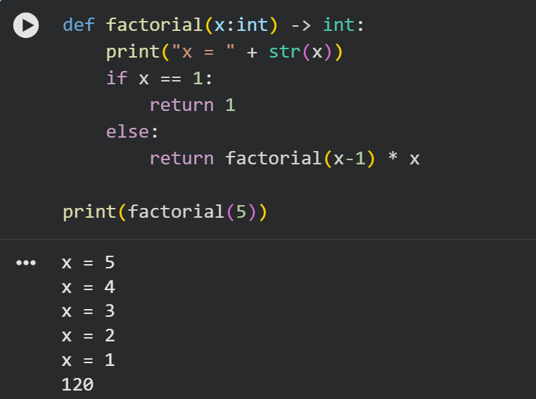
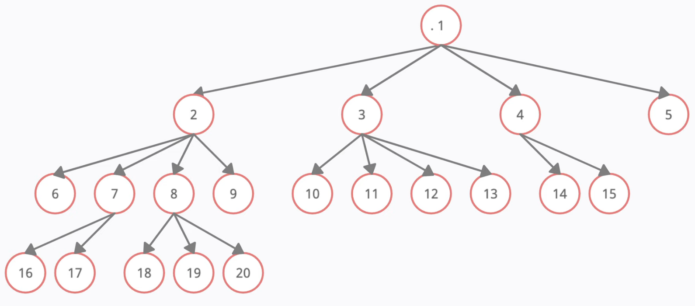
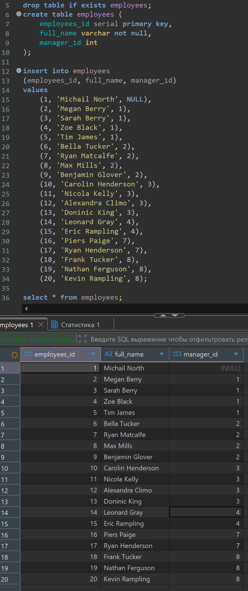
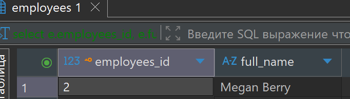
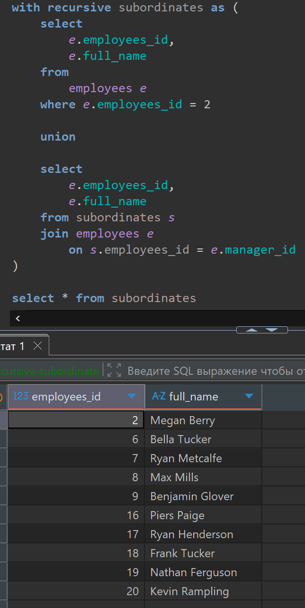
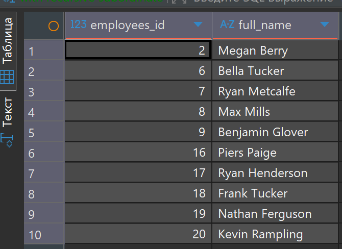
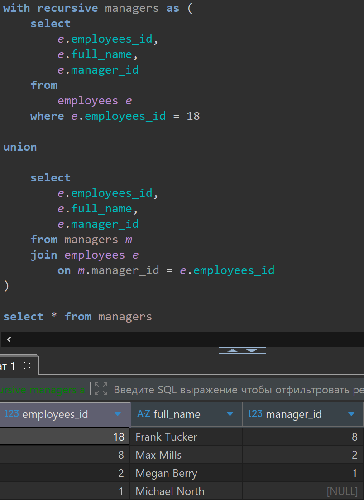
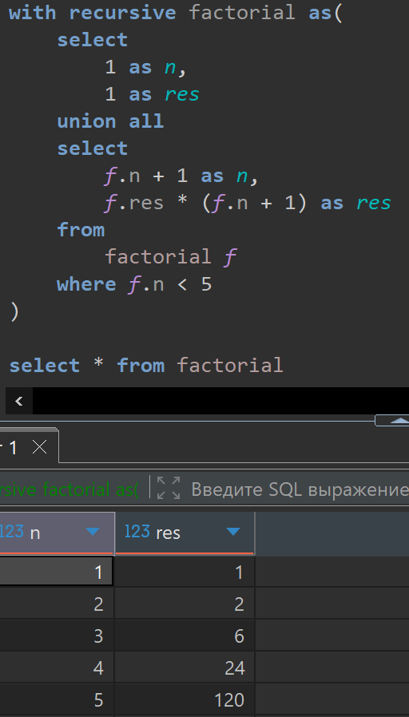

# Lesson 20

## Links

[link lesson](https://www.youtube.com/watch?v=6T7SmDeEwek&list=PLzvuaEeolxkz4a0t4qhA0pxmttG8ZbBtd&index=67)

## Рекурсия в SQL

Первым шагом мы посмотрим на рекурсию в языке python.
Затем разберемся как рекурсия устроена в SQL.

Рекурсия встречается в SQL очень редко, встречается в базах данных 1C

Рекурсия это когда функция вызывает сама себя, для получения промежуточного результата
Самый простой пример это расчет факториала числа
Факториал от числа 5 записывается так

5! = 5 * 4 * 3 * 2 * 1
4! = 4 * 3 * 2 * 1
1! = 1

в общем случае 
n! = n * (n-1) * (n-2) * .... * 2 * 1

Сделаем на языке python функцию которая рассчитывает факториал от числа x

```python
def factorial(x:inr) -> int:
    print("x = " + str(x))
    if x == 1:
        return 1
    else:
        return factorial(x-1) * x
```

Вот так будут выглядеть вызов этой функции в google colab



Для языка SQL для понимания мы создадим новую таблицу, пусть у нас есть некая компания и в ней есть
сотрудники (employees). А компании есть генеральный директор (сотрудник с идентификатором 1) у него начальника нет но есть четыре непосредственных подчиненных (сотрудники с идентификаторами 2, 3, 4, 5), У сотрудника с идентификатором 2 есть также четыре непосредственных подчиненных (с идентификаторами 6, 7, 8, 9). И так далее смотрим картинку



Вот такая у нас структура всего 20 сотрудников, и вот у нас стоит задача в таком дереве получить список всех подчиненных (непосредственных и тех которые подчиняются через какой-то уровень иерархии например 18 ый сотрудник подчиняется 8-ому... а 8-ой подчиняется 2-ому соответственно 18-ый подчиняется 2-ому через один уровень)

Для этого мы сперва создадим такую таблицу и наполним ее скриптом который который создаст таблицу employees в которой
будут поля: employee_id, full_name, manager_id (номер менеджера сотрудника)

```sql
drop table if exists employees;
create table employees (
    employees_id serial primary key,
    full_name varchar not null,
    manager_id int
);

insert into employees
(employees_id, full_name, manager_id)
values 
    (1, 'Michael North', NULL),
    (2, 'Megan Berry', 1),
    (3, 'Sarah Berry', 1),
    (4, 'Zoe Black', 1),
    (5, 'Tim James', 1),
    (6, 'Bella Tucker', 2),
    (7, 'Ryan Metcalfe', 2),
    (8, 'Max Mills', 2),
    (9, 'Benjamin Glover', 2),
    (10, 'Carolyn Henderson', 3),
    (11, 'Nicola Kelly', 3),
    (12, 'Alexandra Climo', 3),
    (13, 'Dominic King', 3),
    (14, 'Leonard Gray', 4),
    (15, 'Eric Rampling', 4),
    (16, 'Piers Paige', 7),
    (17, 'Ryan Henderson', 7),
    (18, 'Frank Tucker', 8),
    (19, 'Nathan Ferguson', 8),
    (20, 'Kevin Rampling', 8);

select * from employees;
```

Запрос в DBeaver выглядит так:



Теперь как нам получить всех подчиненных сотрудника с номером 2. Можно воспользоваться
рекурсивным вызовом с помощью специальной возможности общих табличных выражений CTE
пишем специальное слово recursive которое указывает CTE что тут рекурсия. даем ему название subordinates
ну и сам запрос будет состоять из двух частей.

В первой части получим сотрудника c идентификатором 2

```sql
select
    e.employees_id,
    e.full_name
from
    employees e
where e.employees_id = 2
```

Это будет наш, созданный ранее пользователь Megan Berry, выглядит результат так:



Во второй, 'хитрой части', как раз рекурсивной, которая циклично выполняется, до тех пор пока
не будет возвращен результат. И в этой цикличной части есть один 'Хитрый трюк' мы в этой части
запрашиваем информацию из под-запроса в котором находимся в нашем случае его имя subordinates

```sql
with recursive subordinates as (
    select
        e.employees_id,
        e.full_name
    from
        employees e
    where e.employees_id = 2
    
    union
    
    select
        e.employees_id,
        e.full_name
    from subordinates s
    join employees e
        on s.employees_id = e.manager_id
)

select * from subordinates
```

Вот так будет выглядеть запрос наш с рекурсией:



Разберем как оно сработало.
В начале выполняется один раз первый запрос, находится сотрудник с e.employees_id = 2,
при выполнении этого запроса, был получен один сотрудник, как мы уже выяснили.
Эта одна строка была добавлена в общий результат выполнения CTE, а также эта строка была
помещена в табличку с именем subordinates. То есть, теперь по этому именем у нас есть связь
с первым выполненным запросом.

После выполнения первого запроса у нас начал выполняться второй запрос который после union
в нашем CTE, причем он будет выполняться до тех пор, пока не вернет пустой результат,
а соответственно в табличке subordinates у нас будут меняться значения первый раз она хранит
одну строчку с пользователем Megan Berry, соответственно к этой строке присоединяется таблица
employees по новой, по условию соединения s.employees_id = e.manager_id, то есть у нас получаться
эти пользователи:


Теперь у нас по имени subordinates будут эти четыре пользователя видны,
и эти строчки 4-е пользователя добавятся в общий результат нашей CTE

Далее еще раз повториться этот запрос который указан после union,
соответственно к таблице с четырьмя предыдущими пользователями присоединиться таблица
employees по новой, по условию соединения s.employees_id = e.manager_id, то есть
получатся такие пять пользователей


Теперь у нас по имени subordinates будут эти пять пользователей видны,
и эти строчки 5 пользователей добавятся в общий результат нашей CTE

И на следующем шаге снова повториться этот запрос который указан после union,
соответственно к таблице с 5 предыдущими пользователями присоединиться таблица
employees по новой, по условию соединения s.employees_id = e.manager_id, и так как
не найдется этих пользователей ни у кого в начальниках (то есть в поле manager_id),
на этот раз будет возвращен пустой список, и наша рекурсия прервется

и наша CTE вернет список который получился на всех шагах



Вот так и работает рекурсия в SQL

Посмотрим еще один пример, например для любого сотрудника (например с employees_id = 18)
вернем всех его начальников по цепочке подчинения.
Для этого сделаем CTE, которое назовем managers так как получаем начальников сотрудника

```sql
with recursive managers as (
    select 
        e.employees_id,
        e.full_name,
        e.manager_id
    from
        employees e
    where e.employees_id = 18

    union

    select
        e.employees_id,
        e.full_name,
        e.manager_id
    from managers m
    join employees e
        on m.manager_id = e.employees_id 
)

select * from managers
```

Вот так будет выглядеть запрос наш с рекурсией:



Видим что результат корректный. В рекурсивной CTE можно использовать не только UNION но и UNION ALL
и EXCEPT, и INTERSECT любые объединения которые нам подходят для решения.

И теперь для примера напишем SQL код который будет рассчитывать факториал числа 5.
Мы можем рассчитывать как от 1 до 5 так и от 5 до 1.

```sql
with recursive factorial as(
    select
        1 as n,
        1 as res
    union all
    select 
        f.n + 1 as n,
        f.res * (f.n + 1) as res
    from
        factorial f
    where f.n < 5
)

select * from factorial
```

Вот так будет выглядеть запрос наш с рекурсией:


