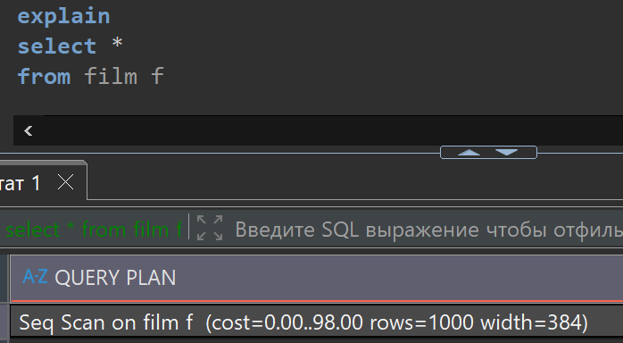
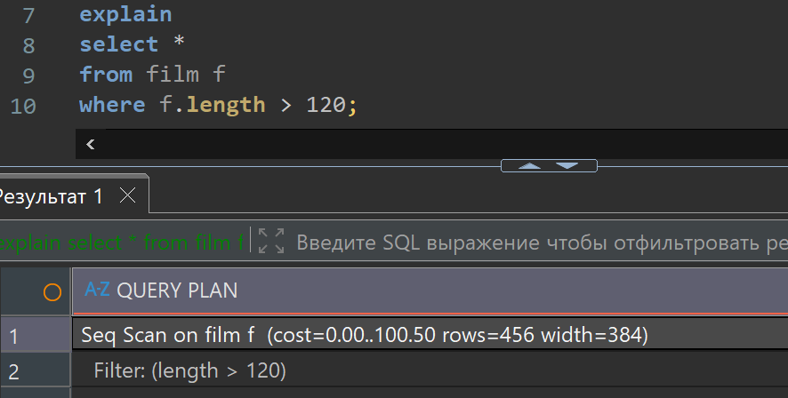
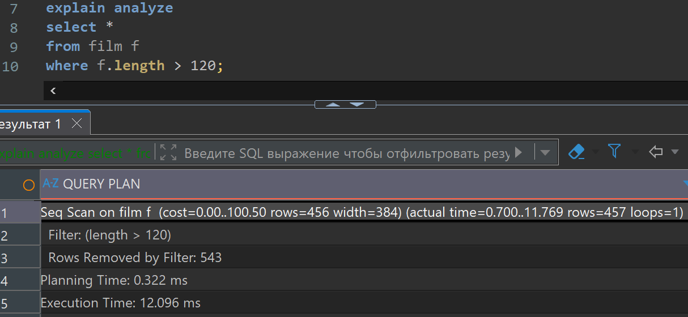
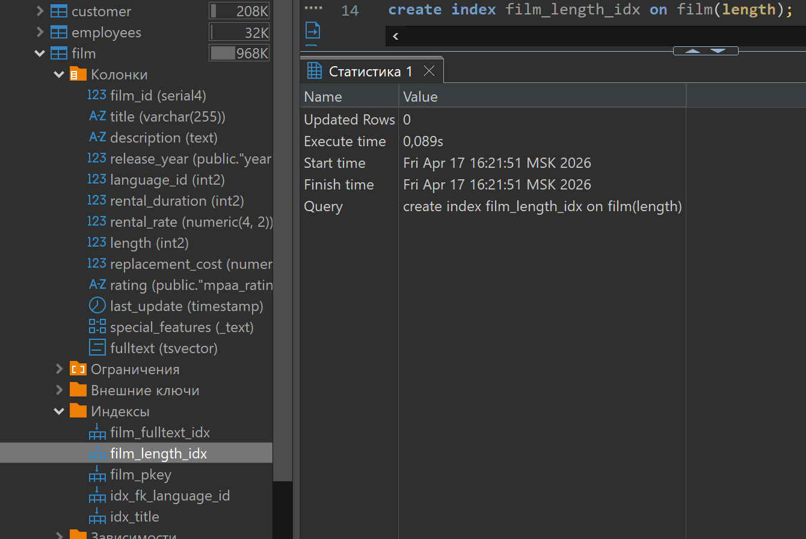
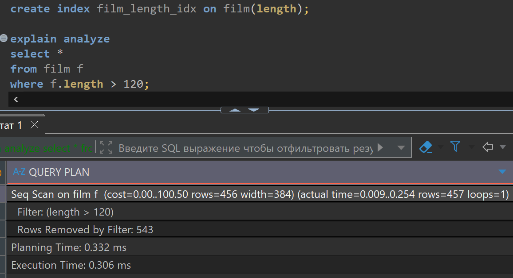

# Lesson 21

## Links

[link lesson](https://www.youtube.com/watch?v=-bD485Icyxc&list=PLzvuaEeolxkz4a0t4qhA0pxmttG8ZbBtd&index=70)

## Оптимизация запросов

Эта тема очень большая, можно очень много посмотреть протестировать и понять. Тут мы слегка коснемся этой темы для понимания.

Так как сегодня объемы данных очень большие, а скорость их обработки для бизнеса очень важна, то освоить
оптимизацию запросов, это важный навык любого специалиста работающего с данными.

Для начала посмотрим на индексы, и то как они влияют на работу.
Вторым шагом разберем также планы построения запросов и как, с их помощью, можно искать способы ускорения
работы этого запроса.

Если мы хотим посмотреть, как, любой запрос выполняется в СУБД, то перед этим запросом мы пишем
ключевое слово explain. Тогда мы будем получать план построения запроса

```sql
explain
select * 
from film f
```

План выполнения этого запроса очень простой, выдаст одну строку

Seq Scan on film f  (cost=0.00..98.00 rows=1000 width=384)

Seq Scan - означает чтение строк из таблицы film в случае нашего запроса;

(cost=0.00..98.00 rows=1000 width=384) - тут:

cost это цена выполнения запроса.

rows это количество строк которое получаем

width это объем памяти затраченной на операцию

Вот так будет выглядеть DBeaver:



Цена (cost) это некое значение не привязанное ни ко времени, ни к количеству операций процессора, это
просто, какая-то условная единица, важная для планировщика задач который занимается оптимизацией выполнения
запроса. Эти  самые планы могут сильно отличаться по производительности, и вот планировщик смотрит
разные варианты выполнения запроса и выбирает с наименьшей стоимостью (cost).

Для нас важно, что-бы запрос имел наименьшую стоимость
На стоимость можно повлиять как на уровне 'железа' сервера на котором работает СУБД, так и оптимизацией
кода который мы пишем в запросе

Перепишем наш запрос, добавив в него условие по выбору интересующих нас записей.
На этот раз напишем explain analyze. Когда пишем просто explain у нас выводится только план
выполнения запроса, сам запрос не выполняется, а когда пишем explain analyze то у нас будет план выполнения
запроса и плюс сам запрос выполнится и мы увидим информацию о его выполнении.

```sql
explain
select * 
from film f
where f.length > 120;
```

Вот так будет выглядеть запрос с explain с результатом в DBeaver:



```sql
explain analyze
select * 
from film f
where f.length > 120;
```

Вот так будет выглядеть запрос с explain analyze с результатом в DBeaver:



Видим что планируемы цифры отличаются от реальных цифр выполнения запроса

С помощью этих инструментов можно смотреть как будут отрабатывать те или иные запросы, и оценивать
эффективность выполнения этих запросов.

Для ситуаций когда у нас в таблице записей очень много, а в наших запросах будет этих строк попадать мало,
то-есть мы должны оптимально фильтровать данные в таблицах, придуманы индексы как один из вариантов
оптимизации выполнения таких запросов. Для создания индекса пишем

```sql
create index film_length_idx on film(length);
```

где film_length_idx это название индексы
film(length) это таблица и ее поле на которые создаем индекс

После выполнения увидим этот индекс в DBeaver:



Видим что там есть и другие индексы это по ключу по названию
сразу пример кода для удаления индекса

```sql
drop index film_length_idx;
```

Теперь создадим этот индекс, и попробуем для сравнения
результатов запустим предыдущий запрос с фильтром по length > 120

```sql
create index film_length_idx on film(length);

explain analyze
select * 
from film f
where f.length > 120;
```

После выполнения увидим этот индекс в DBeaver:



Видим что actual time у нас изменилось в десятки раз что не может ни радовать,
особенно если такого рода запросы у нас ожидаются в больших количествах.

Индекс это отдельная структура данных, это иерархическая структура, которая внутри себя
содержит все идентификаторы из таблицы film в упорядоченном виде по полю length в данном случае,
эта структура нам позволяет идти не в саму таблицу, а в эту структуру, и уже использовать не все строки
в таблице, а только их часть и в итоге может быть выполнен запрос очень быстро.
Такой выигрыш мы, сможем получить не всегда, и это зависит от эффективности отсева данных на шаге
обращения в структуру созданного индекса, поэтому может быть не эффективным лишнее обращение к этой
структуре, если она не уменьшает нам количество перебираемых строк.
Это оптимизирует планировщик, запроса, и он может сам отказаться от использования индекса в запросе.

Так же сама по себе структура индекса, накладывает на СУБД определенные расходы на содержание и
обслуживание этих индексов, то-есть например при добавлении новых строк в таблицу, нам теперь нужно
обновлять не только саму таблицу, но и структуру индекса, что тоже потребляет ресурсы сервера.

Соответственно, создавать новые индексы нужно при реальной необходимости, когда они реально помогают
поднять производительность сервера (скорость его работы).
