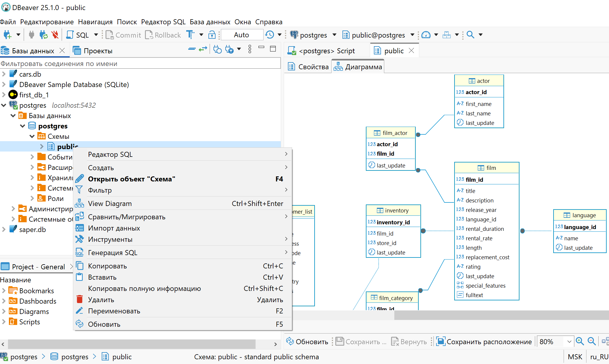
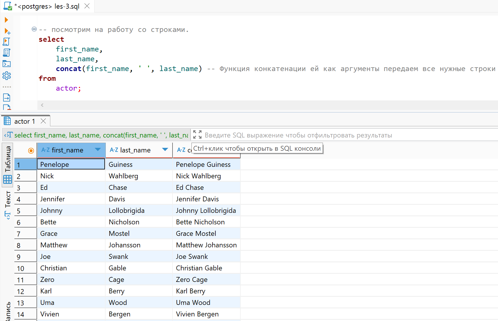

# Lesson 3

## Links

[link lesson](https://www.youtube.com/watch?v=VLFF1w4Vzj4&list=PLzvuaEeolxkz4a0t4qhA0pxmttG8ZbBtd&index=4)

## Познакомимся с dbeaver

У нас есть база данных с названием postgres
Нас интересует схема этой базы данных с названием public
Можем добавить еще одну схему или еще одну базу данных, но нам это не нужно пока во всяком случае.

Разные схемы в базе данных можно создавать для логического разделения набора данных. Когда таблиц много их удобно логически сгруппировать
Например владелец магазина DVD дисков, может открыть еще один магазин по продаже мебели, например. Тогда разработчик базы данных который будет
делать программу для этого нового магазина, может создать отдельную схему, куда будет размещать все таблицы для магазина мебели.

Если таких магазинов очень много то можно их разделить еще и по разным базам данных
Также в отдельную базу данных можно отделить таблицы к которым предъявляются отдельные требования. Например в магазине DVD дисков нам важно получать быстро информацию о наличии в магазине дисков определенного диска, для быстрого ответа покупателю, так же нужно очень быстро добавлять запись о арендованных дисках, также для быстрого взаимодействия с покупателем.
А если у нас другая задача, у нас большой поток системных сообщений, логов, например 1гиг с секунду, и нам их нужно записывать в базу данных, для этой задачи можно сделать другую базу данных, и построить ее уже с учетом большой необходимости в быстрой записи данных в нее, и уже не сильно беспокоится о быстроте с которой эта база сможет отдавать нам данные.

Можно визуально посмотреть на структуру нашей схемы базы данных
левый клик на схеме -> View Diagram (CTRL + Shift + Enter)



База данных postgres является реляционной, то есть у таблиц этой базы есть отношения (relation) которые позволяют сохранять целостность базы данных. Как это работает разберем позже.

Порассуждаем для чего нам нужна база данных. У нас есть продавец, к нему приходит покупатель и спрашивает фильм Титаник, продавец должен посмотреть по названию есть ли такой фильм, и быстро отвечает есть такой диск в продаже или нет. А если покупатель берет диск в аренду, то продавец быстро делает запись в базу о том что диск взяли в аренду, с какого числа и с другой информацией.
Еще есть управляющий который может нуждаться в информации о том как покупаются и арендуются диски для понимания как идут дела, может что то нужно докупить, или что то убрать из магазина

## Изучаем непосредственно запросы выводим информацию из таблиц

Перейдем к написанию запросов к нашей базе данных. Посмотрим на запрос колонок в определенной таблице.

Код вот такой

```sql
SELECT
	actor_id actorIdentity,
	first_name as firstName,
	last_name "Last Name",
	last_update as "Last Update"
FROM
	actor;
```


## Комментарии в коде SQL (postgres)

Виды комментариев:

1 Много строчный комментарий

 ```sql
 /*
    Этот многострочный
    комментарий поясняет
    несколько строк кода
*/
```

2 Однострочный комментарий

```sql
-- SELECT * FROM orders WHERE status = 'pending';
SELECT * FROM products;

SELECT * FROM users WHERE age > 18; -- Выбираем совершеннолетних пользователей
```

## Перейдем к Математическим операциям в postgres

Это самые популярные математические операции

```sql
-- посмотрим на математические операции.
select 
	amount,
	amount + 2, -- Можем прибавлять значения
	amount - 3, -- Можем вычитать значения
	amount * 1.5, -- Можем умножать на значение
	amount / 3, -- Можем делить на значение
	amount ^ 2, -- Можем возводить в степень (например в квадрат)
	amount % 4, -- Можем вычислять остаток от деления (например на 4)
	mod(amount, 4), -- Можем вычислять остаток от деления (например на 4) функцией mode()
	div(amount, 3), -- Возвращает результат деления (например на 2) отбрасывая дробную часть 
	round(amount / 2, 4), -- Переданное число округляет по правилам математики до указанной точности 
	floor(amount / 3), -- Переданное число округляет до целого в меньшую сторону
	ceil(amount / 3) -- Переданное число округляет до целого в большую сторону 
from
	public.payment; -- более общая форма запроса таблицы через схему, так тоже можно
```

Результат выглядит так:


Если будет не хватать этих функций можно "погуглить" по принципу запроса:

postgresql math function

в результате получим ссылку на документацию а лучше и не придумаешь [link postgresql.org](https://www.postgresql.org/docs/9.5/functions-math.html)

## Перейдем к работе со строками в SQL (postgres)

Для работы со строками будем работать с таблицей actor
Получим для начала данные из нее фамилию и имя актера:

```sql
select 
	first_name,
	last_name
from 
	actor;
```

Результат выглядит так:


Теперь предположим мы хотим распечатывать этикетки для компакт дисков, и нам нужно пять актеров которые снимались в фильме, в формате: имя пробел фамилия. И вот нам нужен запрос который будет эту информацию выводить.

Для такого рода задач есть функция конкатенации и оператор конкатенации.

1 Работа функции конкатенации

```sql
select 
	first_name,
	last_name,
	concat(first_name, ' ', last_name) -- Функция конкатенации ей как аргументы передаем все нужные строки
from 
	actor;
```

Результат выглядит так:



2 Работа оператора конкатенация

```sql
select 
	first_name,
	last_name,
	first_name || ' ' || last_name -- Оператор конкатенации
from 
	actor;
```

Результат выглядит также как в предыдущем примере:

Теперь допустим что у нас может на этикетку влазить только 15 символов.
Соответственно если вся строчка занимает больше символов то нам ее нужно сократить.

### Функция CHAR_LENGTH() возвращает количество символов в строке

У нас есть функция которая возвращает количество символов в строке, это функция CHAR_LENGTH

char_length(first_name || ' ' || last_name) -- Функция считающая длину переданной ей строки
char_length('Количество символов') -- выведет 19

Теперь если длина строки больше 15 символов, то нам нужно сократить длину строки.
Можно использовать условные выражения, но это мы оставим на будущее, а теперь

### Функция LEFT() делает строку нужной длины, обрезая переданную строку

left ( text, 3 ) вернет tex

Возвращает первые n символов в строке text. Когда n меньше нуля, возвращаются все символы слева, кроме последних n

например
left('abcde', 2) вернет ab

Теперь, если по каким то причинам, в базе данных при наборе случайно в начале или в конце фамилии или имени актеров могли добавить пробелы нам нужно это отследить и исправлять. Это очень частая ошибка при наборе данных, поэтому надо уметь ее обходить
Особенность в том что эта может быть незаметной, и это очень часто возникает.

Как же убирать лишние пробелы в начале и в конце строки.

### Функция TRIM()

есть функция
trim ( [LEADING | TRAILING | BOTH] [characters text] [FROM] string )
Удаляет только символы characters (по умолчанию пробелы), с начала (LEADING), с конца (TRAILING) или с обеих сторон (BOTH, по умолчанию) строки string.

например trim(both 'xyz' from 'yxTomxx') вернет Tom
например trim(' Penelope ') вернет Penelope то ест она удалит пробелы с двух сторон слова если они есть

### Функция Lpad()

есть функция для вывода определенного количества символов с строке,

lpad ( text, length [, fill] )
Дополняет строку text слева до длины length символами fill (по умолчанию пробелами). Если длина строки уже больше заданной, она обрезается справа.

например lpad('hi', 5, 'xy') вернет xyxhi

Представим что нам нужно только определенная часть строки. 

Функция SUBSTRING()

substring ( string text [FROM start integer] [FOR count integer] )

Извлекает из string подстроку, начиная с позиции start (если она указана), длиной до count символов (если она указана). Параметры start и count могут опускаться, но не оба сразу.

первый аргумент - строка от которой нужно взять часть.
второй аргумент - начиная с какого символа нам нужно взять (считаются с 1)
третий аргумент - указываем количество символов которые нужно взять

Примеры
substring('Thomas' from 2 for 3) вернет hom
substring('Thomas' from 3) вернет omas
substring('Thomas' for 2) вернет Th

Представим что нам нужно, для каждого актера вывести три символа имени и затем три символа фамилии
substring(first_name, 1, 3) || substring(last_name, 1, 3)

```sql
select 
	first_name,
	last_name,
	concat( first_name, ' ', last_name), -- Функция конкатенации ей как аргументы передаем все нужные строки
	first_name || ' ' || last_name, -- Оператор конкатенации
	char_length(first_name || ' ' || last_name), -- Функция считающая длину переданной ей строки
	left(first_name || ' ' || last_name, 15), -- функция оставляет указанное количество символов в строке
	trim(' ' || first_name || ' '), -- функция убирает пробелы, если они есть в начале и в конце строки
	substring(first_name, 2, 3),	-- функция выведет начиная с второго символа в строке, всего три символа
	substring(first_name, 1, 3) || ' ' || substring(last_name, 1, 3) -- выводим 3 символа имени и 3 символа фамилии
from 
	actor;
```

Результат всех функций можно посмотреть, выглядит так:


### Функция UPPER()

upper ( text )
Переводит символы строки в верхний регистр

пример
upper('tom') вернет TOM

### Функция LOWER()

lower ( text )
Переводит символы строки в нижний регистр

пример
lower('TOM') вернет tom

## Посмотрим таблицу персонал (staff)

У таблицы есть поле email и нам нужно найти значение пользователя, то-есть часть электронной почты до символа @

### Функция STRPOS()

strpos ( string text, substring text )

Возвращает начальную позицию первого вхождения substring в строке string либо 0, если такого вхождения нет.

пример
strpos('high', 'ig') вернет 2

```sql
select
	email,
	strpos(email, '@'), -- получим позицию символа '@' в строке поля email
	substring(email, 1, strpos(email, '@') - 1 ) -- получаем имя пользователя в адресе почты
from
	staff 
```

Результат всех функций можно посмотреть, выглядит так:


