# Lesson 4

## Links

[link lesson](https://www.youtube.com/watch?v=IfDVDm2zwoU&list=PLzvuaEeolxkz4a0t4qhA0pxmttG8ZbBtd&index=10)

## Логические операторы и выражения в WHERE

При работе с реальными таблицами, нам не обязательно работать со всеми тысячами записей сразу,
правильнее писать запросы что бы они выводили только нужное количество строк.

Такое поведение делается с помощью ограничений.

Обратим внимание на поле rental_rate - это рейтинг сдачи в прокат этого фильма

И так, ограничения делаются с помощью where (где), это ключевое слово

Выведем все записи с rental_rate равным 4.99

```SQL
select *
from
    film
where
    rental_rate = 4.99
```

Запрос в DBeaver будет выглядеть так:

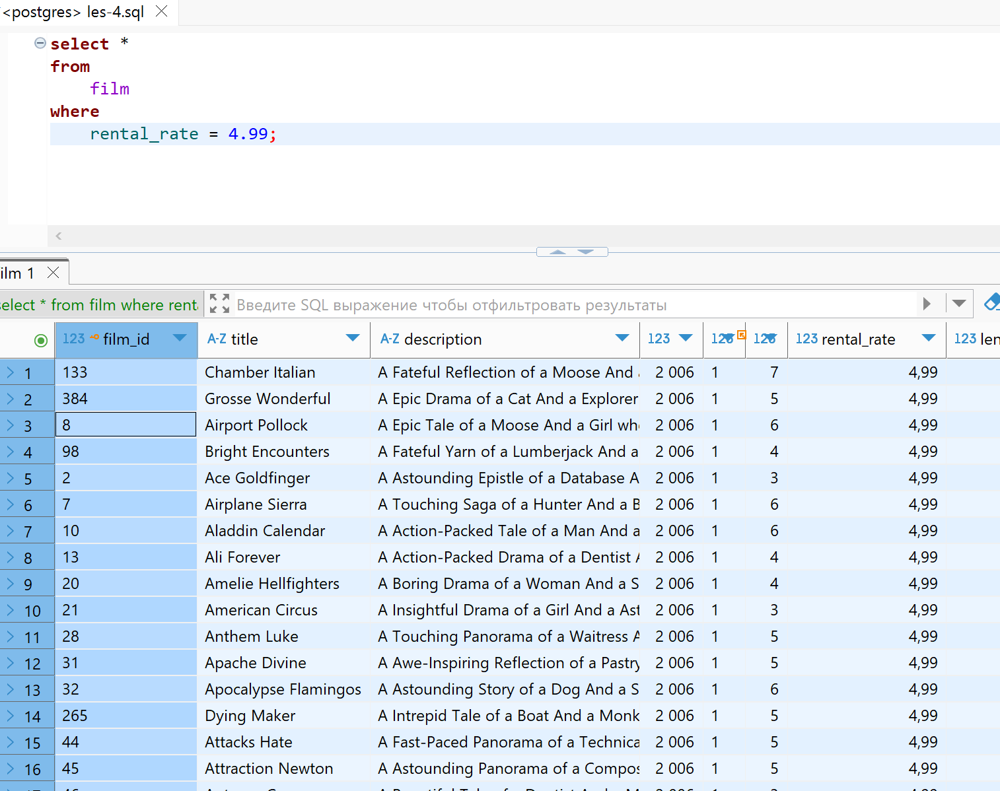

Строки в этом where сравниваются посимвольно, чем дальше символ в таблице ASCI тем символ больше.

Для следующего примера нам понадобятся данные из таблицы rental (факты сдачи дисков в аренду), в ней есть поля
rental_date - дата в которую диск был отдан в аренду

Например запросим все данные из определенного диапазона.
с 26 мая 2004 года по 29 мая 2005 года
Есть ключевое слово BETWEEN

```SQL
select *
from rental
where return_date between '2005.05.26' and '2005.05.29';
```

postgres умеет неявно преобразовывать строки на подобии '2005.05.29' к типу данных - дата. Однако, обычно делают явное преобразование к типу data, но это мы посмотрим немного позже.

Запрос в DBeaver будет выглядеть так:

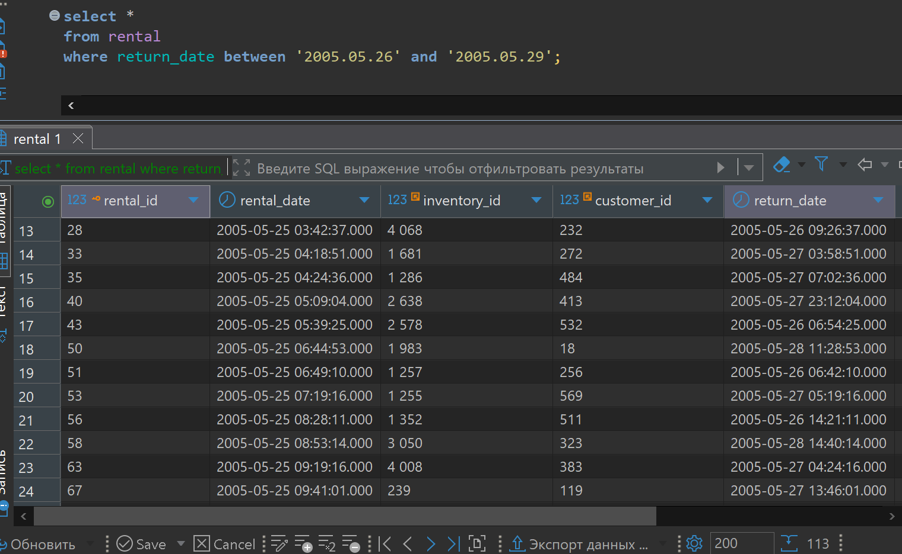

Обратим внимание что дата у нас в формате год.месяц.день
можно и вот так год-месяц-день тоже будет неявное преобразование

Теперь вернемся к таблице film. Представим что к нам в магазин пришел покупатель и увидел фильм с названием (Airport Pollock) И спрашивает, а что у нас еще есть про аэропорты, вот мне это интересно, какие еще есть фильмы в магазине. Для такого случая есть оператор для поиска в тексте определенного шаблона. Это оператор LIKE.

```SQL
select *
from film
where title like '%Airport%';
```

Увидим в выборке дополнительно еще два фильма где есть указанное слово

Запрос в DBeaver будет выглядеть так:

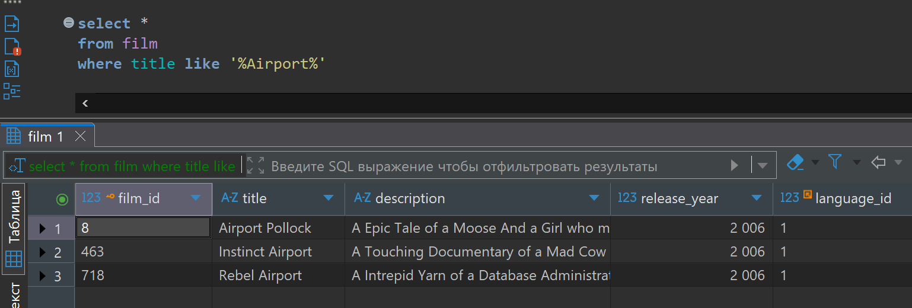

Когда мы пишем LIKE то мы проверяем что строка которая слева (title - в данном случае) удовлетворяет шаблону справа

В шаблоне мы можем писать в одинарных кавычках ('') конкретный текст а так же специальные символы:

% - означает что на его месте может стоять любое количество, любых символов, в том числе символов может и не быть.

_ - знак нижнего подчеркивания означает что на его месте ровно один любой символ (небольше и не меньше)

Есть еще другой оператор NOT LIKE, предположим к нам в магазин пришел придирчивый покупатель который не хочет что бы в описание (description) фильма встречалось слово epic (эпический).
Тут действуют все те же правила к шаблону, только выбираются все записи которые не удовлетворяют этому шаблону.

```SQL
select *
from film
where description not like '%Epic%';
```

Запрос в DBeaver будет выглядеть так:

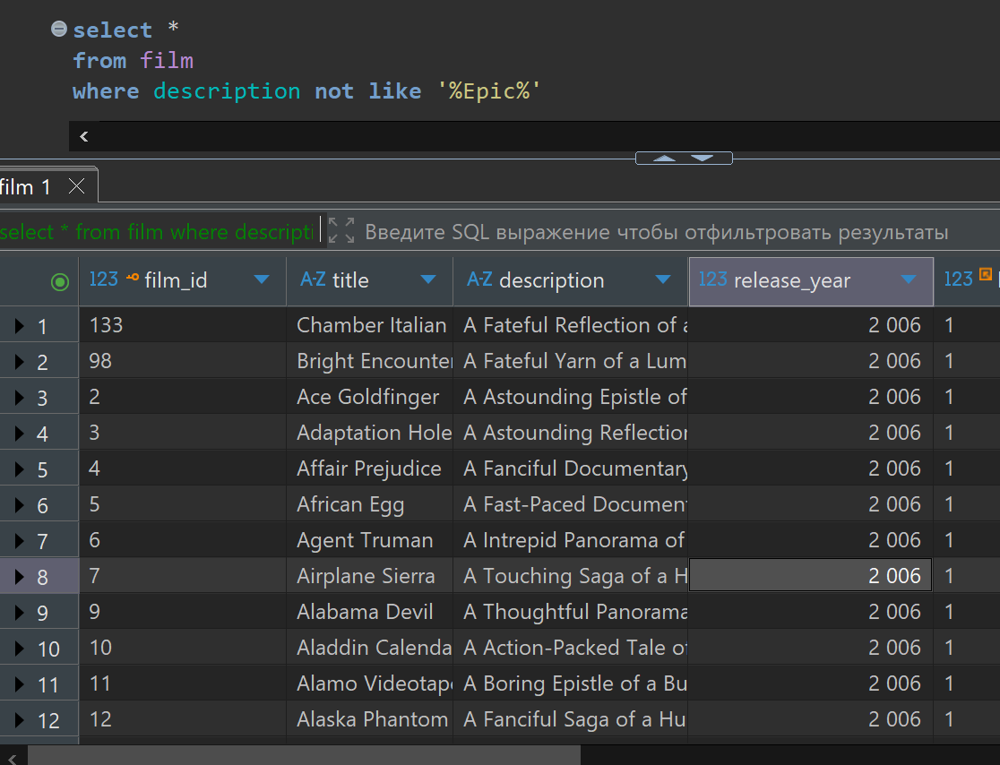

Теперь сделаем запрос к таблице адресов (address) в адресах у нас есть интересно поле (addres2) по задумке второй адрес магазина проката дисков. И можно видеть в некоторых записях значение этого поля NULL то есть нет значения, мы можем при разработке таблицы указывать может эта колонка иметь такое значение или нет. Данная колонка, как видно может. Что интересно там есть и просто пустые строки но они не NULL, и это не одно и тоже.

```SQL
select *
from address;
```

Запрос в DBeaver будет выглядеть так:

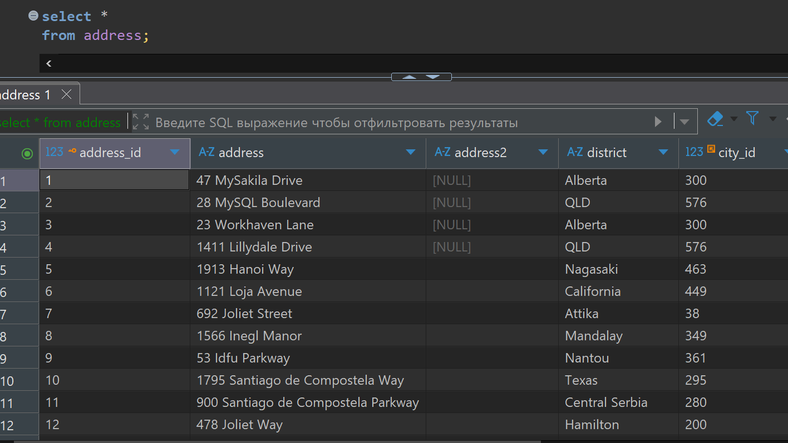

Бывают задачи где как раз нужно различать NULL значение или просто пустое, для этого можно использовать оператор IS NULL, он как раз различает такие значения. Возвращает истину где значение поля именно NULL

```SQL
select *
from address
where address2 is null;
```

Запрос в DBeaver будет выглядеть так:

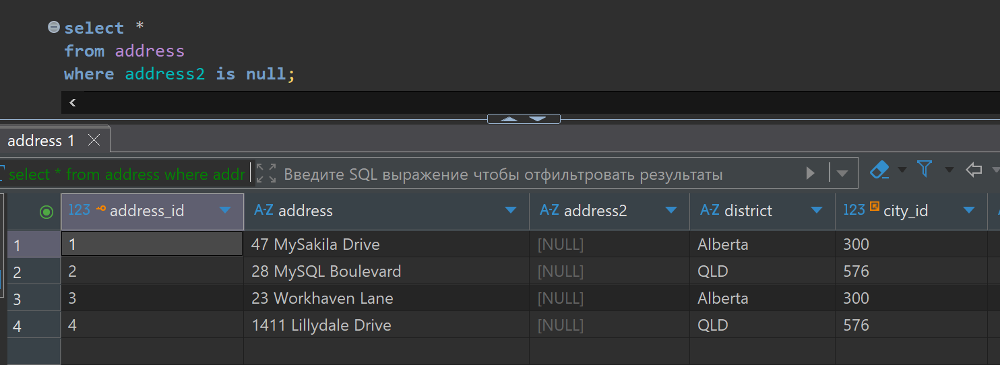

Если нужно где значения не NULL то используют оператор IS NOT NULL

```SQL
select *
from address
where address2 is not null;
```

Запрос в DBeaver будет выглядеть так:

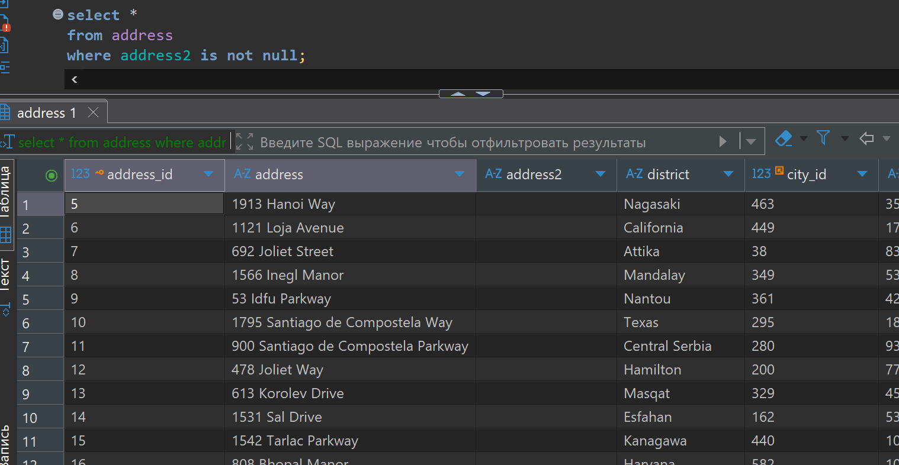

Еще один оператор который нужно знать, это оператор неравенство <>

```SQL
select *
from film
where rental_duration  <> 7;
```

Еще один вариант записи оператора не равенства !=

```SQL
select *
from film
where rental_duration  != 7;
```

Так же можно использовать список значений в который входят нужные нам значения

```SQL
select *
from film
where rental_duration in (3, 4, 7);
```

И так мы рассмотрели операторы =   >   <   >=   <=   LIKE   NOT LIKE    IS NULL   IS NOT NULL    <>   !=   in   between

Помимо использования этих условий мы можем использовать комбинации этих условий для формирования которых у нас есть три оператора:

1 Оператор NOT
Если нам нужны все фильмы у которых поле rental_duration не равно 7 можно записать так

```SQL
select *
from film
where not rental_duration = 7;
```

Запрос в DBeaver будет выглядеть так:

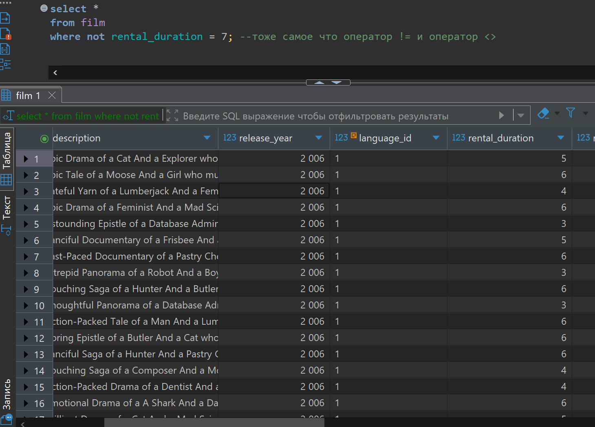

Так же само, можно использовать этот оператор с:

NOT LIKE (раньше уже видели пример с "Epic")
Так же можно написать NOT перед полем к которому мы его применяем

```SQL
-- Идентичные записи 
select *
from film
where description not like '%Epic%';

select *
from film
where not description like '%Epic%';
```

На самом деле, так как postgres "умный" эти два запроса выполнятся с одинаковой скоростью, но если задуматься, то NOT LIKE это один оператор, а во втором варианте это два оператора, поэтому логичнее использовать первый вариант. В данном случае достаточно одной проверки.

Тоже самое будет работать с !=, NOT NULL

2 Оператор AND
Нужен когда нам нужно что бы выполнялось сразу несколько операторов.
Допустим нам нужны фильмы у которых rental_duration были либо 6 либо 7, кроме того rental_rate должен быть больше 1, и еще нам нужны только фильмы начинающиеся на букву "P"

Решение будет такое:

```SQL
select *
from film
where 
        rental_duration in (6, 7) 
    and rental_rate > 1
    and title like 'P%';
```

Запрос в DBeaver будет выглядеть так:

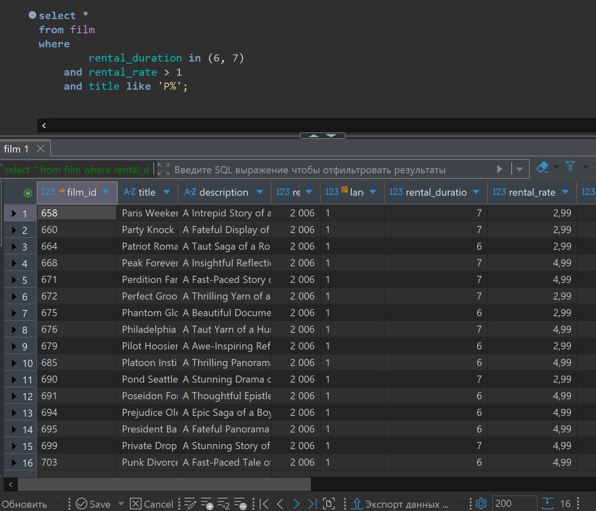

Видим что выполняются все три условия нами заданные.
Таким же образом можно добавлять еще условия.

3 Оператор OR
Применяется когда нам нужно выполнение или одного условия либо другого, и нам не важно какое из них выполнится.
Для примера, нам подойдет когда у фильма rental_duration равен 1, или равен 6,
Или если название фильма начинается с буквы "P"

Решение будет такое:

```SQL
select *
from film
where 
        rental_duration in (1, 6) 
    or title like 'P%';
```

Запрос в DBeaver будет выглядеть так:

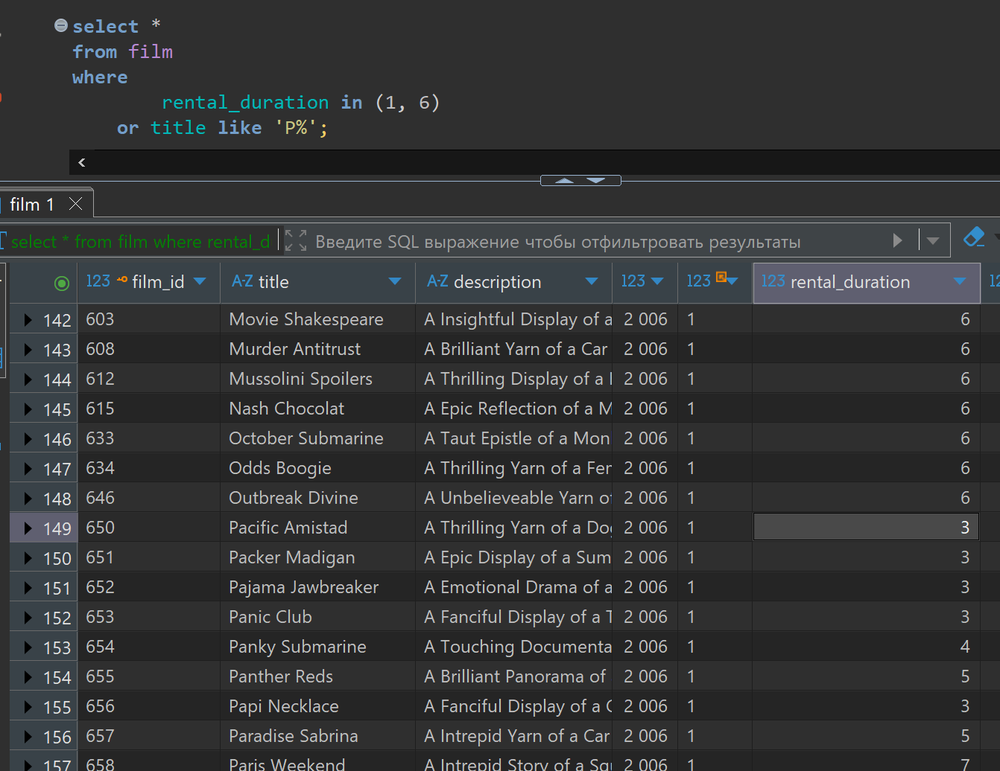

Можно использовать комбинации этих операторов.

Например запросим фильмы у которых rental_duration должен быть или 6 или 7,

или rental_rate больше 1 и название фильма (title) должно начинаться с буквы "P"

или продолжительность фильма должна быть между 70 и 120 минутами и рейтинг фильма (rating) должен быть "PG"

Решение будет такое:

```SQL
select *
from film
where
    rental_duration in (6, 7) or
    (rental_rate > 1 
     and title like 'P%') or 
    (length between 70 and 120 
     and rating = 'PG');
```

Второй вариант

```SQL
select *
from film
where
    rental_duration in (6, 7) or
    (rental_rate > 1 
     and title like 'P%') or 
    (length between 70 and 120 
     and cast(rating AS text) like 'PG');
```

Запрос в DBeaver будет выглядеть так:

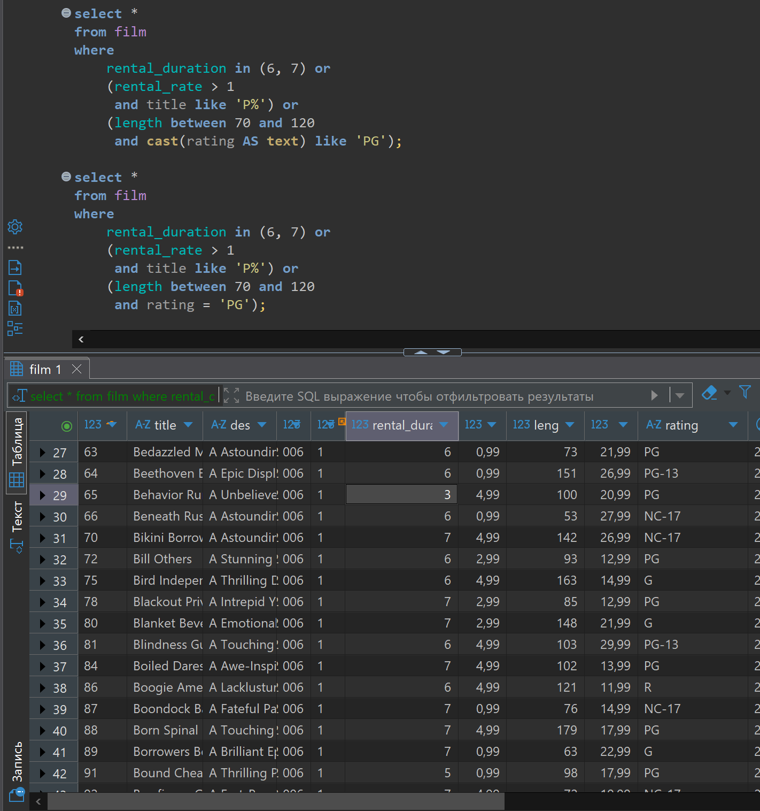

У операторов NOT, AND, OR есть приоритеты согласно их перечислению тут. Если нужен другой порядок то используем скобки ().
У скобок наивысший приоритет.
