# Lesson 5

## Links

[link lesson](https://www.youtube.com/watch?v=S2B-7qichEA&list=PLzvuaEeolxkz4a0t4qhA0pxmttG8ZbBtd&index=15)

## Сортировка строк с помощью order by

Разберем что такое NULL и сравним с пустой строкой.
А поможет нам разобраться в этом вопросе, быстрее следующая конструкция

Смысл в том что NULL не тоже самое что '' или просто отсутствие значения числа, bool, или другого типа значения.

Например сравним NULL и пустую строку ''

```sql
select 1, 5 + 6, 1 = 6, 4 = 4;
select null = 'Some string'; -- Результат будет NULL
select '' = 'Some string'; -- Результат false
select '' = '' -- Результат true
select 'text' = 'text' -- Результат true
select 'text' = 'new_text' -- Результат false
select '' = null; -- Результат NULL
select null = null; -- Результат будет NULL
select '' || 'Some string';  -- Результат будет строка Some string
select null || 'Some string';  -- Результат будет NULL
select 1 = 1 or null = ''; -- Результат true
```

Любая логическая операция с NULL вернет NULL кроме операции OR

Теперь посмотрим такой пример, Обратимся к таблице address там есть поле address2 у которого есть значения NULL

```sql
select *
from address;
```

Значения в DBeaver увидим так

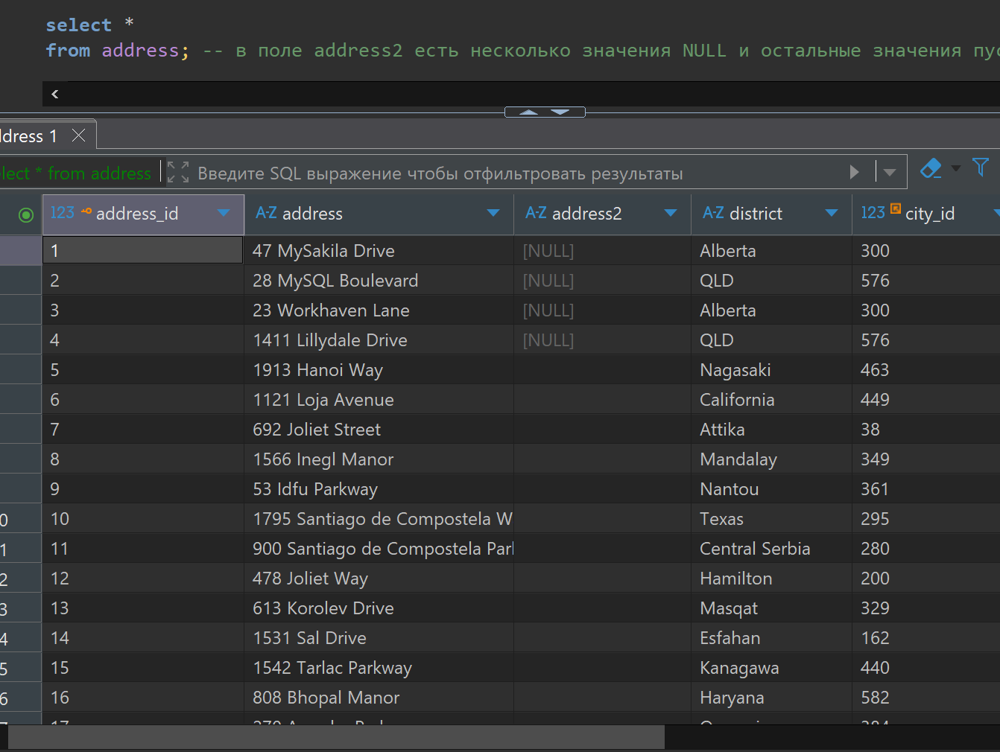

Теперь попробуем сравнить со строкой "Moscow".
У нас все строки не равны строке "Moscow" но строки со значением NULL при сравнении вернут NULL и не попадут в выборку

```sql
select *
from address
where address2 <> 'Moscow'
```

Значения в DBeaver увидим так

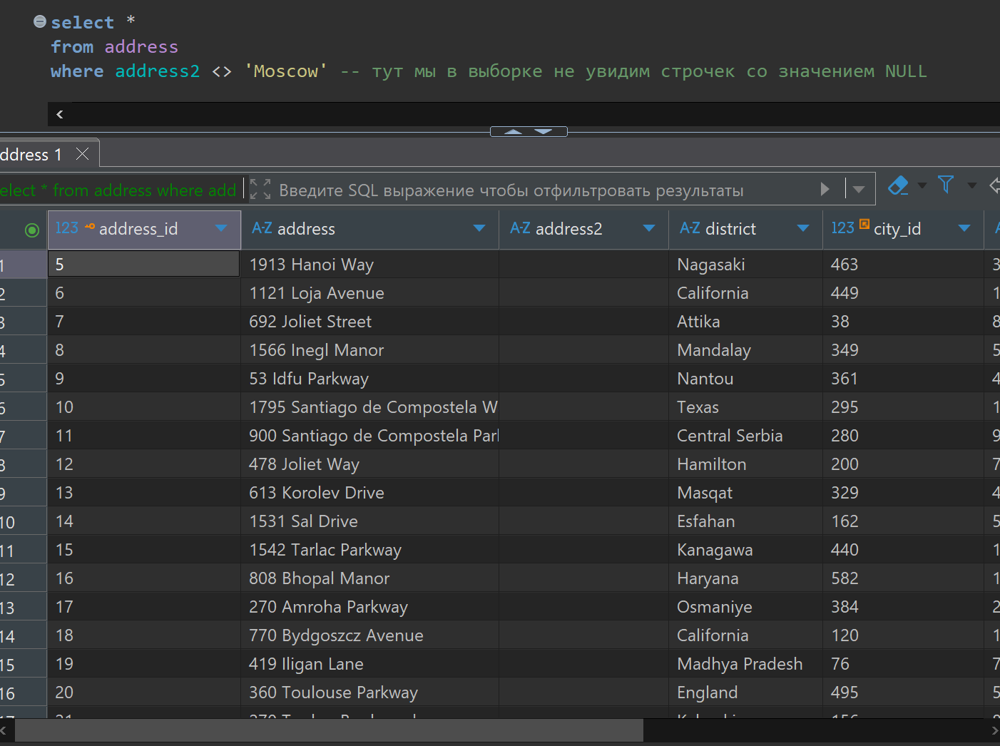

Чтобы попали и поля со значением NULL нужно учесть этот нюанс поэтому можно сделать так

```sql
select *
from address
where 
    address2 <> 'Moscow' or
    address2 is null;
```

Значения в DBeaver увидим так

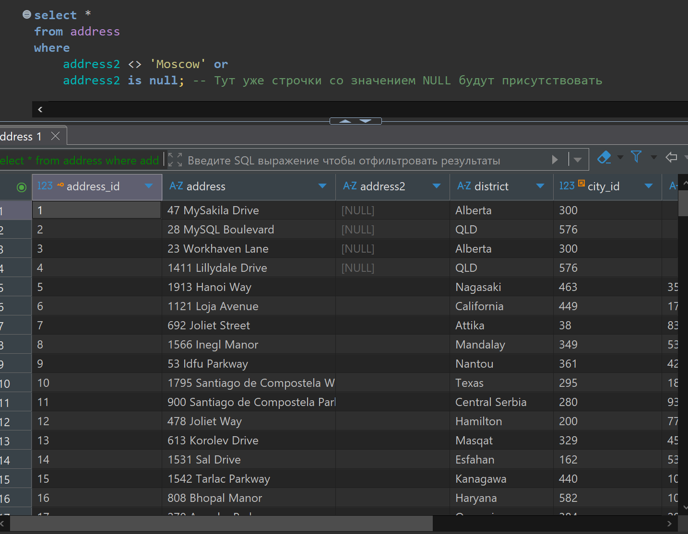

Теперь сортировки. Иногда бывает полезным уметь выводить строки в нужном порядке.
Например сделаем запрос для управляющего, который выведет по каждому фильму сумму выручки, с проката, полученную за последний месяц. Управляющему интересней всего увидеть фильмы с самой большой выручкой и далее по убыванию выручки, что бы сравнить фильмы между собой.

Начнем с простого, получим всех актеров из таблицы actor и отсортируем их по имени актера (полю first_name)

```sql
select *
from actor
order by first_name;
```

Значения в DBeaver увидим так

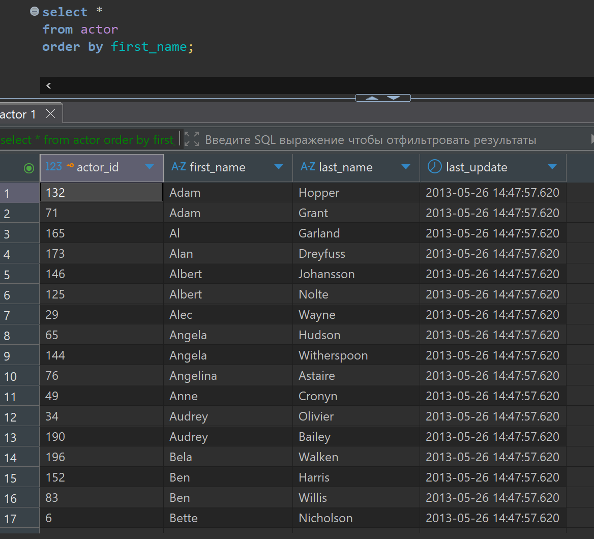

Так же можем указать сортировку по нескольким полям пишем их через запятую

```sql
select *
from actor
order by first_name, last_name;
```

Значения в DBeaver увидим так

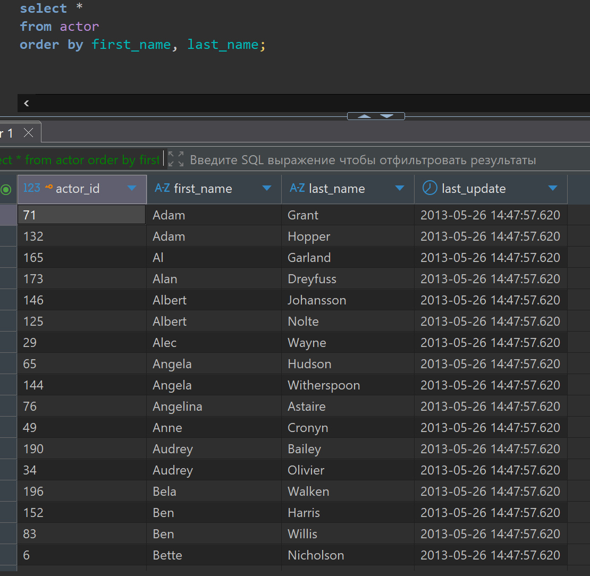

Видим что строки сортируются по алфавиту.
Таким образом можно указывать сколько нам нужно полей для сортировки

Если нам еще нужно условие where для отбора сортируемых значений, то его нужно записать до сортировки после from. Посмотрим пример нам нужны актеры с буквой "a" в имени.

```sql
select *
from actor
where LOWER(first_name) like '%a%'
order by first_name, last_name;
```

Значения в DBeaver увидим так

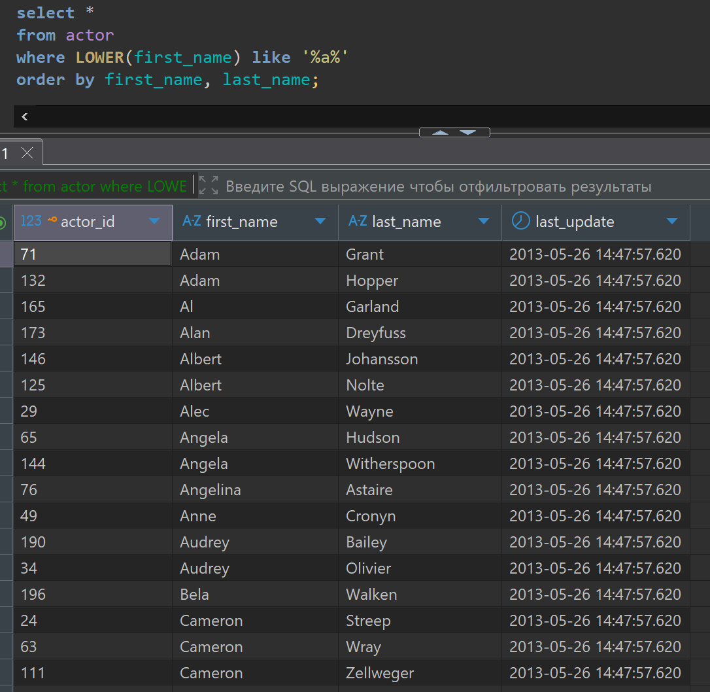

Мы также, можем сортировать не только в алфавитном порядке, но можем еще и по убыванию алфавитного порядка. Можем явно задавать порядок сортировки

Хотим чтобы по имени актеры были по убыванию отсортированы, а по фамилии сортировка по возрастанию

```sql
select *
from actor
order by first_name DESC, last_name ASC;
```

DESC - ключевое слово по убыванию
(сокращение от descending – нисходящий)

ASC - ключевое слово по возрастанию (используется по умолчанию)
(сокращение от ascending – восходящий)

Значения в DBeaver увидим так

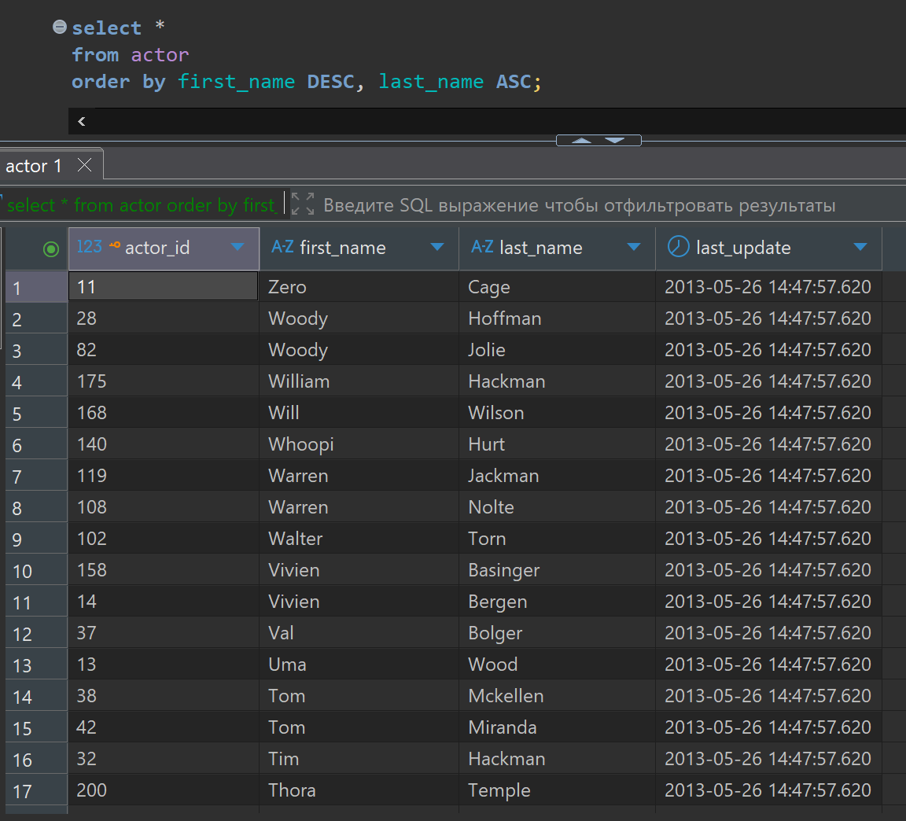

Можно так же сортировать по вычисляемому полю например так, в примере объединим два поля first_name и last_name и отсортируем по этому полю

```sql
select *
from actor
order by first_name || last_name;
```

результат такой же как на картинке (img/5/005.png)

Еще один пример отсортируем по результату вычисления остатка от деления на десять

```sql
select 
    *,
    mod(actor_id, 10)
from actor
order by mod(actor_id, 10);
```

Значения в DBeaver увидим так

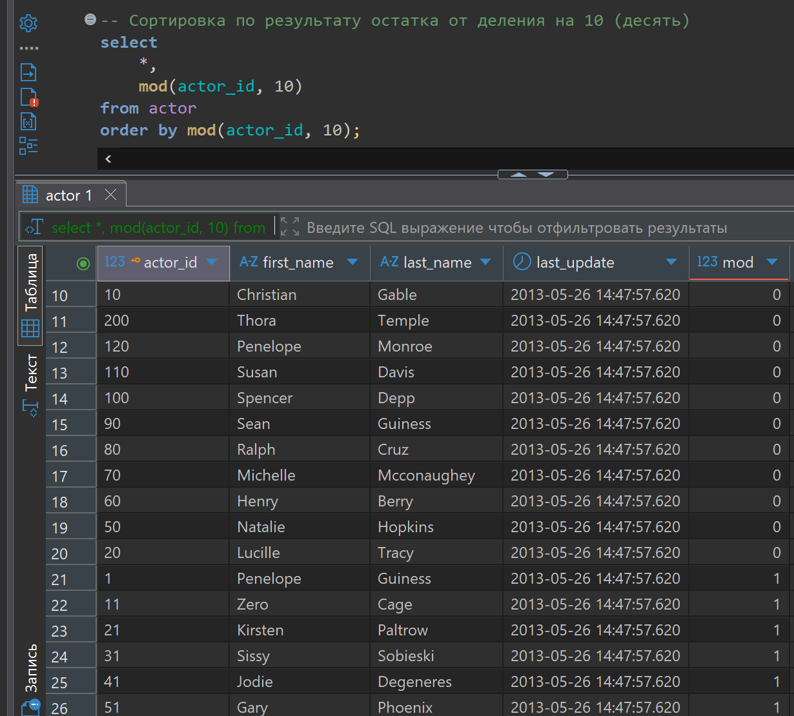

Так же можем использовать несколько таких рассчитываемых выражения, при этом еще и не обязательно их выводить в запросе, можно просто по ним сортировать наш вывод, но их значения не выводить.

Для следующего примера выведем нужные нам поля и дадим им псевдонимы из таблицы actor

поле first_name псевдоним f

поле last_name псевдоним l

поле actor_id псевдоним i

При сортировки мы можем ссылаться на такие псевдонимы, сортируем по имени и затем по фамилии актеров фильмов.

```sql
select 
    first_name f,
    last_name l,
    actor_id i    
from actor
order by  f, l;
```

Значения в DBeaver увидим так

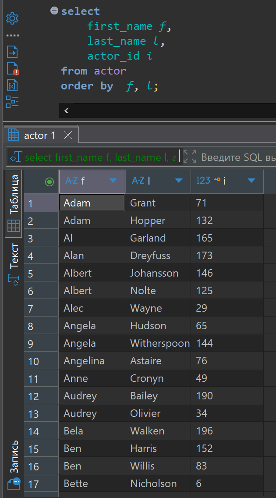

Так же можем указывать порядок сортировки для псевдонимов полей.
С псевдонимами не получится создавать вычисляемые значения.

Рассмотрим еще один способ сортировки по номеру столбца в выборке select.
Когда указываем число это ссылка на поле в выборке.

```sql
select 
    first_name f,
    last_name l,
    actor_id i    
from actor
order by  1, 2;
```

значения будут те же что в примере (img/5/009.png)
Тоже номерам полей можно задавать порядок сортировки.
С номерами в выборке так же, не получится создавать вычисляемые значения.

Теперь поиграем с таблицей адресов (address).
Там в поле address2 есть значения NULL и просто пустые значения. Если мы будем выполнять сортировку по этой колонке. По умолчанию NULL значения считаются самыми большими, поэтому по возрастанию они попадают в самый низ.

Но такое поведение можно изменить не только DESC (заданием по убыванию)

Есть ключевое слово nulls first, которое будет значения с NULL ставить первыми

```sql
select *  
from address
order by address2;
```

Значения в DBeaver увидим так

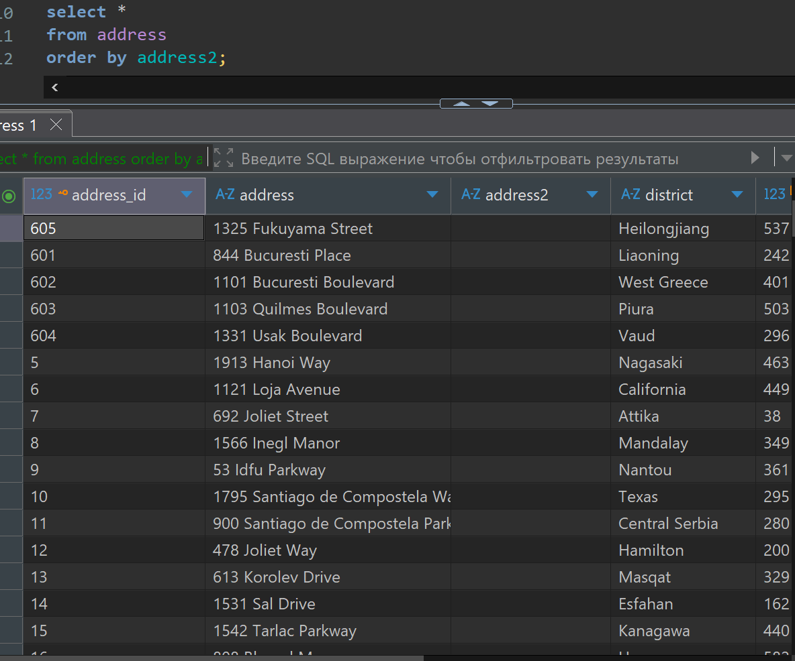

```sql
select *  
from address
order by address2 DESC;
```

Значения в DBeaver увидим так

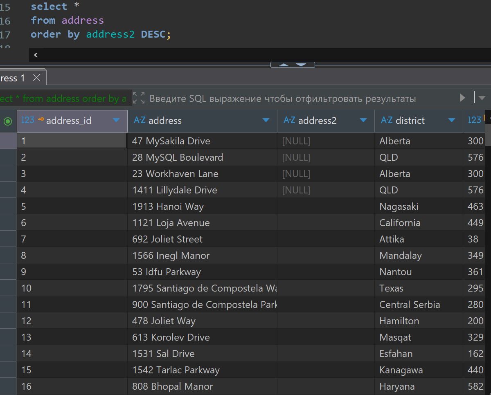

```sql
select *  
from address
order by address2 nulls first;
```

Значения в DBeaver увидим так

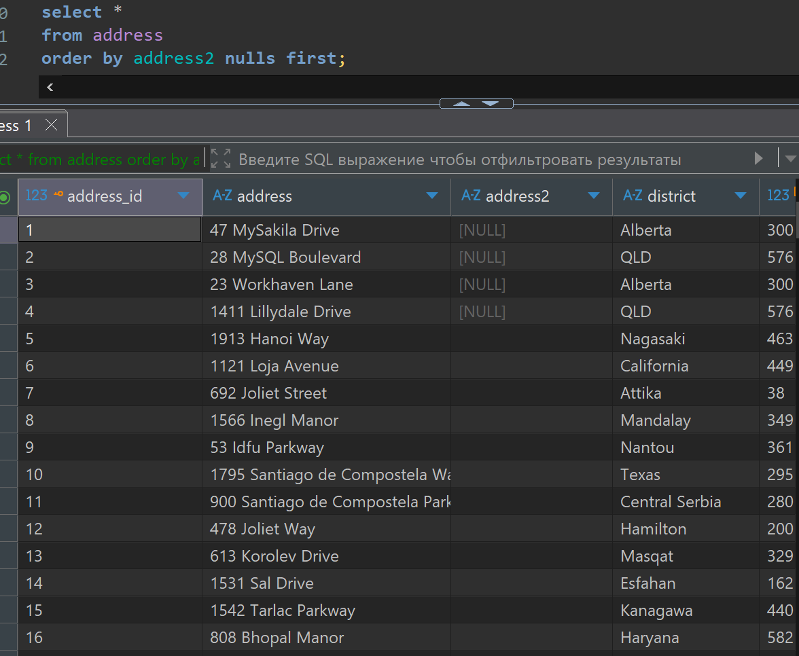

Или если при сортировки по убыванию мы хотим что бы NULL значения шли внизу
есть ключевое слово nulls last

```sql
select *  
from address
order by address2 DESC nulls last;
```

Значения в DBeaver увидим так

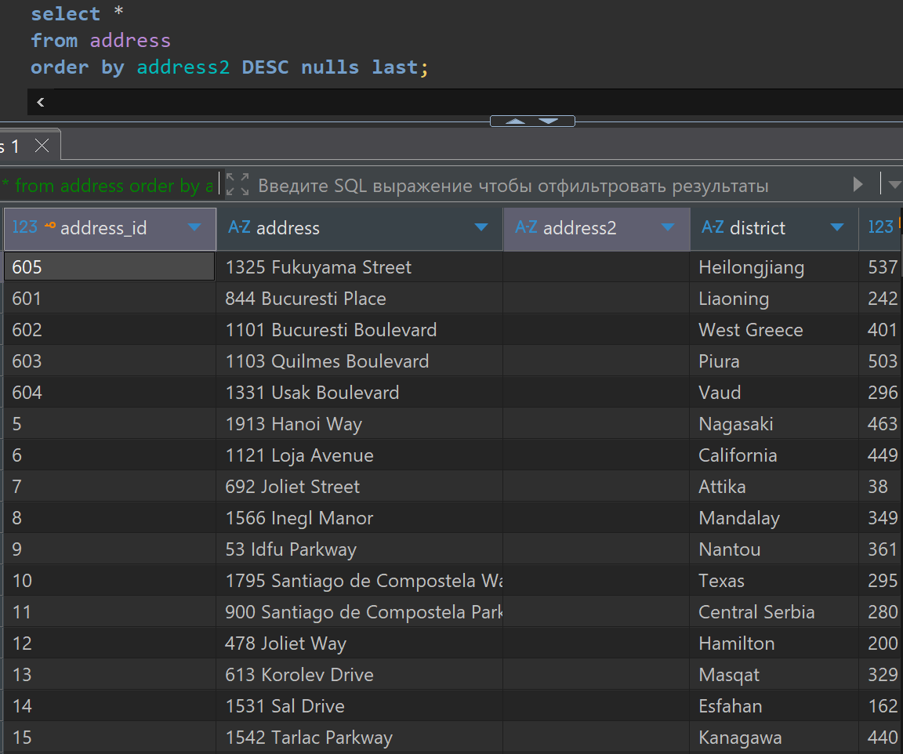

Еще один пример приведем с таблицей staff (персонал)
там есть столбец picture, и у одного сотрудника у нас есть фотография, а у второго нету это поле со значением NULL, применим сортировку по этому полю.

```sql
select *  
from staff
order by picture
```

Видим что сотрудник с NULL у нас попал в конец списка.

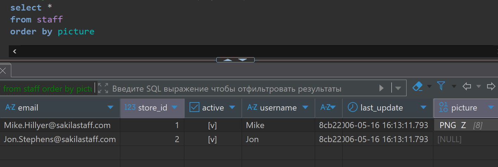
