# Lesson 6

## Links

[link lesson](https://www.youtube.com/watch?v=bf6RnsY5I10&list=PLzvuaEeolxkz4a0t4qhA0pxmttG8ZbBtd&index=18)
[link lesson](https://www.youtube.com/watch?v=se1r_weX380&list=PLzvuaEeolxkz4a0t4qhA0pxmttG8ZbBtd&index=23)

## Получение уникальных значений. Distinct

Будет занятие по получению уникальных значений или по удалению дублей в значениях по полю.

Получим для начала данные из таблицы film, и обратим внимание на поле rental_rate в нем повторяющиеся значения,
нас может интересовать максимальное значение из всех в этой колонке, или минимальное значение в этой колонке.

Вот что бы как то сориентироваться мы можем отобрать все уникальные значения, и посмотреть на них все для какого то анализа.

Для получения уникальных значений из колонки указывают название колонки и после select указываем ключевое слово DISTINCT
При использовании оператора DISTINCT для двух и более колонок будут удаляться записи, которые имеют одинаковые значения по всем полям.

```sql
select *
from address;
```

Код и значения в DBeaver выглядят так:

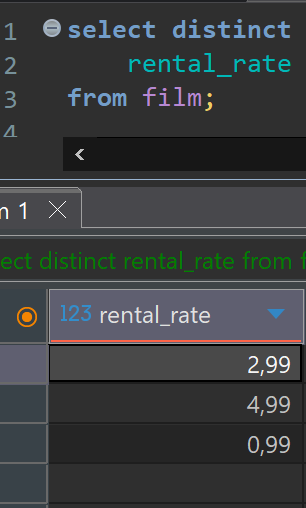

Видим что у нас всего три уникальных значения 2,99; 4,99; 0,99.

А значит фильмы с рейтингом 4,99 сдаются лучше всего, на данный момент, во всяком случае, это так.

Для другого примера возьмем из таблицы actor все фамилии актеров, всего у нас в таблице фамилий 200 штук.

```sql
select 
    last_name
from actor;
```

Посмотрим сколько уникальных окажется что уникальных всего 121 штук.
Оказывается повторений фамилии довольно много

```sql
select distinct
    last_name
from actor;
```

Можно также получить уникальные значения по паре полей фамилии и имени актера окажется что 199 штук,
то есть есть два актера с одинаковой фамилией и именем.

```sql
select distinct
    last_name,
    first_name
from actor;
```

DISTINCT указывается один раз и мы получаем уникальные значения по всем указанным полям в таблице

Так же можно искать уникальные значения по вычисляемым полям в выборке

Форматировать SQL код можно комбинацией клавиш <ctrol> + <shift> + f

Теперь посмотрим таблицу платежей payment
В ней есть информация о продавце который проводит платеж, и мы хотим найти по каждому продавцу максимальный платеж который он проводил.
Можем сделать так:

```sql
select distinct on (staff_id)
    staff_id,
    amount
from payment
order by staff_id, amount desc;
```

В группировке order by обязательно первым должно идти поле
указанное в select distinct on (staff_id)

Код и значения в DBeaver выглядят так:

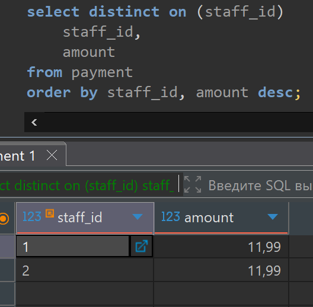

Есть хороший сайт по postgres postgrespro.ru там есть документация переведенная на русский язык и даже курсы для изучения в открытом доступе.

## Соединения таблиц. JOIN. Внутренние и внешние соединения

Начнем разбираться, у нас есть таблица фильмов (film), в ней есть поле language_id которое показывает закодированный идентификатор языка фильма но цифра кода для нас не информативна. Есть таблица языков (language), в ней опять же есть поле language_id с кодом языка а в дополнение к цифре имеет поле с человеко понятным названием языка фильма это поле (name)

Допустим мы по каждому фильму хотим вывести название фильма и понятное человеку название языка этого фильма. Для такой задачи нам понадобится соединить эти две таблицы что бы вывести интересующие нас поля из обеих таблиц

Создадим внутреннее соединение INNER JOIN
Решение может быть таким:

```sql
select 
    f.title,
    l.name
from 
    film f 
    inner join language l
        on f.language_id = l.language_id;
```

Код и значения в DBeaver выглядят так:

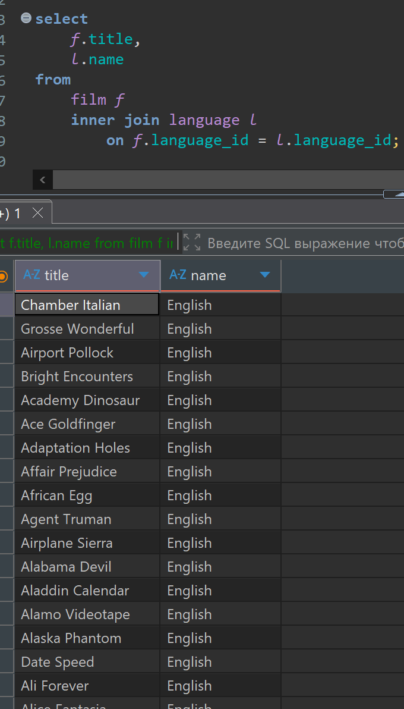

Все фильмы у нас на Английском (English) но тем не менее мы результат получили

Теперь разберем как это соединение сработало:

Берутся все пары строк из двух таблиц и проверяется соответствие условию указанному в ON.
Проверка одной строки левой таблицы со всеми строками из второй таблицы, и так
пока не закончатся все строки в первой таблице.

Когда условие выполняется у нас добавляется совпавшая строка в результирующую таблицу.
Так у нас формируется результирующая таблица из объединенных строк, с полями из первой таблицы и второй таблицы.

Причем соединении таблиц происходит первым делом при выполнении запроса.
Далее уже могут идти условия фильтрации.

например хотим выбрать фильмы у которых название начинается с буквы 'C'

```sql
select 
    f.title,
    l.name
from 
    film f
inner join language l
    on f.language_id = l.language_id
where f.title like 'C%';
```

Код и значения в DBeaver выглядят так:

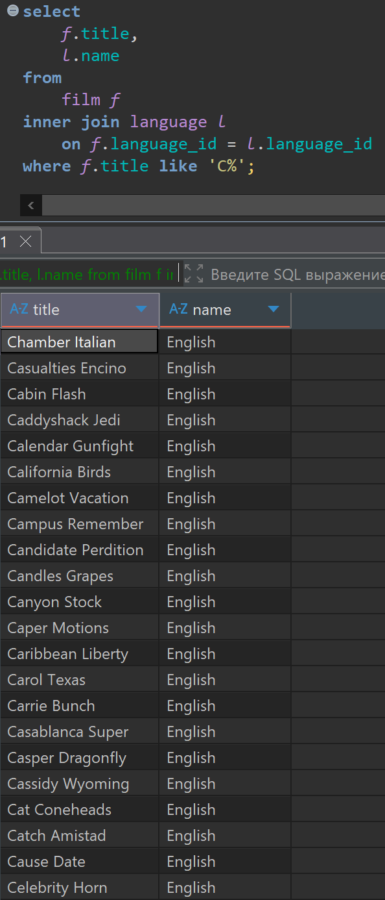

Теперь попробуем получить список всех пар название фильма и имя актера который в нем
снимался, а если в фильме снималось несколько актеров, то пусть у нас будет несколько строчек в которых будет одно и тоже название фильма но разные имена актеров.

У нас есть таблица (film_actor) которая содержит информацию о том какой актер (actor_id) в каком фильме снимался (film_id). Это таблица где закодированы порядковые номера актеров и фильмов в которых они снимались.

То есть перед нами такая задача, присоединить к таблице сразу две таблицы и взять из них нужные данные.

```sql
select *
from film_actor fa
inner join actor a
    on fa.actor_id = a.actor_id
inner join film f 
    on fa.film_id = f.film_id;
```

Код и значения в DBeaver выглядят так:
Видим результат объединения таблиц, и видим что таблиц так можно объединить столько, сколько нам нужно.

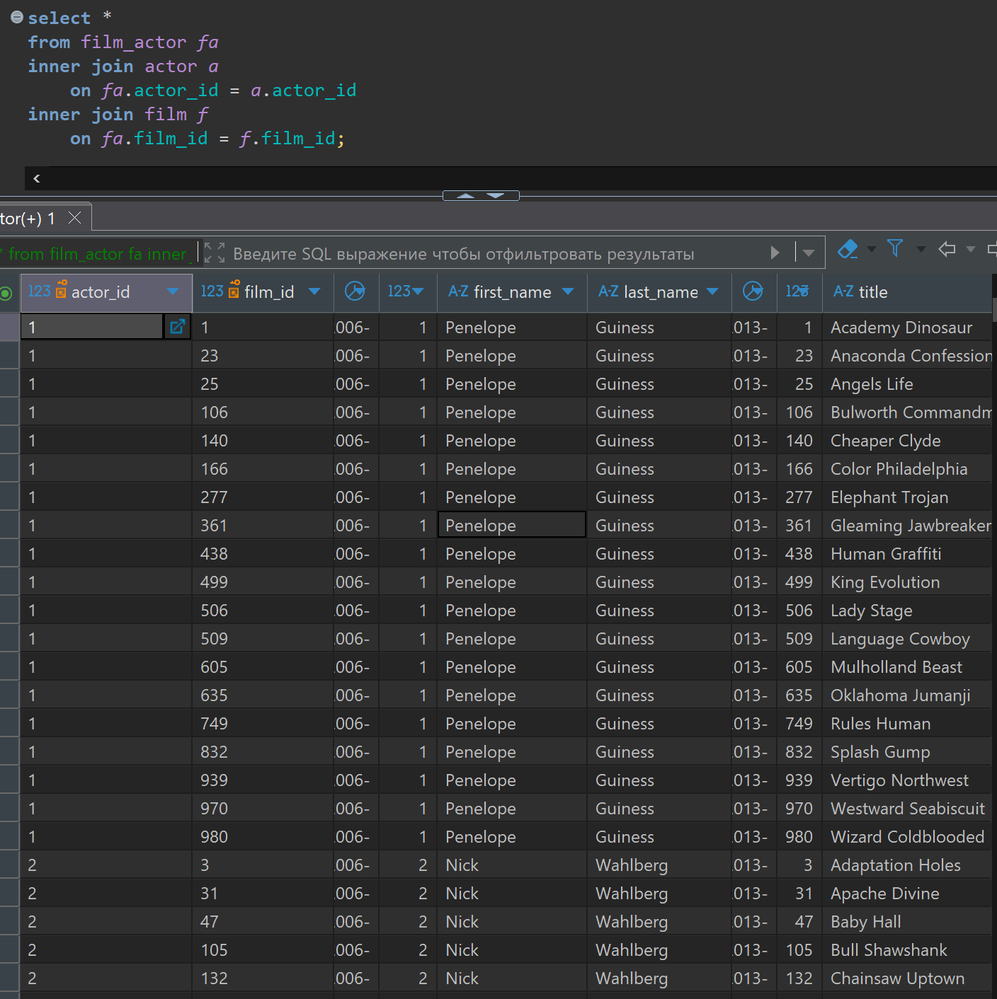

Теперь можем из этого всего набора данных вывести то что нам нужно, а именно имя и фамилию актера и фильм в котором он снимался и так по всей нашей базе, а сортировки сделаем по названию фильма

```sql
select 
    f.title,
    a.first_name || ' ' || a.last_name 
from film_actor fa
inner join actor a
    on fa.actor_id = a.actor_id
inner join film f 
    on fa.film_id = f.film_id
order by f.title;
```

Код и значения в DBeaver выглядят так:

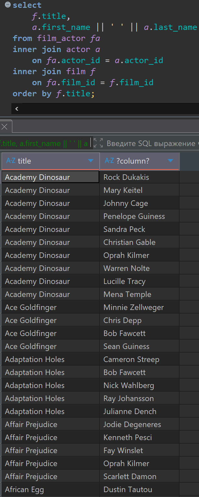

Допустим теперь у нас задача получить список тех актеров которые есть у нас на дисках. Дело в том что у нас есть отдельно наличие дисков с фильмами которые у нас есть в наличии. Теперь нас нужно найти какие фильмы у нас есть на дисках в наличии.
Это можно сделать при помощи таблицы (inventory)
Одна запись в этой таблице означает что есть компакт диск с номером (inventory_id) на диске записан фильм с номером (film_id), номер магазина в котором он есть (store_id), и дата обновления сведений о этом диске (last_update)

То есть, если у нас в (inventory_id) есть запись с фильмом (film_id) то на такой фильм у нас есть компакт диск, и значит всех актеров этого фильма нам нужно собирать.
И соответственно если фильма в этой таблице нет, значит этот фильм мы не учитываем.

Только еще нам нужно применить DISTINCT чтобы избавится от повторов, так как у нас есть в магазине некоторое количество дисков с одинаковыми фильмами, нам в выборку попадут они все

таблица inventory выглядит так

```sql
select * from inventory i;
```

Код и значения в DBeaver выглядят так:

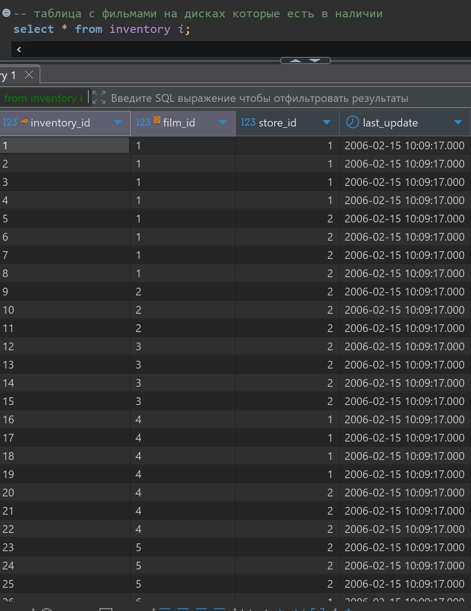

Решение примера выглядит так:

```sql
select distinct 
    a.first_name || ' ' || a.last_name as actor_name
from film_actor fa
inner join actor a
    on fa.actor_id = a.actor_id
inner join film f 
    on fa.film_id = f.film_id
inner join inventory i 
    on i.film_id = f.film_id 
order by 1;
```

Код и значения в DBeaver выглядят так:

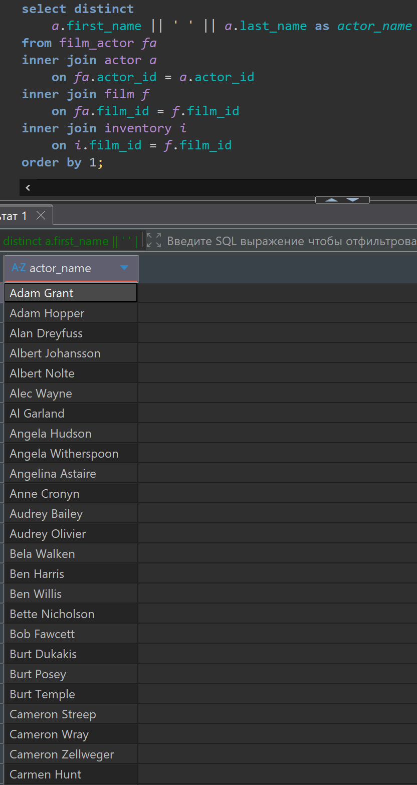

Еще есть такая особенность в postgres у названий полуй которые одинаковые в разных таблицах,
можно вместо такого синтаксиса (on fa.actor_id = a.actor_id)
использовать ключевое слова USING будет выглядеть так (using (actor_id))
в скобках можно перечислить и несколько таких полей (using (actor_id, film_id)) это если они есть в обеих
соединяемых таблицах.
Весь предыдущий запрос может выглядеть так:

```sql
select distinct 
    a.first_name || ' ' || a.last_name as actor_name
from film_actor fa
inner join actor a
    using (actor_id)
inner join film f 
    using (film_id)
inner join inventory i 
    using (film_id) 
order by 1;
```

Результат будет тот же самый.

Теперь попробуем найти все фильмы которых у нас нет в прокате (то есть фильмы на которые нет дисков).

Для решения нам понадобится левое внутреннее соединение LEFT OUTER JOIN

Условия написания такие же как по внутреннему соединению мы можем использовать ON или USING

Если посмотреть результат, то увидим что у нас есть записи с NULL значениями, это будут записи которых
нет в таблице (inventory) то есть на которые у нас нет дисков.

Левое внешнее соединение работает так, в начале оно получает результат внутреннего соединения все точно так же как в предыдущем варианте, только в случае когда мы не нашли соответствия указанному условию соединения при внешнем соединении мы все равно берем содержимое этого поля и добавляем его в результат, а в ячейках в которых должны быть значения из второй таблицы мы заполняем их значениями NULL.

То есть у нас в результат обязательно попадают все значения из левой (относительно соединяемых таблиц) таблицы, а те поля в правой таблице которым мы не нашли соответствия в правой (относительно соединяемых таблиц) таблице, значения ее полей в результирующей таблице мы получим значения NULL.

Решение примера выглядит так:

```sql
select *
from film f
left outer join inventory i 
    using (film_id)
where i.inventory_id is NULL;
```

Код и значения в DBeaver выглядят так:

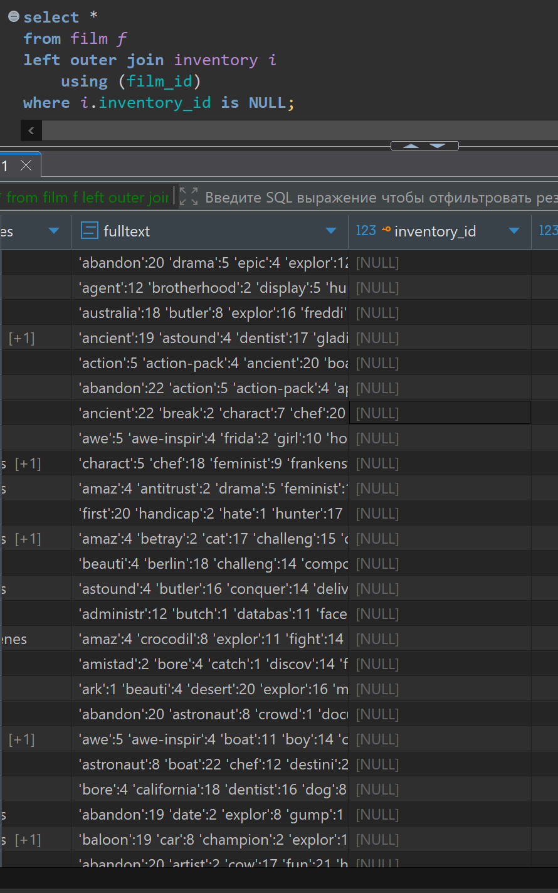

И теперь для результата из всей выборки отберем только поле название фильма, для получения списка отсутствующих фильмов в прокате, таких фильма всего 42.

Решение примера выглядит так:

```sql
select f.title 
from film f
left outer join inventory i 
    using (film_id)
where i.inventory_id is NULL;
```

Код и значения в DBeaver выглядят так:

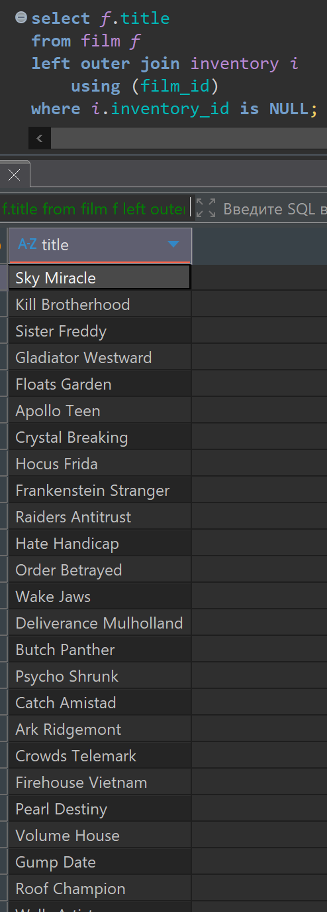

Теперь разберем правое внешнее соединение RIGHT OUTER JOIN.

Тут разницы только в том что при правом внешнем соединении теперь в обязательном порядке в результирующую
таблицу попадут строки из правой (относительно соединяемых таблиц) таблицы

То есть для правильной логики нашего примера, что бы в результате ничего не поменялось для правого внешнего соединения нужно таблицы поменять местами, выглядеть будет так

```sql
select f.title 
from inventory i
right outer join  film f
    using (film_id)
where i.inventory_id is NULL;
```

Код и значения в DBeaver выглядеть будет так же как на картинке предыдущей (img/6/013.png)

Рассмотрим еще полное внешнее соединение FULL OUTER JOIN

Он работает так же как при внутреннем соединении, затем он берет все строчки из левой таблицы которые не попали в результат, и все строчки из правой таблицы которые не попали в результат, и по каждой из них добавляет в строчки в поля правой и левой таблицы которых не знает значения NULL в результирующую таблицу.

```sql
select f.title 
from inventory i
full outer join  film f
    using (film_id)
where i.inventory_id is NULL;
```

Код и значения в DBeaver выглядеть будет так же как на картинке предыдущей (img/6/013.png)

Еще посмотрим что такое декартово произведение. У нас есть таблица актеров (actor) и таблица фильмов (film)
Мы хотим получить все возможные пары фильмов и актеров вне зависимости снимался актер в фильме или нет.

делаем такой запрос:
В нем используем ключевое слово CROSS JOIN с его помощью мы получим все возможные комбинации фильмов и актеров которые есть в базе, такое поведение называют "декартовым произведением"

И выведем через пробел имя и фамилию актера

Решение примера выглядит так:

```sql
select 
    f.title,
    a.first_name || ' ' || a.last_name as actor_name
from film f 
cross join actor a;
```

Код и значения в DBeaver выглядят так:

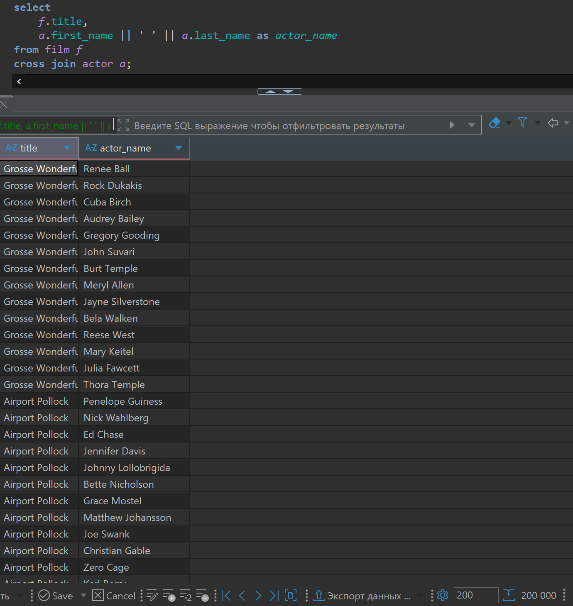

А декартово произведение трех таблиц это, например присоединим к предыдущему запросу еще таблицу категорий (category), происходит оно, так сперва формируется декартово произведение первых двух таблиц, а затем каждая строчка этого полученного набора так же комбинируется с каждой строчкой третьей таблицы.
То есть уже получим все возможные комбинации строк из трех таблиц.

Решение примера выглядит так:

```sql
select 
    f.title,
    a.first_name || ' ' || a.last_name as actor_name,
    c.name 
from film f 
cross join actor a
cross join category c; 
```

Код и значения в DBeaver выглядят так:

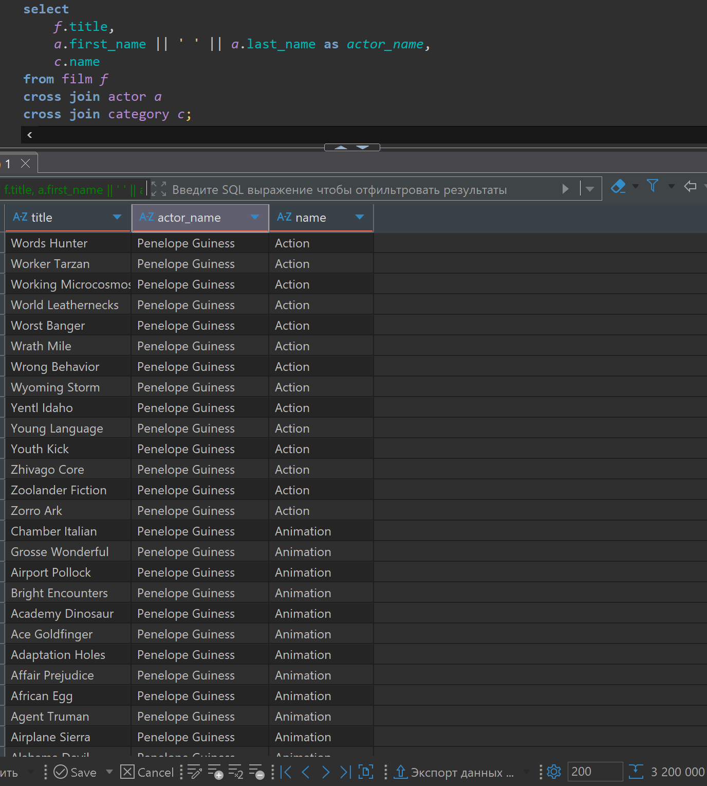

Такое же поведение можно получит и по другому.
Обычному внутреннему соединению указав в качестве условия соединения условие которое всегда истина.

```sql
select
    f.title,
    a.first_name || ' ' || a.last_name as actor_name
from film f
inner join actor a
    on true;
```

результат будет как здесь (img/6/014.png)

Еще один вариант добиться такого декартового произведения данных это просто перечислив соединяемые таблицы в from, при такой записи они так и соединятся.

```sql
select 
    f.title,
    a.first_name || ' ' || a.last_name as actor_name
from film f, actor a;
```

результат будет как здесь (img/6/014.png)

Попробуем решить такую задачу: ранее мы выводили все возможные комбинации фильмов и актеров в нашей базе, используя декартово произведение, а теперь к этому добавим колонку в которой будет отображаться, снимался в этом фильме этот актер или нет.

Для решения мы присоединим к сформированным всем возможным вариантам таблицу film_actor, в которой содержится в каком фильме снимаются какие актеры.

Решение примера выглядит так:

```sql
select 
    f.title,
    a.first_name || ' ' || a.last_name as actor_name,
    fa.actor_id is not null
from film f 
cross join actor a
left join film_actor fa 
    on fa.film_id = f.film_id and
    fa.actor_id = a.actor_id;
```

Код и значения в DBeaver выглядят так:

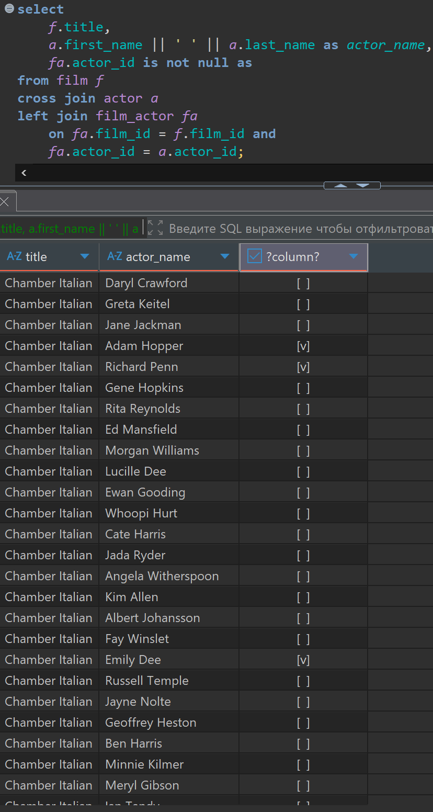

По умолчанию если мы пишем просто JOIN то соединение считается внутренним 
по умолчанию (INNER JOIN), а если добавляем (LEFT JOIN) то по умолчанию это внешнее соединение (left outer join) OUTER ключевое слово можно опускать.
