# Lesson 7

## Links

[link lesson](https://www.youtube.com/watch?v=D1rDWJuMecs&list=PLzvuaEeolxkz4a0t4qhA0pxmttG8ZbBtd&index=26)

## Группировки. Group By, Having

Для начала посмотрим на значения таблицы film в этой таблице есть поле rating.
Вот мы можем все фильмы разделить на группы по значениям этого поля rating,
в каждой группе будут фильмы с разным рейтингом.

Так мы можем сделать ключевым словом GROUP BY и указываем по какому признаку (полю) будем группировать

Когда мы делаем группировку то на всю группу у нас выводится одна строка, соответственно без группирующих функций
нельзя вывести другие поля.

```sql
select 
    rating
from film f 
group by 
    rating; 
```

Запрос в DBeaver выглядит так

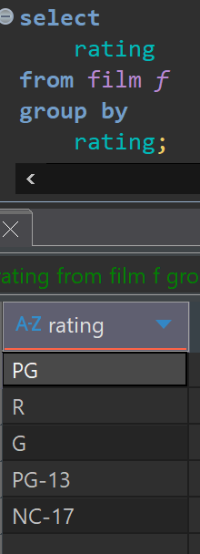

Идентичным запросом будет

```sql
select distinct 
    rating
from film f;
```

Применяя группировки GROUP BY, мы можем использовать дополнительные возможности работы с
группами, используя функции группировок.

Самое просто что можно посчитать это сколь в каждой группе значений (строк)

с помощью функции группировки COUNT()

```sql
select 
    rating,
    count(*)
from film f 
group by 
    rating; 
```

Запрос в DBeaver выглядит так

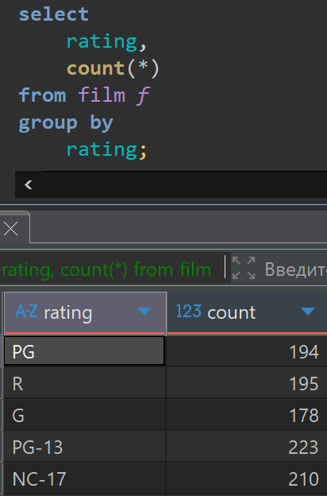

Видим сколько у нас всего фильмов попадает в какой рейтинг.

У нас у каждого фильма есть поле length (продолжительность фильма)
Мы можем посчитать общую продолжительность всех фильмов в каждой группе по рейтингу
Суммируем все время в каждой категории из поля length
с помощью функции группировки SUM()

И назовем поля как-то осмысленно.

```sql
select 
    rating,
    count(*) films_count,
    sum(length) total_lenght
from film f 
group by 
    rating; 
```

Запрос в DBeaver выглядит так

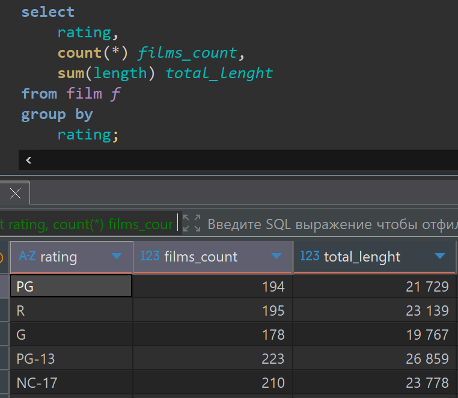

Можем найти максимальное время которое есть у фильмов в каждой группе,
с помощью функции группировки MAX()

```sql
select 
    rating,
    count(*) films_count,
    sum(length) total_lenght,
    max(length) max_lenght
from film f 
group by 
    rating;
```

Запрос в DBeaver выглядит так

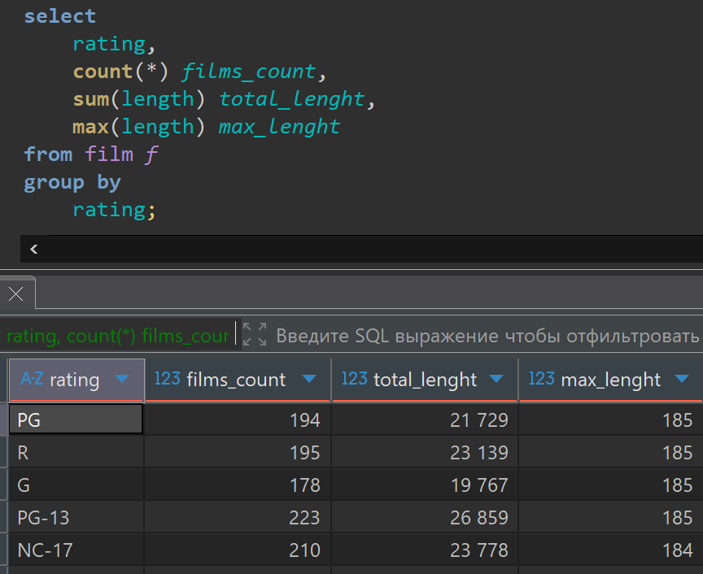

Можем найти самое короткое время которое есть у фильмов в каждой группе,
с помощью функции группировки MIN()

```sql
select 
    rating,
    count(*) films_count,
    sum(length) total_lenght,
    min(length) min_lenght
from film f 
group by 
    rating; 
```

Запрос в DBeaver выглядит так


Можем найти среднюю продолжительность всех фильмов в каждой группе,
с помощью функции группировки AVG()

```sql
select 
    rating,
    count(*) films_count,
    avg(length) avg_lenght
from film f 
group by 
    rating; 
```

Запрос в DBeaver выглядит так

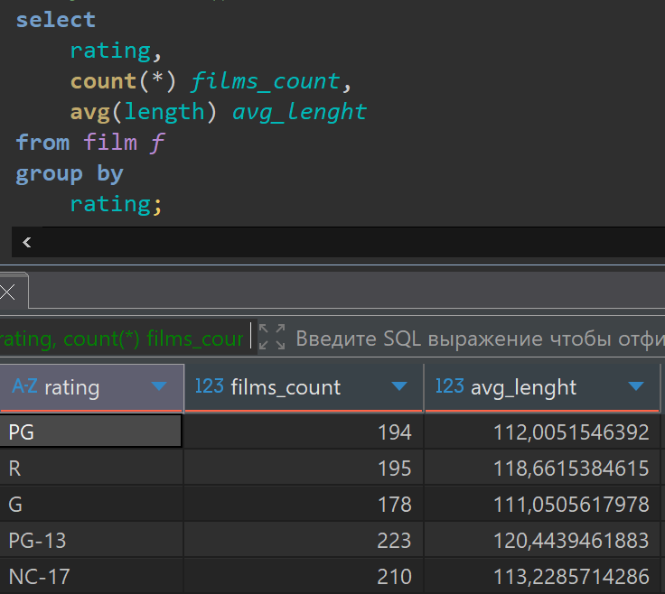

Это были перечислены самые популярные функции группировок но есть и другие:

Функция BOOL_AND(),
которой передается логическое выражение, результат которой
true (истина) или false (лож) она вернет истину если для каждой строки из группы введенное условие истина, иначе будет лож.

```sql
select 
    rating,
    count(*) films_count,
    max(length) max_lenght,
    bool_and(length < 185) 
from film f 
group by
    rating; 
```

Запрос в DBeaver выглядит так

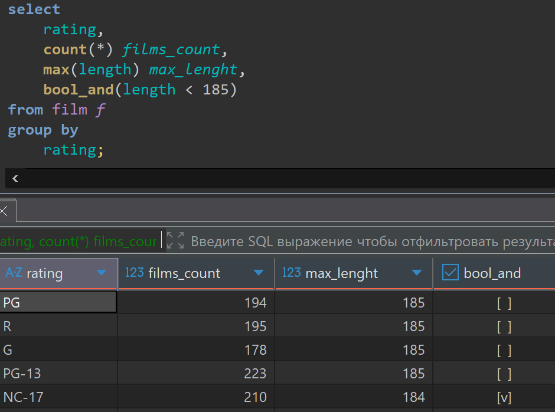

Функция BOOL_OR(),
которая возвращает истину (true) если хотя бы для одной строки из группы условие будет истинным.

```sql
select 
    rating,
    count(*) films_count,
    max(length) max_lenght,
    bool_or(length >= 185) 
from film f 
group by 
    rating; 
```

Запрос в DBeaver выглядит так

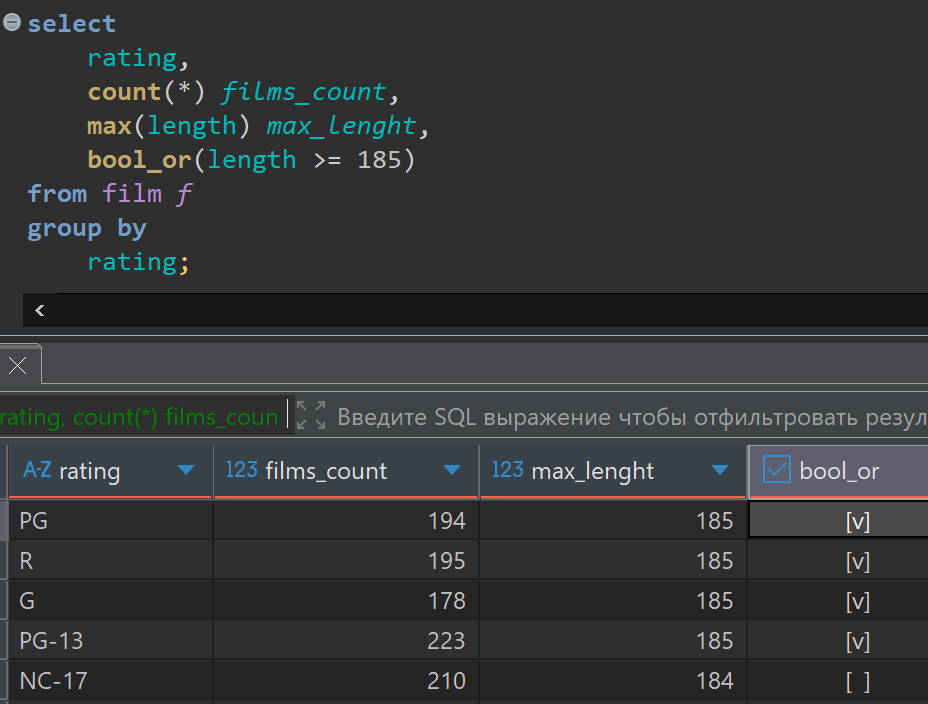

Функция STRING_AGG(),
получает на вход имя колонки и разделитель для строк и она для каждой строки таблицы объединяет все строки в одну через разделитель,то есть, например можно получить названия всех фильмов которые входят в группу, при этом разделив их точкой с запятой (; ).

```sql
select 
    rating,
    count(*) films_count,
    string_agg(title, '; ')
from film f 
group by 
    rating;
```

Запрос в DBeaver выглядит так

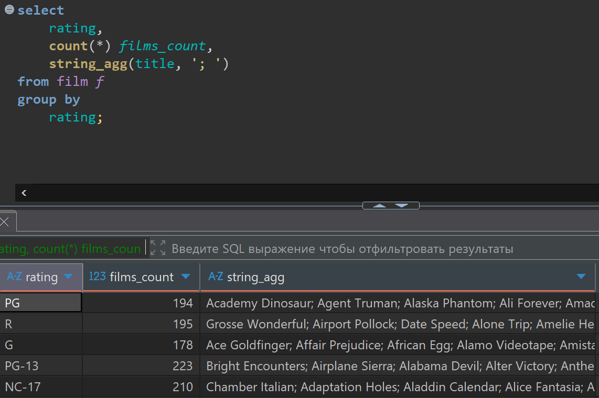

Эти функции можно, также применять не указывая по чем группировать, тогда она будет применятся ко всем строкам в таблице. Увидим что у нас всего 1000 строк в таблице.

```sql
select 
    count(*) films_count
from film f;
```

Запрос в DBeaver выглядит так

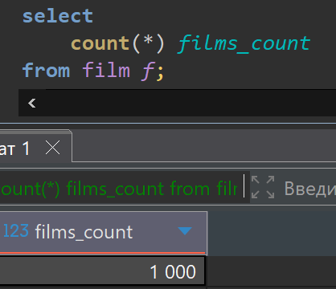

Так же можно делить на группы не только по одному полю, а по нескольким сразу.
Например разделим таблицу film по rantal рейтингу и по rantal_rate арендная ставка,
в этом случае по каждому параметру будет создана своя отдельная группа.
И для каждой такой группы мы тоже можем применят агрегатные функции.

```sql
select 
    rating,
    rental_rate,
    count(*)
from film f
group by
    rating,
    rental_rate
order by
    rating,
    rental_rate;
```

Запрос в DBeaver выглядит так

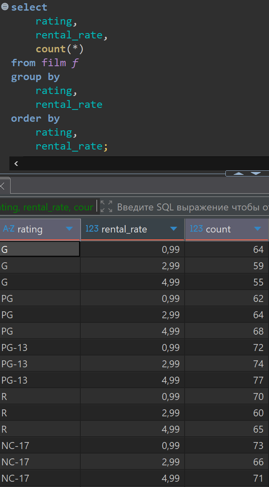

Так же можно делить на группы по результатам вычисления выражений.
Например возьмем первую букву в названии фильма и в зависимости от нее поделим группы, на еще более мелкие группы. Получится по алфавиту названий еще раздробим.

```sql
select 
    rating,
    rental_rate,
    substr(title, 1, 1),
    count(*)
from film f
group by
    rating,
    rental_rate,
    substr(title, 1, 1)
order by
    rating,
    rental_rate;
```

Запрос в DBeaver выглядит так

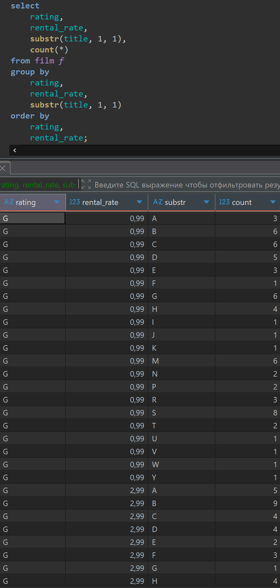

Теперь посмотрим для примера сколько у нас по каждому фильму всего дисков во всех магазинах. Для этого запросим данные из таблицы (inventory)
В этой таблице каждая строчка это диск в наличии, в определенном магазине.

Можно сгруппировать диски по полю film_id, и посчитаем сколько у нас в каждой группе строк. Тем самым увидим сколько у нас дисков для каждого фильма всего в магазинах.
Но так как просто номер этого фильма нам мало о чем говорит, мы можем через соединение таблиц вывести title поле из таблицы film.

```sql
select 
    f.title,
    count(*)
from inventory i
join film f
    on  f.film_id = i.film_id 
group by f.title;
```

Запрос в DBeaver выглядит так

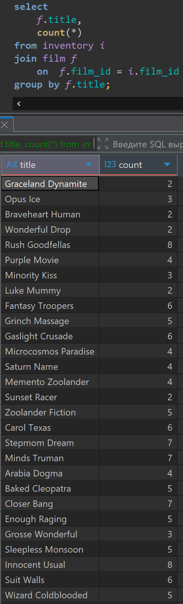

Таким способом мы получаем фильмы которые у нас есть в наличии, а если мы хотим все фильмы, в том числе и тех по которым у нас дисков в наличии нет, то мы будем делать другое соединение.

```sql
select 
    f.title,
    count(i.film_id) -- что бы функция count() не считала строки со значением NULL
from  film f
left join inventory i
    using(film_id)
group by f.title;
```

Запрос в DBeaver выглядит так

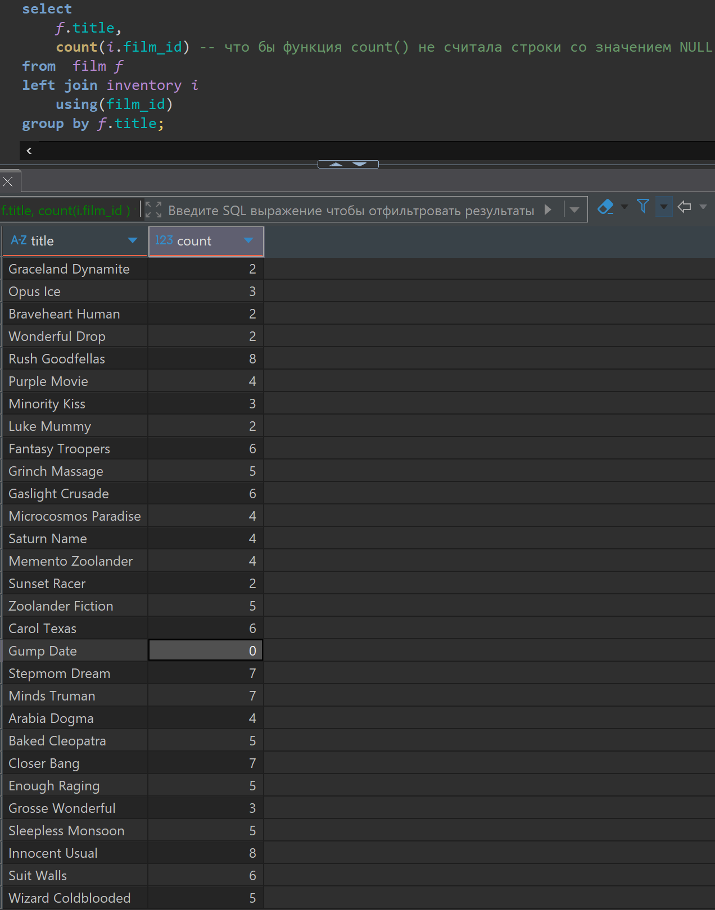

Теперь для каждого актера посчитаем в скольких фильмах он снимался, и в скольки категориях фильмов он снимался.

```sql
select 
    a.first_name || ' ' || a.last_name,
    count(*) as films_count,
    count(distinct fc.category_id) -- расчет коли-ва уникальных категорий фильмов
from actor a
join film_actor fa 
    using (actor_id)
join film_category fc 
    on fa.film_id = fc.film_id 
group by
    a.first_name || ' ' || a.last_name;
```

Запрос в DBeaver выглядит так

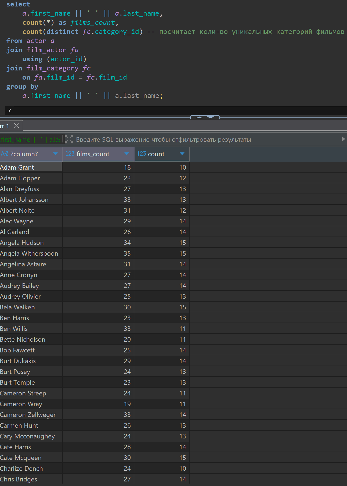

Теперь пришло время добавить условия к группировкам в запросах с помощью ключевого слова HAVING.

Нам нужно по каждому фильму, у которого rental_rate больше 2, посчитать сколько всего было платежей, при этом нас будут интересовать фильмы у которых платежей больше 10

В SQL нельзя использовать псевдоним, заданный в SELECT, в HAVING так как:
Псевдонимы создаются на этапе SELECT, который выполняется после HAVING.
HAVING работает только с постоянными значениями, а не с переменными.
HAVING не поддерживает использование любых псевдонимов.

```sql
select 
    f.title,
    count(*) as payment_count
from film f
join inventory i 
    on f.film_id = i.film_id
join rental r 
    on r.inventory_id = i.inventory_id 
join payment p 
    on p.rental_id = r.rental_id 
where f.rental_rate > 2
group by 
    title
having count(*) > 10
order by 
    payment_count;
```

Запрос в DBeaver выглядит так

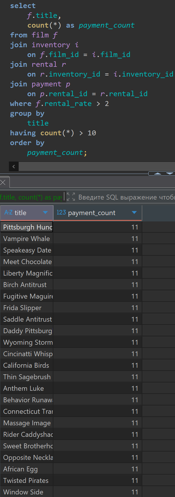

В первую очередь соединяются 4-е таблицы и получается одна единая результирующая таблица. Мы берем эту таблицу и фильтруем в ней по условиям в where. Затем группировка по group by. Затем на полученные группы накладывается условие having.
И в конце когда получаем SELECT мы сортируем поля в нужном порядке.

Теперь выполним еще один запрос, по каждому актеру посчитаем количество фильмов с рейтингом 'G' в которых он снимался.

```sql
select 
    a.first_name || ' ' || a.last_name as actor_name,
   count(*)
from actor a 
left join film_actor fa 
    on a.actor_id = fa.actor_id
left join film f 
    on fa.film_id = f.film_id
where f.rating = 'G'
group by 
    actor_name;
```

Запрос в DBeaver выглядит так

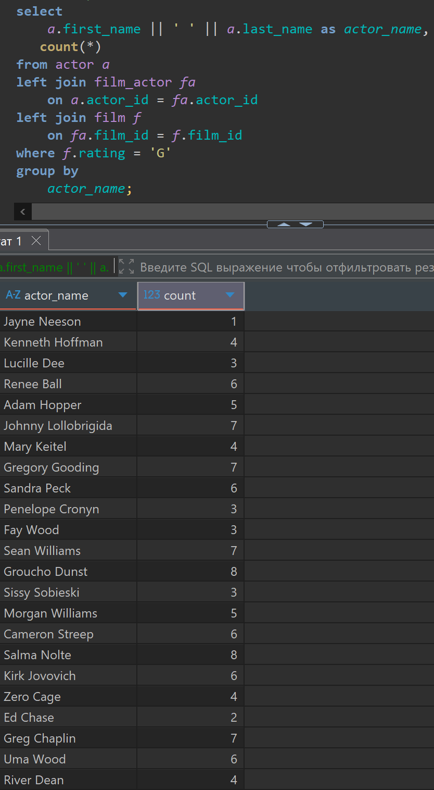

Так мы отсеяли всех других актеров которые снимались в других рейтингах,
а нам хочется для них выводить что нет фильмов с рейтингом 'G'

```sql
select 
    a.first_name || ' ' || a.last_name as actor_name,
    count(f.title )
from actor a 
left join film_actor fa 
    on a.actor_id = fa.actor_id
left join film f 
    on fa.film_id = f.film_id
    and f.rating = 'G';
group by 
    actor_name;
```

Запрос в DBeaver выглядит так

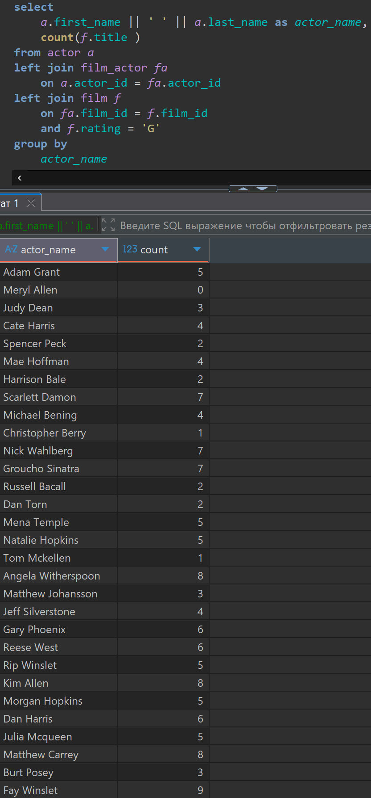
