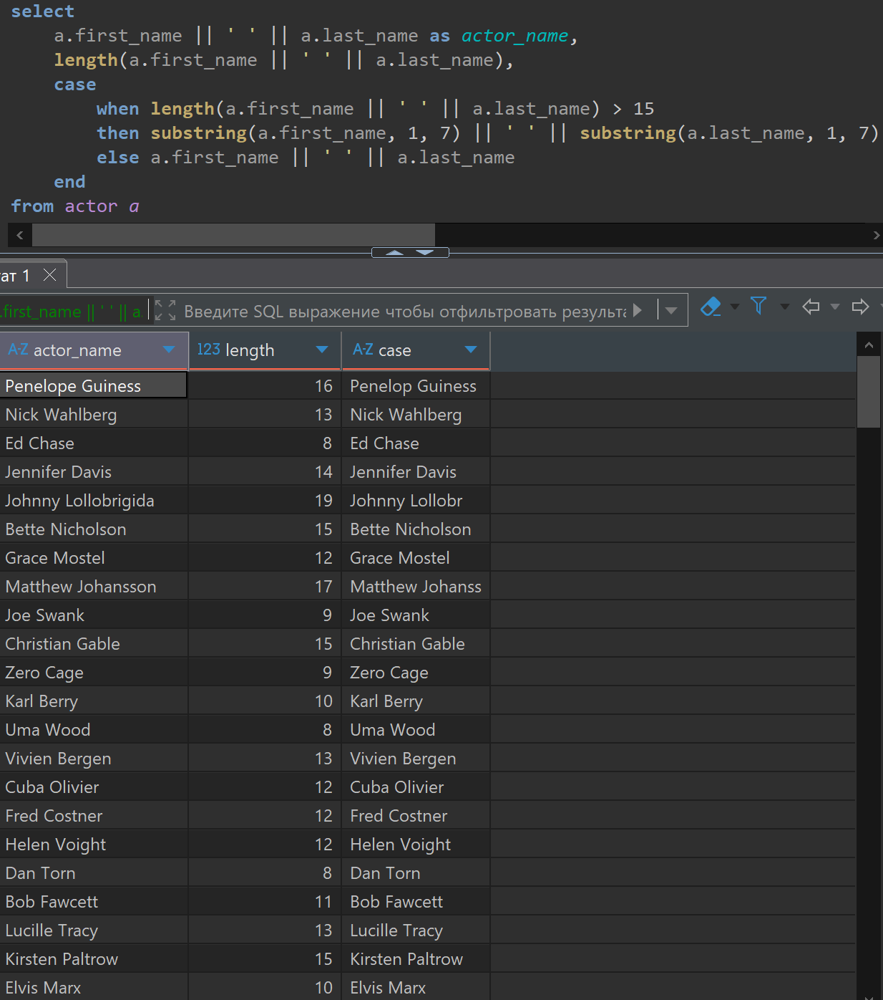
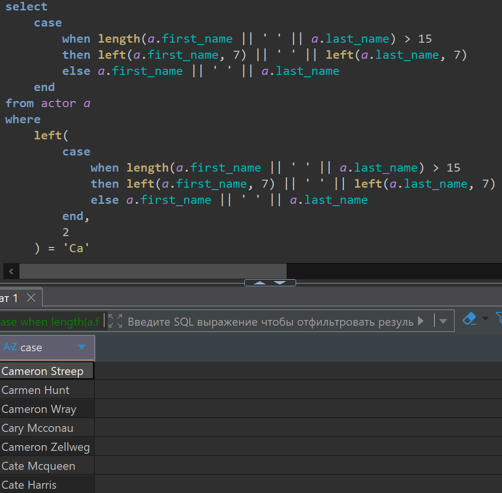
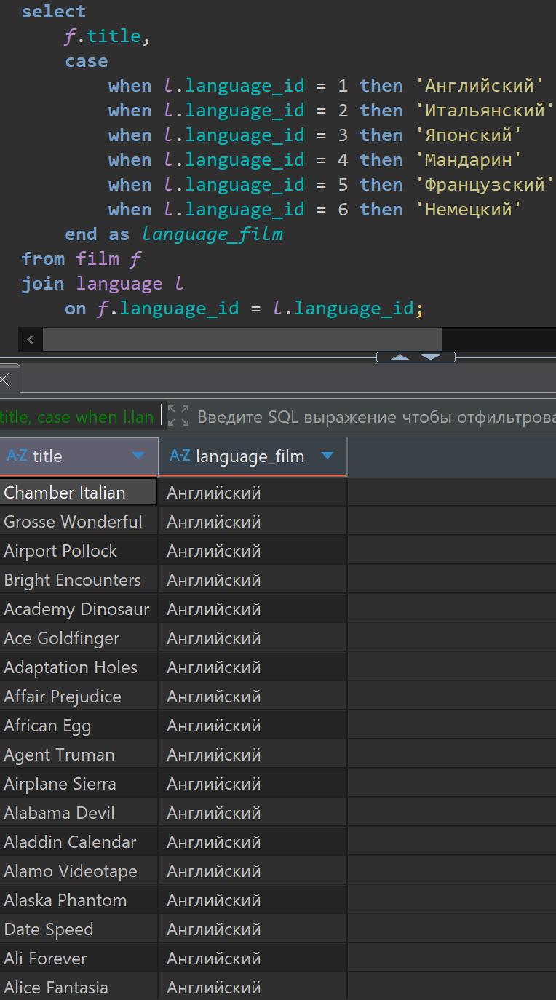
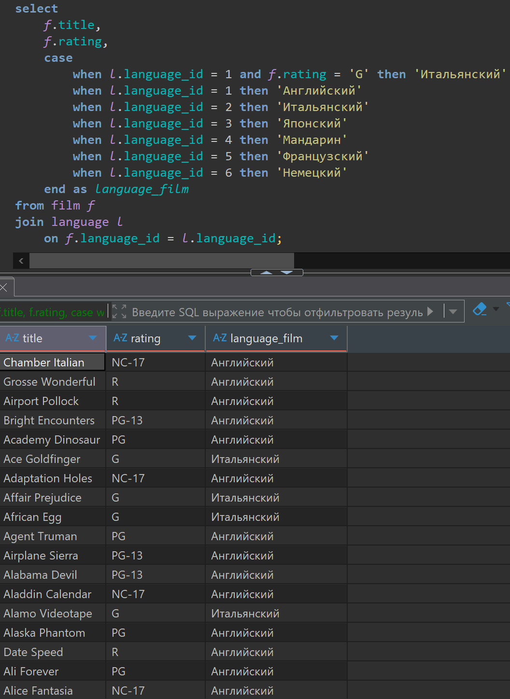
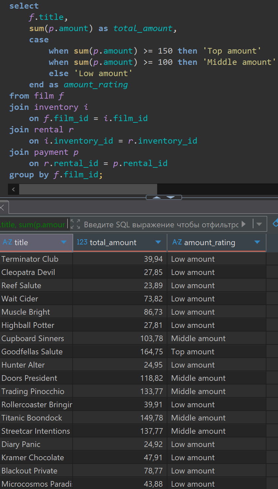

# Lesson 8

## Links

[link lesson](https://www.youtube.com/watch?v=2X8Jn15imbA&list=PLzvuaEeolxkz4a0t4qhA0pxmttG8ZbBtd&index=30)

## Условия и выражения с помощью CASE

Вспомним про наш принтер этикеток, на каждой этикетке мы хотим указывать актеров имя (first_name) и фамилию (last_name) через пробел. И у нас на эту строку ограниченное количество символов, пусть их будет 15. Если длина строки больше 15 символов, то мы ее сократим. Для наглядности выведем длину полученной строчки.

Для сбора нужной информации мы можем получить данные из таблицы actor
Для задания условий обычно нужно использовать CASE и в конце END, а между ними мы указываем все необходимые условия.
Что-бы указать пишем when (когда) и указываем выражение которое проверяем на истину.

В нашем случае проверяем нашу длину строки больше ли она 15 символов. Если условие истина,
то тогда будет возвращено значение которое идет после THEN (тогда) и тут нам нужно обрезать нашу строку как нам нужно, мы хотим взять от имени 7 символов и от фамилии 7 символов, указав между ними пробел. Если условие ложно, то мы возвращаем то что идет после ELSE (иначе), тут просто вернем строчку как она есть целиком.

```sql
select 
    a.first_name || ' ' || a.last_name as actor_name,
    length(a.first_name || ' ' || a.last_name),
    case
        when length(a.first_name || ' ' || a.last_name) > 15
        then substring(a.first_name, 1, 7) || ' ' || substring(a.last_name, 1, 7)
        else a.first_name || ' ' || a.last_name
    end
from actor a;
```

Запрос в DBeaver выглядит так



Такие проверки мы можем включать в любых выражениях, как в полях select, так и при вычислении условий в where, так и при соединениях таблиц в join, так и при сортировках таблиц, так и в условиях для группировок таблиц в having, и так далее.

Представим что мы делаем справочник по всем актерам, что бы человек пришел в магазин, взял книгу, по алфавиту нашел имя своего любимого актера, и по этому актеру увидел все диски которые есть в магазине с ним. Вот представим что мы заполняем такую книгу, и нам нужно найти актеров имя которых начинается на буквы 'Ca', то есть нам нужно получить сокращенные имена всех актеров так же как в предыдущем примере, только еще добавим условие where в котором будем брать подстроку из двух символов, и их сравнивать с символами которые нам нужны 'Ca'

```sql
select 
    case
        when length(a.first_name || ' ' || a.last_name) > 15
        then left(a.first_name, 7) || ' ' || left(a.last_name, 7)
        else a.first_name || ' ' || a.last_name
    end
from actor a
where
    left(
        case
            when length(a.first_name || ' ' || a.last_name) > 15
            then left(a.first_name, 7) || ' ' || left(a.last_name, 7)
            else a.first_name || ' ' || a.last_name
        end, 
        2
    ) = 'Ca';
```

Запрос в DBeaver выглядит так



Так же можно условиям задавать псевдоним, если они в секции select, и потом например сортировку делать по этому псевдониму, псевдоним указывается после end as

Сделаем такой пример, выведем информацию по языку фильма, из таблицы (language) где язык указан на латинице, а мы хотим вывести на русском (на кириллице)

После case мы можем указывать любое количество условий.
В нашем случае если не найдется соответствия то будет подставлено NULL (так как мы не указываем else)
И в нашей таблице оказывается все фильмы только на English

```sql
select 
    f.title,
    case
        when l.language_id = 1 then 'Английский'
        when l.language_id = 2 then 'Итальянский'
        when l.language_id = 3 then 'Японский'
        when l.language_id = 4 then 'Мандарин'
        when l.language_id = 5 then 'Французский'
        when l.language_id = 6 then 'Немецкий'
    end as language_film
from film f
join language l
    on f.language_id = l.language_id;
```

Запрос в DBeaver выглядит так



Есть еще другой вариант синтаксиса условий case, он не везде поддерживается, и не является стандартным SQL, но поддерживается в postgres. Напишем тот же пример этим способом

```sql
select 
    f.title,
    case
        l.language_id
        when 1 then 'Английский'
        when 2 then 'Итальянский'
        when 3 then 'Японский'
        when 4 then 'Мандарин'
        when 5 then 'Французский'
        when 6 then 'Немецкий'
    end as language_film
from film f
join language l
    on f.language_id = l.language_id;
```

Запрос в DBeaver выглядит так же как предыдущий [img](img/8/003.png)

Теперь реализуем другую задачу. Допустим у нас есть список фильмов по этим фильмам есть рейтинги, и мы хотим получить данные о языке на котором снят фильм но фильмы с рейтингом 'G' (фильмы для любого возраста) для таких фильмов нужно вывести язык Итальянский, вот например мы знаем что к нам пришли такие диски и они все на итальянском, не смотря на то что в самой базе у нас все фильмы указаны что они на Английском, как мы уже раньше видели.

Решение будет таким

```sql
select 
    f.title,
    f.rating,
    case
        when l.language_id = 1 and f.rating = 'G' then 'Итальянский'
        when l.language_id = 1 then 'Английский'
        when l.language_id = 2 then 'Итальянский'
        when l.language_id = 3 then 'Японский'
        when l.language_id = 4 then 'Мандарин'
        when l.language_id = 5 then 'Французский'
        when l.language_id = 6 then 'Немецкий'
    end as language_film
from film f
join language l
    on f.language_id = l.language_id;
```

Запрос в DBeaver выглядит так



Еще один вариант реализации

```sql
select 
    f.title,
    f.rating,
    case
        when l.language_id = 1 then 'Английский'
        when l.language_id = 2 then 'Итальянский'
        when l.language_id = 3 then 'Японский'
        when l.language_id = 4 then 'Мандарин'
        when l.language_id = 5 then 'Французский'
        when l.language_id = 6 then 'Немецкий'
    end as language_film
from film f
join language l
    on
    case
        when f.rating  = 'G'
        then l.language_id = 2
        else f.language_id = l.language_id
    end;
```

Запрос в DBeaver выглядит так же как предыдущий [img](img/8/004.png)

Попрактикуемся еще использовать case с агрегатными функциями.
Например мы хотим посчитать объем выручки с каждого фильма и поделить все фильмы по
этой выручке, на топовые (Top amount), средние (Middle amount), фильмы с минимальной продажей (Low amount).

Решение будет таким

```sql
select 
    f.title,
    sum(p.amount) as total_amount,
    case
        when sum(p.amount) >= 150 then 'Top amount'
        when sum(p.amount) >= 100 then 'Middle amount'
        else 'Low amount'
    end as amount_rating
from film f
join inventory i
    on f.film_id = i.film_id
join rental r
    on i.inventory_id = r.inventory_id
join payment p 
    on r.rental_id = p.rental_id
group by f.film_id;
```

Запрос в DBeaver выглядит так


