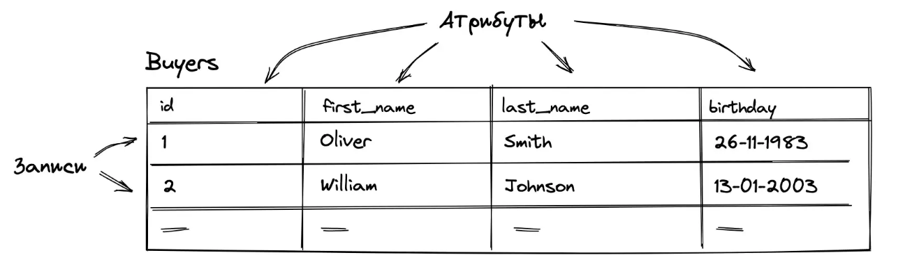
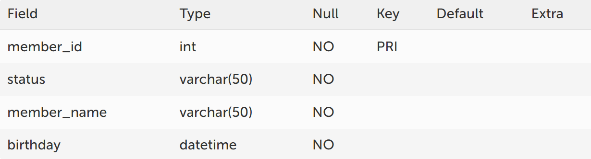
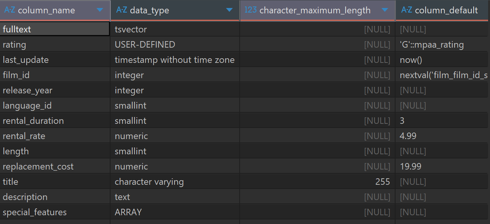
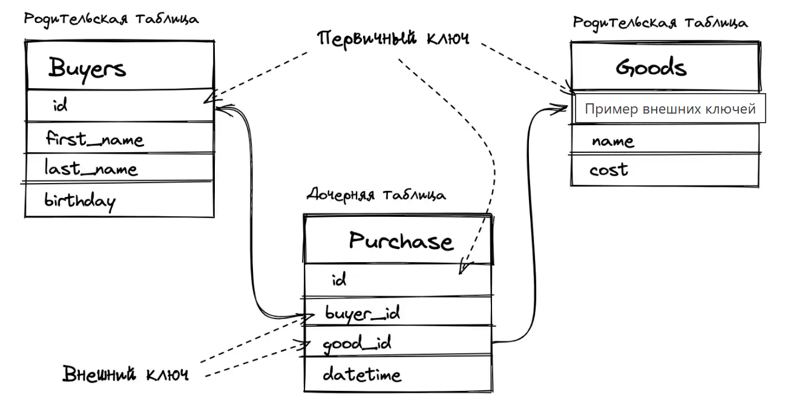

# Структура реляционных баз данных

SQL — язык структурированных запросов (SQL, Structured Query Language), который используется в качестве эффективного способа сохранения данных, поиска их частей, обновления, извлечения и удаления из базы данных.

В реляционных базах данных информация хранится в связанных друг с другом таблицах. Сами же таблицы состоят из:

- строк, которые называют «записями»
- столбцов, которые называют «полями» или же «атрибутами»



В каждой таблице каждый столбец имеет заранее определённый тип данных. Например,такими типами могут выступать:

- `VARCHAR` (строковый тип данных)
- `INTEGER` (числовой тип данных)
- `DATETIME` (тип данных для даты и времени) и прочие

И каждая строка таблицы должна иметь соответствующий тип для каждого столбца. СУБД не допустит попытку добавления в поле с типом `DATETIME` произвольной строки.

Для того чтобы узнать типы данных атрибутов, можно выполнить SQL команду `DESCRIBE` и указать название таблицы:

Для MySQL

```sql
DESCRIBE FamilyMembers
```


Рис. То что увидим в mySQL

Аналог для Postgres

```sql
select column_name, data_type, character_maximum_length, column_default, is_nullable
from INFORMATION_SCHEMA.COLUMNS where table_name = 'film';
```


Рис. То что увидим в Postgres

Или же посмотреть на ER-диаграмму схемы базы данных:

1 Первичный ключ (PRIMARY KEY)
Любая СУБД имеет встроенную систему целостности и непротиворечивости данных. Эта система работает на наборе правил, определённых в схеме базы данных. Первичный ключ и внешние ключи как раз являются одними из таких правил.

Чтобы избежать неоднозначности при поиске в таблицах существует первичный ключ или, как его ещё называют, «ключевое поле».

Ключевое поле (первичный ключ) – это поле (или набор полей), значение которого однозначно определяет запись в таблице.

Если обратиться к нашей вышеупомянутой таблице `FamilyMembers`, то в ней ключевым полем является `member_id`. С помощью данного правила СУБД не позволит нам создать новую запись, где поле `member_id` будет неуникальным.

Стоит заметить, что наличие первичного ключа не обязательно, а целостность данных может определяться, к примеру, на уровне приложения.

2 Внешний ключ (FOREIGN KEY)
Внешний ключ – это поле (или набор полей) в одной таблице, которое ссылается на первичный ключ в другой таблице.

Таблица с внешним ключом называется дочерней таблицей, а таблица с первичным ключом называется ссылочной или родительской таблицей.

Правило внешнего ключа гарантирует, что при создании записей в дочерней таблице, значение поля, являющегося внешним ключом, есть в родительской таблице.


Рис пример использования ключей в базе данных

Наличие внешнего ключа – это такое же необязательное требование, как и в случае с первичным ключом.

Если внешний ключ не определён, то всё также будет работать, но СУБД не будет проверять, что, например, при создании записи в таблице `Purchase` в полях `buyer_id` и `good_id` лежат значения, которые определены в соответствующих таблицах в поле `id`.
